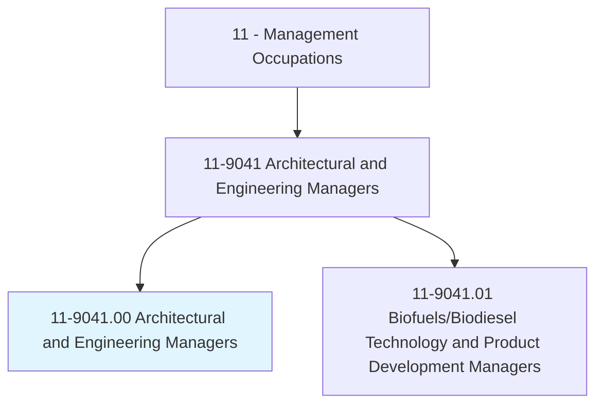
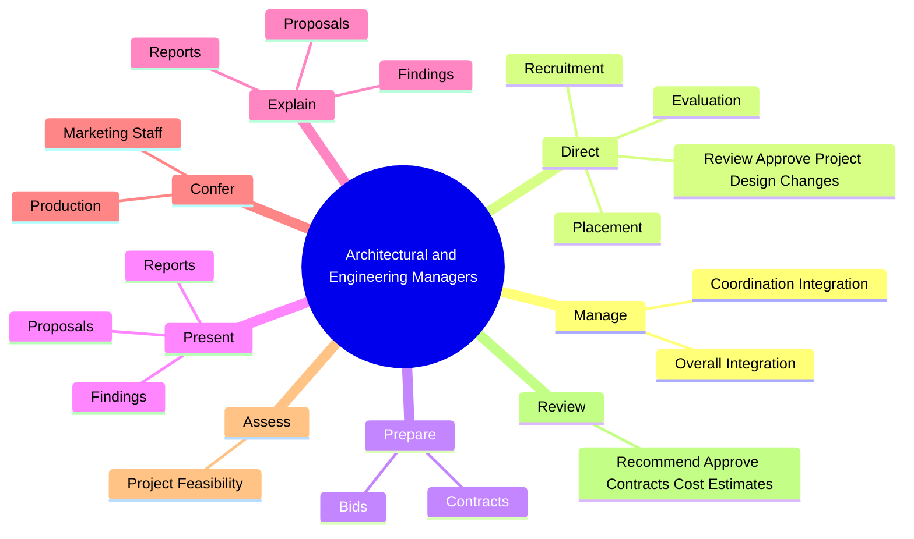
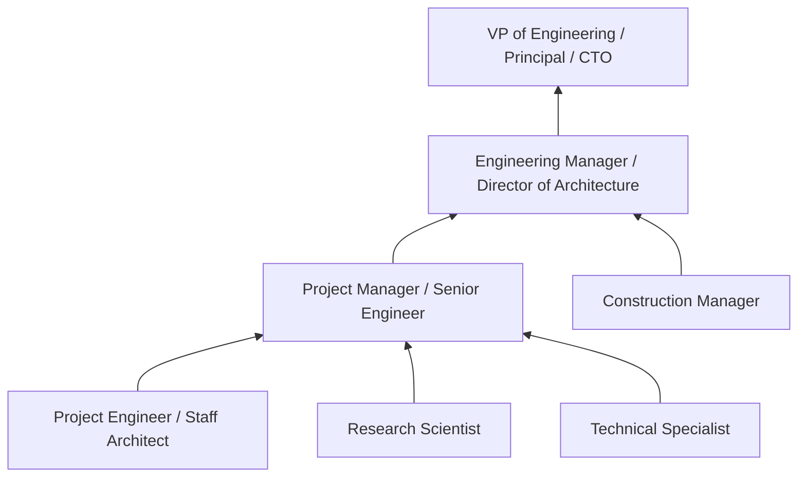
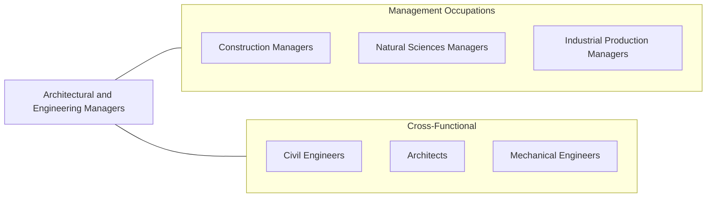

# Architectural and Engineering Managers

> Plan, direct, or coordinate activities in such fields as architecture and engineering or research and development in these fields.

## Overview

Architectural and Engineering Managers lead teams of architects, engineers, and technical professionals, overseeing projects from concept through completion. They are responsible for coordinating complex technical activities, managing project budgets and timelines, and ensuring that designs meet client requirements, regulatory standards, and quality expectations. Their work spans diverse sectors including construction, manufacturing, aerospace, energy, and technology.

These managers bridge the gap between technical expertise and business operations. They translate client needs into actionable project scopes, allocate resources across multiple concurrent projects, and make critical decisions about design approaches, materials, and technologies. They also play a key role in business development, preparing proposals and bids, presenting to clients, and maintaining professional relationships that generate new work.

The role requires deep technical knowledge combined with strong management capabilities. Architectural and Engineering Managers must stay current with evolving codes, standards, and technologies while also developing their teams' skills and managing complex stakeholder relationships. They are increasingly involved in sustainability initiatives, digital transformation (BIM, computational design), and interdisciplinary collaboration.

## Classification Hierarchy

## Key Statistics

| Metric | Value |
|--------|-------|
| SOC Code | 11-9041.00 |
| Job Zone | 5 (Extensive Preparation) |
| Category | [Management Occupations](/occupations/Management/index) |
| Task Count | 94 |
| Salary Range | $100,000 - $190,000+ |
| Employment Level | Moderate - approximately 190,000 |
| Growth Outlook | Average |
| Source | O*NET |

## Core Tasks

### manage.CoordinationIntegration

Architectural and Engineering Managers coordinate the integration of technical activities across architecture and engineering disciplines, ensuring projects deliver cohesive and functional outcomes.

**Actions:**
- `manage.CoordinationIntegration.of.TechnicalActivities.in.Architecture`
- `manage.CoordinationIntegration.of.EngineeringProjects`
- `manage.OverallIntegration.of.TechnicalActivities.in.Architecture`
- `manage.OverallIntegration.of.EngineeringProjects`

### direct.ReviewApproveProjectDesignChanges

Architectural and Engineering Managers review and approve design changes, manage staff recruitment and placement, and ensure project teams are appropriately staffed and skilled.

**Actions:**
- `direct.ReviewApproveProjectDesignChanges`
- `direct.Recruitment.of.Architecture`
- `direct.Recruitment.of.EngineeringProjectStaff`
- `direct.Placement.of.Architecture`

### prepare.Bids

Architectural and Engineering Managers prepare competitive bids and contracts that accurately scope work, estimate costs, and position the firm for project wins.

**Actions:**
- `prepare.Bids`
- `prepare.Contracts`

## Skills & Competencies

### Technical Skills
- **Engineering / Architecture Principles** - Expert
- **Project Management** - Expert
- **Design Review & Quality Assurance** - Advanced
- **Cost Estimation & Budgeting** - Advanced
- **Regulatory Compliance (Building Codes, Standards)** - Advanced
- **Research & Development Management** - Advanced
- **Technical Documentation** - Advanced

### Soft Skills
- **Leadership** - Critical
- **Communication** - Critical
- **Decision Making** - Essential
- **Problem Solving** - Essential
- **Client Relationship Management** - Essential
- **Team Development** - Important
- **Strategic Thinking** - Important

## Education & Certifications

| Requirement | Details |
|-------------|---------|
| Typical Education | Bachelor's degree in Engineering, Architecture, or related technical field |
| Advanced Education | Master's degree or MBA often preferred for senior positions |
| Work Experience | 10+ years in engineering or architecture, including supervisory experience |
| Licensure | PE (Professional Engineer - NCEES), RA (Registered Architect - NCARB) often required |
| Common Certifications | PMP (Project Management Professional - PMI), LEED AP (USGBC), SE (Structural Engineer), Six Sigma Black Belt |

## Career Progression

## Industry Variations

- **Architectural Firms** - Design leadership; client presentations; code compliance review; project delivery method selection (design-build, CM at-risk)
- **Aerospace & Defense** - Systems engineering management; security clearances; compliance with ITAR/EAR; long-cycle R&D programs
- **Energy & Utilities** - Power plant design; environmental impact assessments; renewable energy integration; grid modernization
- **Manufacturing** - Product development management; process engineering; quality systems (ISO 9001); factory design and automation

## Technology & Tools

- **CAD / BIM** - AutoCAD, Revit, SolidWorks, CATIA, Rhino
- **Engineering Analysis** - ANSYS, MATLAB, SAP2000, ETABS, STAAD
- **Project Management** - Microsoft Project, Primavera P6, Procore, Smartsheet
- **Document Management** - Bluebeam Revu, Newforma, ProjectWise
- **Collaboration** - BIM 360, Autodesk Construction Cloud, Miro
- **Financial** - Deltek Vision, BST Global for AE firm management

## Related Occupations

## Industries

- [Professional, Scientific, and Technical Services](/industries/Scientific) - Very High Employment
- [Manufacturing](/industries/Manufacturing/index) - High Employment
- [Construction](/industries/Construction) - Moderate Employment
- [Government](/industries/PublicAdministration) - Moderate Employment
- Mining, Quarrying, and Oil and Gas - Moderate Employment

## Departments

This occupation typically works in:
- [Engineering](/departments/Engineering/index)
- Architecture / Design
- [Research & Development](/departments/RnD/index)
- [Project Management Office](/departments/Operations)

---

*Source: O*NET 11-9041.00 - ONETOccupation*
