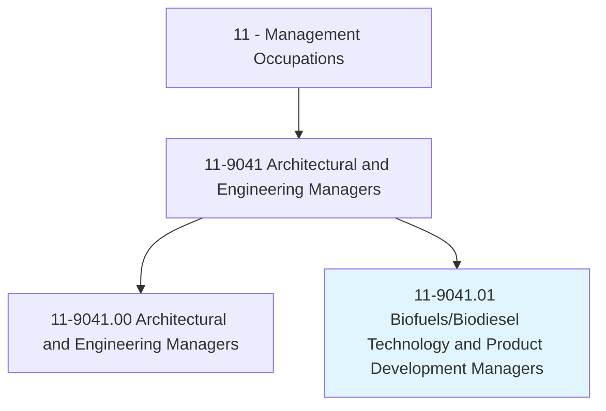
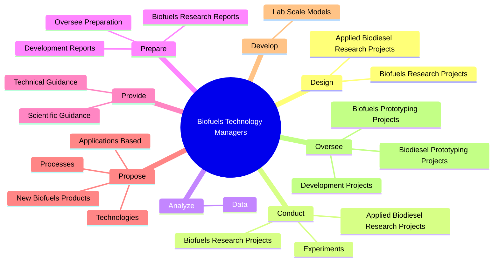
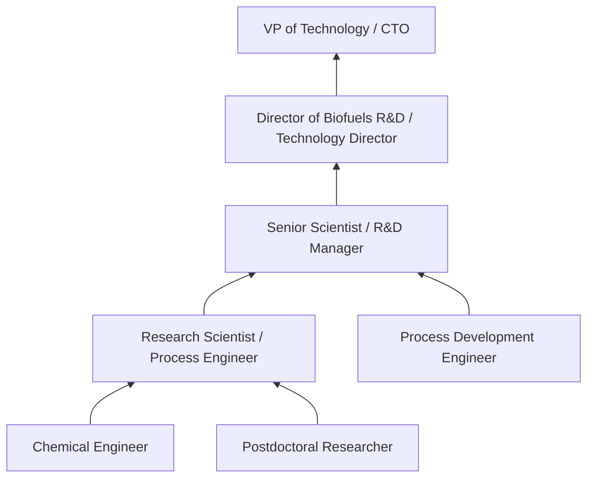
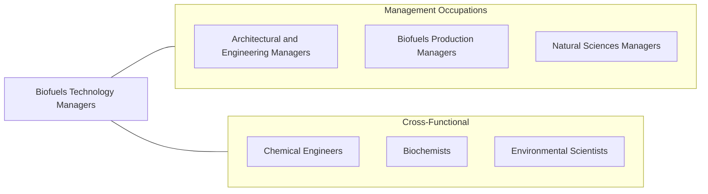

# Biofuels/Biodiesel Technology and Product Development Managers

> Define, plan, or execute biofuels/biodiesel research programs that evaluate alternative feedstock and process technologies with near-term commercial potential.

## Overview

Biofuels/Biodiesel Technology and Product Development Managers lead research and development programs focused on producing renewable fuels from biological sources. They design experiments, oversee laboratory and pilot-scale testing, evaluate alternative feedstocks (corn, soybeans, algae, waste oils, cellulosic materials), and assess process technologies for commercial viability. Their work bridges fundamental research and commercial production of sustainable transportation fuels and bio-based chemicals.

These managers direct multidisciplinary teams of chemists, chemical engineers, biologists, and technicians working on topics including reaction kinetics, fluid dynamics, thermodynamics, solvent extraction, and process optimization. They analyze research data, prepare technical reports, and make recommendations about which technologies merit scale-up investment. The role requires both deep technical knowledge and the ability to evaluate commercial potential and market readiness.

The biofuels industry operates at the intersection of energy policy, agricultural markets, and environmental sustainability. Managers must understand renewable fuel standards (RFS), lifecycle emissions analysis, feedstock economics, and the competitive landscape relative to petroleum-based fuels. As the energy transition accelerates, the role increasingly encompasses sustainable aviation fuel (SAF), renewable diesel, and bio-based chemical production.

## Classification Hierarchy

## Key Statistics

| Metric | Value |
|--------|-------|
| SOC Code | 11-9041.01 |
| Job Zone | 5 (Extensive Preparation) |
| Category | [Management Occupations](/occupations/Management/index) |
| Task Count | 121 |
| Salary Range | $90,000 - $165,000+ |
| Employment Level | Small |
| Growth Outlook | Average to faster than average |
| Source | O*NET |

## Core Tasks

### design.AppliedBiodieselResearchProjects

These managers design research projects investigating biodiesel production, exploring topics in transport phenomena, thermodynamics, and mixing optimization.

**Actions:**
- `design.AppliedBiodieselResearchProjects.on.Topics`
- `design.AppliedBiodieselResearchProjects.on.Transport`
- `design.AppliedBiodieselResearchProjects.on.Thermodynamics`
- `design.AppliedBiodieselResearchProjects.on.Mixing`

### analyze.Data

These managers analyze data from biofuels studies across fluid dynamics, water treatment, and solvent extraction to evaluate process performance and scalability.

**Actions:**
- `analyze.Data.from.BiofuelsStudies`
- `analyze.Data.from.FluidDynamics`
- `analyze.Data.from.WaterTreatments`
- `analyze.Data.from.SolventExtraction`

### propose.NewBiofuelsProducts

These managers identify and propose new biofuel products, processes, and technologies based on research findings and market opportunities.

**Actions:**
- No specific sub-actions listed for this task group.

## Skills & Competencies

### Technical Skills
- **Chemical / Process Engineering** - Expert
- **Biofuels Process Technology** - Expert
- **Research Program Management** - Advanced
- **Feedstock Evaluation** - Advanced
- **Pilot Plant Operations** - Advanced
- **Techno-Economic Analysis** - Advanced
- **Regulatory Compliance (RFS, EPA)** - Advanced

### Soft Skills
- **Leadership** - Critical
- **Analytical Thinking** - Critical
- **Communication (Technical)** - Essential
- **Project Management** - Essential
- **Innovation & Creativity** - Essential
- **Team Development** - Important
- **Strategic Thinking** - Important

## Education & Certifications

| Requirement | Details |
|-------------|---------|
| Typical Education | Master's or PhD in Chemical Engineering, Biochemistry, Biotechnology, or related field |
| Work Experience | 5-10 years in biofuels R&D or chemical process development |
| Common Certifications | PE (Professional Engineer - NCEES), PMP (PMI), Six Sigma (process optimization) |

## Career Progression

## Industry Variations

- **Biofuels Producers** - Production process optimization; feedstock procurement; fuel quality testing; RIN credit management
- **Oil & Gas (Renewable Fuels Division)** - Co-processing integration; renewable diesel; SAF development; carbon intensity reduction
- **Agriculture / Agribusiness** - Feedstock development; corn ethanol; soybean biodiesel; agricultural residue utilization
- **National Laboratories / Academia** - Fundamental research; grant-funded programs; advanced biofuels (cellulosic, algal); technology transfer

## Technology & Tools

- **Process Simulation** - Aspen Plus, HYSYS, SuperPro Designer
- **Data Analysis** - MATLAB, Python, R, JMP
- **Lab Equipment** - Gas chromatography, HPLC, mass spectrometry, pilot reactors
- **Project Management** - Microsoft Project, JIRA, Smartsheet
- **CAD / Process Design** - AutoCAD P&ID, SmartPlant
- **Compliance** - EPA EMTS (moderated transaction system), RIN tracking systems

## Related Occupations

## Industries

- [Manufacturing (Petroleum, Chemical, Biofuels)](/industries/Manufacturing/index) - High Employment
- [Professional, Scientific, and Technical Services](/industries/ProfessionalServices) - Moderate Employment
- [Government (DOE, USDA)](/industries/Government) - Low Employment

## Departments

This occupation typically works in:
- [Research & Development](/departments/RnD/index)
- [Technology Development](/departments/TechDev)
- [Process Engineering](/departments/ProcessEngineering)

---

*Source: O*NET 11-9041.01 - ONETOccupation*
