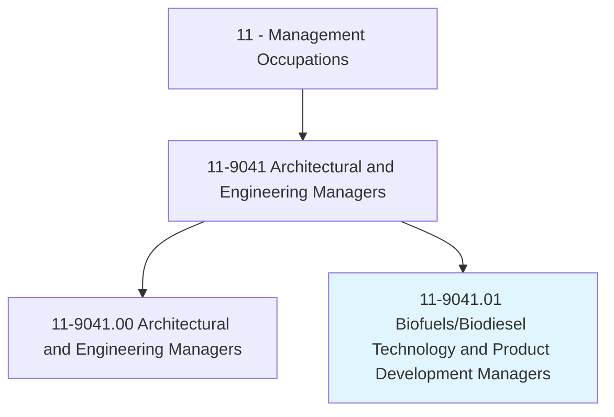
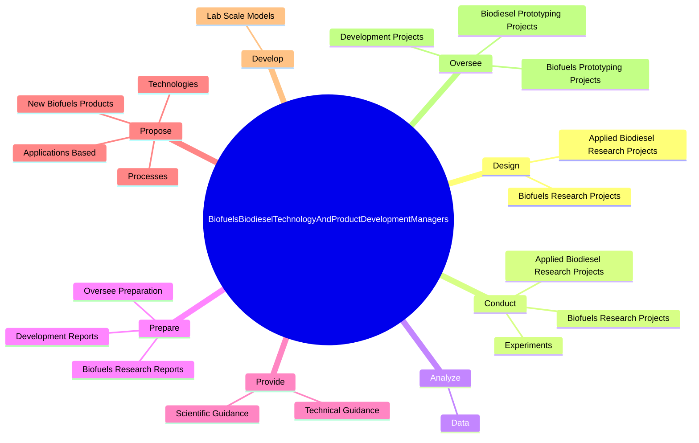

# Biofuels/Biodiesel Technology and Product Development Managers

> Define, plan, or execute biofuels/biodiesel research programs that evaluate alternative feedstock and process technologies with near-term commercial potential.

## Overview

Biofuels/Biodiesel Technology and Product Development Managers is classified under Management Occupations (SOC 11). Define, plan, or execute biofuels/biodiesel research programs that evaluate alternative feedstock and process technologies with near-term commercial potential.

## Classification Hierarchy

## Key Statistics

| Metric | Value |
|--------|-------|
| SOC Code | 11-9041.01 |
| Category | [Management Occupations](/occupations/Management/index) |
| Task Count | 121 |
| Source | O*NET |

## Core Tasks

### design.AppliedBiodieselResearchProjects

Biofuels/Biodiesel Technology and Product Development Managers design applied biodiesel research projects as part of their core responsibilities.

**Actions:**
- `design.AppliedBiodieselResearchProjects.on.Topics`
- `design.AppliedBiodieselResearchProjects.on.Transport`
- `design.AppliedBiodieselResearchProjects.on.Thermodynamics`
- `design.AppliedBiodieselResearchProjects.on.Mixing`

### conduct.AppliedBiodieselResearchProjects

Biofuels/Biodiesel Technology and Product Development Managers conduct applied biodiesel research projects as part of their core responsibilities.

**Actions:**
- `conduct.AppliedBiodieselResearchProjects.on.Topics`
- `conduct.AppliedBiodieselResearchProjects.on.Transport`
- `conduct.AppliedBiodieselResearchProjects.on.Thermodynamics`
- `conduct.AppliedBiodieselResearchProjects.on.Mixing`

### analyze.Data

Biofuels/Biodiesel Technology and Product Development Managers analyze data as part of their core responsibilities.

**Actions:**
- `analyze.Data.from.BiofuelsStudies`
- `analyze.Data.from.FluidDynamics`
- `analyze.Data.from.WaterTreatments`
- `analyze.Data.from.SolventExtraction`

## Skills & Competencies

### Technical Skills
- **Strategic Planning** - Advanced
- **Financial Management** - Advanced
- **Operations Management** - Advanced

### Soft Skills
- **Communication** - Essential
- **Problem Solving** - Essential
- **Critical Thinking** - Important
- **Teamwork** - Important
- **Adaptability** - Important

## Related Occupations

## Industries

This occupation is found across multiple industries. See [Industries](/industries) for sector-specific employment data.

## Career Progression

---

*Source: O*NET 11-9041.01 - ONETOccupation*
