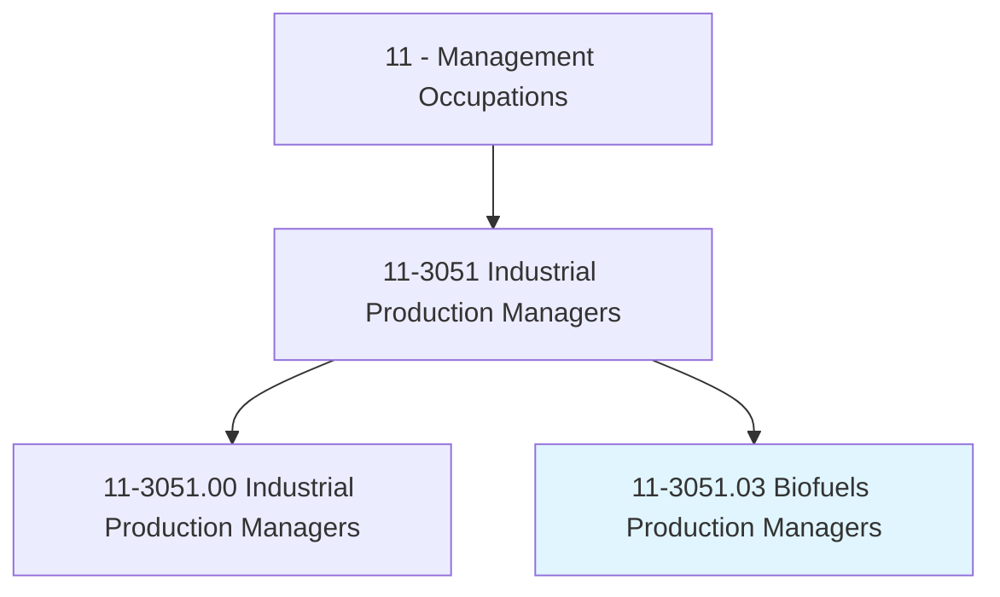
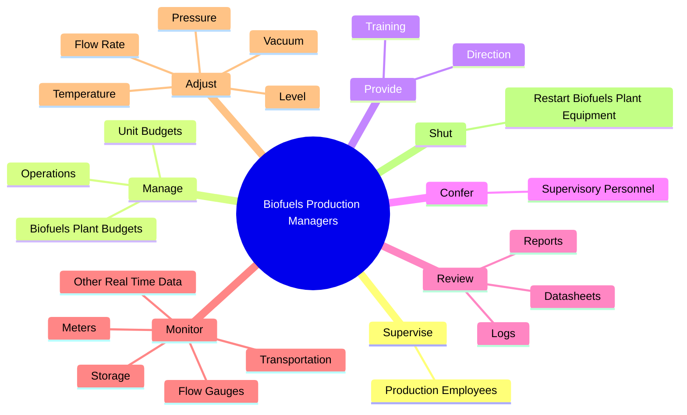

# Biofuels Production Managers

> Manage biofuels production and plant operations. Collect and process information on plant production and performance, diagnose problems, and design corrective procedures.

## Overview

Biofuels Production Managers is a specialized variant within the Management Occupations category. Manage biofuels production and plant operations. 

## Classification Hierarchy

## Key Statistics

| Metric | Value |
|--------|-------|
| SOC Code | 11-3051.03 |
| Category | [Management Occupations](/occupations/Management/index) |
| Task Count | 60 |
| Source | O*NET |

## Core Tasks

### supervise.ProductionEmployees

Biofuels Production Managers supervise production employees as part of their core responsibilities.

**Actions:**
- `supervise.ProductionEmployees.in.Manufacturing.of.Biofuels`
- `supervise.ProductionEmployees.in.Biodiesel`
- `supervise.ProductionEmployees.in.Ethanol`

### manage.Operations

Biofuels Production Managers manage operations as part of their core responsibilities.

**Actions:**
- `manage.Operations.at.BiofuelsPowerGenerationFacilities`
- `manage.Operations.at.IncludingProduction`
- `manage.Operations.at.Shipping`
- `manage.Operations.at.Maintenance`

### provide.Direction

Biofuels Production Managers provide direction as part of their core responsibilities.

**Actions:**
- `provide.Direction.to.EmployeesToEnsureComplianceWithBiofuelsPlantSafety`
- `provide.Direction.to.Environmental`
- `provide.Direction.to.OperationalStandards`
- `provide.Direction.to.Regulations`

## Skills & Competencies

### Technical Skills
- **Strategic Planning** - Advanced
- **Financial Management** - Advanced
- **Operations Management** - Advanced

### Soft Skills
- **Communication** - Essential
- **Problem Solving** - Essential
- **Critical Thinking** - Important
- **Teamwork** - Important
- **Adaptability** - Important

## Related Occupations

## Industries

This occupation is found across multiple industries. See [Industries](/industries) for sector-specific employment data.

## Career Progression

---

*Source: O*NET 11-3051.03 - ONETOccupation*
