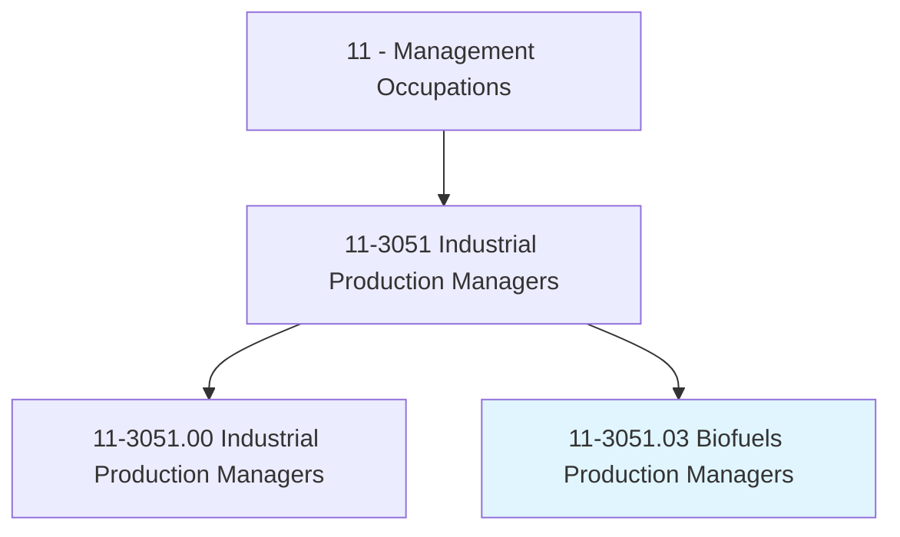
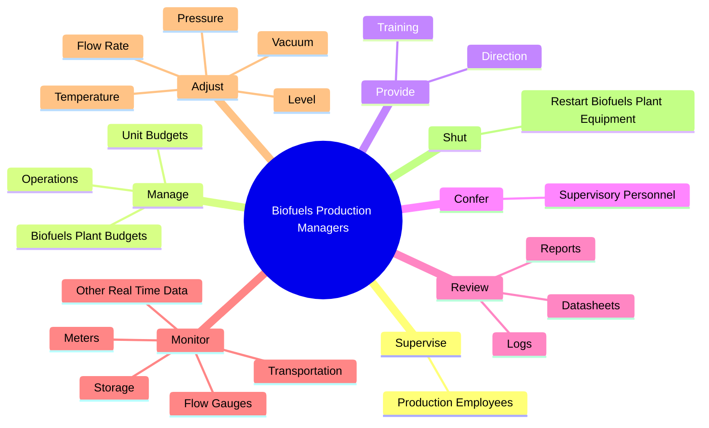
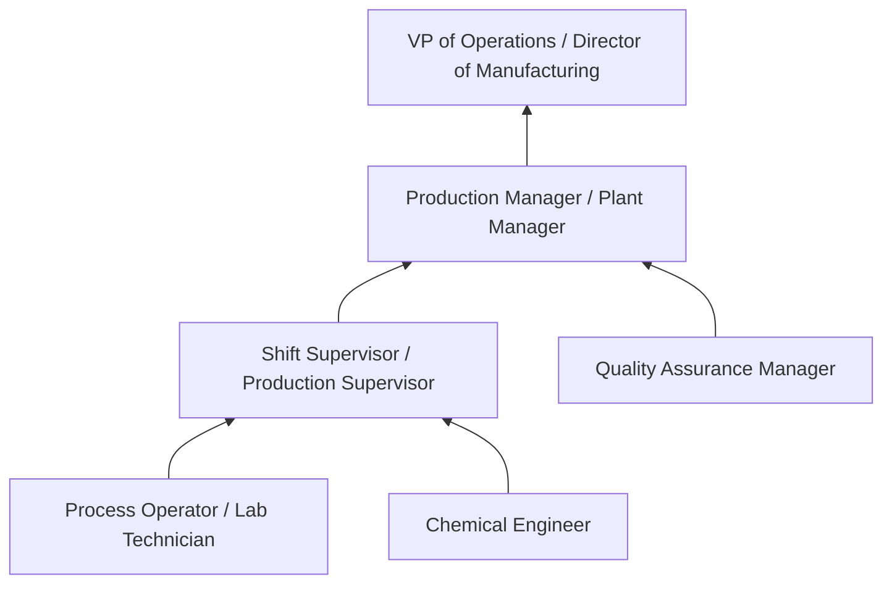
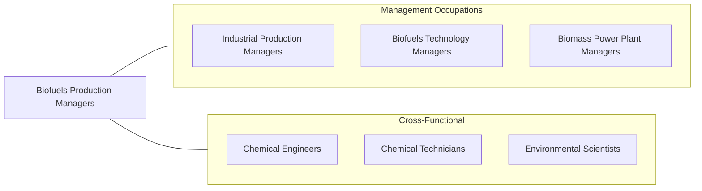

# Biofuels Production Managers

> Manage biofuels production and plant operations. Collect and process information on plant production and performance, diagnose problems, and design corrective procedures.

## Overview

Biofuels Production Managers oversee the day-to-day operations of ethanol, biodiesel, and renewable fuel production facilities. They manage plant personnel, monitor production processes, ensure product quality, and maintain safe working conditions. Their responsibilities span the entire production cycle -- from feedstock receiving and processing through fermentation or transesterification to product storage and shipping. They must balance production targets with safety, environmental compliance, and cost control.

These managers work directly on the plant floor and in control rooms, reviewing real-time data from process instruments, adjusting operating parameters (temperature, pressure, flow rates), and troubleshooting equipment issues. They supervise operators, maintenance technicians, and laboratory staff while coordinating with supply chain, quality assurance, and environmental compliance teams. Production planning requires understanding of feedstock variability, seasonal supply fluctuations, and market demand for finished fuels.

The biofuels industry is shaped by the Renewable Fuel Standard (RFS), state-level low carbon fuel standards (LCFS), and tax incentives that drive production economics. Managers must understand Renewable Identification Number (RIN) generation, carbon intensity scoring, and lifecycle emissions accounting. As the industry expands into cellulosic ethanol, renewable diesel, and sustainable aviation fuel (SAF), production managers face increasingly complex process technologies and tighter quality specifications.

## Classification Hierarchy

## Key Statistics

| Metric | Value |
|--------|-------|
| SOC Code | 11-3051.03 |
| Job Zone | 4 (Considerable Preparation) |
| Category | [Management Occupations](/occupations/Management/index) |
| Task Count | 60 |
| Salary Range | $75,000 - $140,000+ |
| Employment Level | Small |
| Growth Outlook | Faster than average |
| Source | O*NET |

## Core Tasks

### supervise.ProductionEmployees

Biofuels Production Managers supervise operators, technicians, and laboratory staff engaged in the manufacturing of ethanol, biodiesel, and other renewable fuels.

**Actions:**
- `supervise.ProductionEmployees.in.Manufacturing.of.Biofuels`
- `supervise.ProductionEmployees.in.Biodiesel`
- `supervise.ProductionEmployees.in.Ethanol`

### manage.Operations

Biofuels Production Managers direct all operational activities at biofuels production facilities, including production scheduling, shipping logistics, and maintenance coordination.

**Actions:**
- `manage.Operations.at.BiofuelsPowerGenerationFacilities`
- `manage.Operations.at.IncludingProduction`
- `manage.Operations.at.Shipping`
- `manage.Operations.at.Maintenance`

### provide.Direction

Biofuels Production Managers provide direction and training to ensure compliance with plant safety, environmental, and operational standards.

**Actions:**
- `provide.Direction.to.EmployeesToEnsureComplianceWithBiofuelsPlantSafety`
- `provide.Direction.to.Environmental`
- `provide.Direction.to.OperationalStandards`
- `provide.Direction.to.Regulations`

## Skills & Competencies

### Technical Skills
- **Biofuels Process Technology** - Expert
- **Plant Operations Management** - Expert
- **Process Control & Instrumentation** - Advanced
- **Safety Management (PSM/RMP)** - Advanced
- **Environmental Compliance (EPA, RFS)** - Advanced
- **Quality Control & Laboratory Methods** - Advanced
- **Maintenance Planning** - Advanced

### Soft Skills
- **Leadership** - Critical
- **Problem Solving** - Critical
- **Communication** - Essential
- **Decision Making** - Essential
- **Team Development** - Essential
- **Attention to Detail** - Important
- **Stress Management** - Important

## Education & Certifications

| Requirement | Details |
|-------------|---------|
| Typical Education | Bachelor's degree in Chemical Engineering, Biochemistry, Agricultural Engineering, or related field |
| Work Experience | 5-8 years in biofuels or chemical process plant operations |
| Common Certifications | PE (Professional Engineer - NCEES), Six Sigma (process optimization), OSHA 30-Hour (safety), ASQ CQE (quality engineering) |

## Career Progression

## Industry Variations

- **Corn Ethanol Producers** - Dry mill or wet mill operations; distillers grains co-product management; energy optimization; water usage reduction
- **Biodiesel Producers** - Transesterification process management; feedstock quality (soybean oil, used cooking oil, animal fats); glycerin co-product; cold flow additives
- **Cellulosic / Advanced Biofuels** - Pretreatment and enzymatic hydrolysis; novel fermentation organisms; process scale-up from pilot; technology licensing
- **Renewable Diesel / SAF** - Hydroprocessing operations; hydrogen management; product specification compliance (ASTM D975, D7566); co-processing with petroleum

## Technology & Tools

- **Process Control** - DCS (Honeywell Experion, Emerson DeltaV), PLCs, SCADA systems
- **Data Analysis** - PI System (OSIsoft), process historians, statistical process control (SPC)
- **Lab Equipment** - Gas chromatography, Karl Fischer titration, flash point testers, cloud point analyzers
- **Maintenance** - CMMS (SAP PM, Maximo), predictive maintenance tools, vibration analysis
- **Compliance** - EPA EMTS (RIN generation), LCFS reporting tools, emissions monitoring (CEMS)
- **ERP** - SAP, Oracle, JD Edwards

## Related Occupations

## Industries

- [Manufacturing (Petroleum, Chemical, Biofuels)](/industries/Manufacturing/index) - High Employment
- [Utilities](/industries/Utilities/index) - Moderate Employment
- [Agriculture and Food Processing](/industries/Agriculture/index) - Low Employment

## Departments

This occupation typically works in:
- [Operations / Production](/departments/Operations/index)
- Plant Management
- Quality Assurance

---

*Source: O*NET 11-3051.03 - ONETOccupation*
