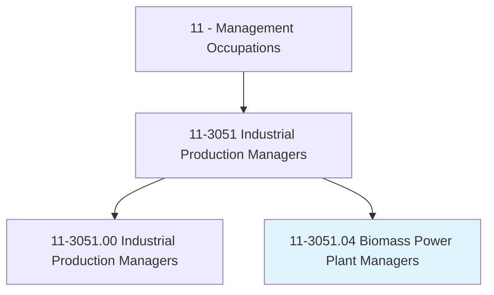
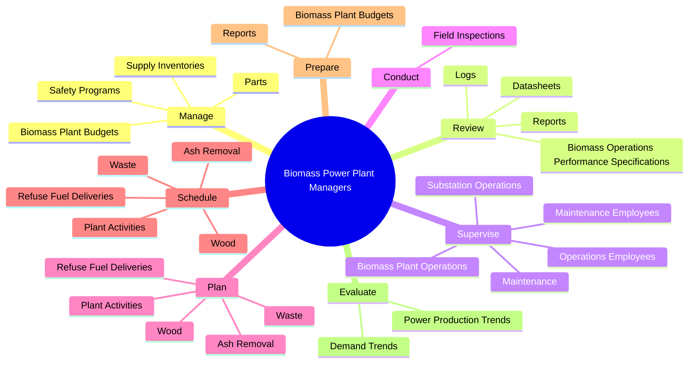
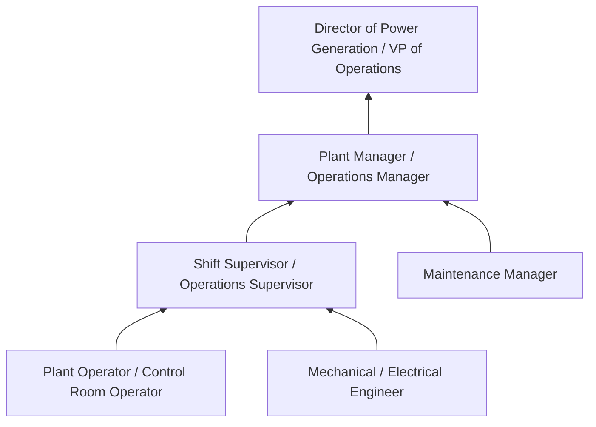
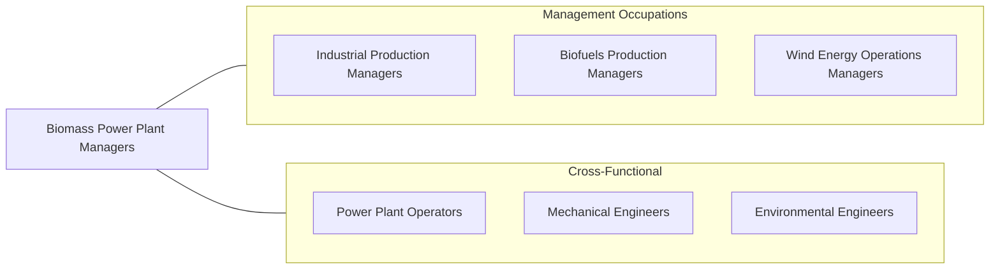

# Biomass Power Plant Managers

> Manage operations at biomass power generation facilities. Direct work activities at plant, including supervision of operations and maintenance staff.

## Overview

Biomass Power Plant Managers oversee the generation of electricity from organic materials including wood waste, agricultural residues, municipal solid waste, landfill gas, and paper sludge. They direct all aspects of plant operations -- fuel receiving and handling, boiler operations, turbine-generator systems, emissions control, and ash disposal. Their primary objective is to maintain reliable, efficient power production while meeting environmental regulations and safety standards.

These managers supervise operations crews and maintenance teams across multiple shifts, ensuring continuous 24/7 power generation. They monitor plant performance through control room instrumentation and field inspections, reviewing logs, datasheets, and production reports to identify abnormalities. Fuel management is a distinctive challenge: biomass feedstocks vary in moisture content, heating value, and physical characteristics, requiring constant adjustment of combustion parameters and fuel blending strategies.

The biomass power sector operates within the broader renewable energy landscape, competing for power purchase agreements (PPAs) and renewable energy credits (RECs). Plant managers must balance fuel procurement costs (which can represent 40-60% of operating expenses) against electricity market prices. Environmental compliance involves air quality permits, ash disposal regulations, and water discharge permits. As utilities and corporations pursue carbon-neutral energy portfolios, biomass plants face both opportunities and scrutiny regarding sustainability of feedstock sourcing and net carbon emissions.

## Classification Hierarchy

## Key Statistics

| Metric | Value |
|--------|-------|
| SOC Code | 11-3051.04 |
| Job Zone | 4 (Considerable Preparation) |
| Category | [Management Occupations](/occupations/Management/index) |
| Task Count | 101 |
| Salary Range | $80,000 - $145,000+ |
| Employment Level | Small |
| Growth Outlook | Average |
| Source | O*NET |

## Core Tasks

### manage.SafetyPrograms

Biomass Power Plant Managers develop and enforce comprehensive safety programs covering lockout/tagout, confined space entry, hot work, and combustible dust hazards unique to biomass facilities.

**Actions:**
- `manage.SafetyPrograms.at.PowerGenerationFacilities`
- `manage.BiomassPlantBudgets`
- `manage.Parts.for.BiomassPlants`
- `manage.SupplyInventories.for.BiomassPlants`

### review.BiomassOperationsPerformanceSpecifications

Biomass Power Plant Managers review plant performance data to ensure regulatory compliance and identify equipment abnormalities before they cause unplanned outages.

**Actions:**
- `review.BiomassOperationsPerformanceSpecifications.to.ensure.ComplianceWithRegulatoryRequirements`
- `review.Logs.to.ensure.AdequateProductionLevelsProductionEnvironmentsToIdentifyAbnormalitiesWithPowerProductionEquipmentProcesses`
- `review.Logs.to.SafeProductionEnvironmentsToIdentifyAbnormalitiesWithPowerProductionEquipmentProcesses`
- `review.Datasheets.to.ensure.AdequateProductionLevelsProductionEnvironmentsToIdentifyAbnormalitiesWithPowerProductionEquipmentProcesses`

### supervise.OperationsEmployees

Biomass Power Plant Managers supervise multi-shift operations and maintenance teams responsible for continuous power production from biomass, wood, coal co-firing, and paper sludge.

**Actions:**
- `supervise.OperationsEmployees.in.Production.of.PowerFromBiomass`
- `supervise.OperationsEmployees.in.Wood`
- `supervise.OperationsEmployees.in.Coal`
- `supervise.OperationsEmployees.in.PaperSludge`

## Skills & Competencies

### Technical Skills
- **Power Plant Operations** - Expert
- **Biomass Combustion Systems** - Expert
- **Safety Management (OSHA, NFPA)** - Advanced
- **Environmental Compliance (CAA, CWA)** - Advanced
- **Electrical Systems & Grid Interconnection** - Advanced
- **Maintenance Management** - Advanced
- **Fuel Procurement & Logistics** - Advanced

### Soft Skills
- **Leadership** - Critical
- **Decision Making** - Critical
- **Problem Solving** - Essential
- **Communication** - Essential
- **Planning & Organization** - Essential
- **Crisis Management** - Important
- **Team Development** - Important

## Education & Certifications

| Requirement | Details |
|-------------|---------|
| Typical Education | Bachelor's degree in Mechanical Engineering, Electrical Engineering, Power Engineering, or related field |
| Work Experience | 7-10 years in power plant operations with progressive supervisory responsibility |
| Common Certifications | PE (Professional Engineer - NCEES), Certified Plant Engineer (AFE), OSHA 30-Hour, First Class Power Engineer (state-specific), NERC Certification (grid reliability) |

## Career Progression

## Industry Variations

- **Independent Power Producers** - Merchant power sales; capacity markets; PPA management; REC generation and trading
- **Pulp & Paper Industry** - Combined heat and power (CHP); black liquor recovery boilers; bark boilers; steam sales to mill processes
- **Municipal Waste-to-Energy** - MSW combustion; tipping fee revenue; ash testing and disposal; community relations; air quality permitting
- **Utility-Owned Biomass** - Integrated resource planning; coal-to-biomass conversion; co-firing strategies; regulated rate recovery

## Technology & Tools

- **Control Systems** - DCS (ABB, Emerson, Honeywell), SCADA, PLCs, burner management systems
- **Performance Monitoring** - PI System (OSIsoft), heat rate optimization tools, efficiency tracking dashboards
- **Environmental Monitoring** - CEMS (continuous emissions monitoring), opacity monitors, stack testing
- **Maintenance** - CMMS (Maximo, SAP PM), vibration analysis, thermography, oil analysis
- **Fuel Management** - Truck scale systems, fuel sampling and analysis, inventory tracking
- **Safety** - Permit-to-work systems, incident management (Intelex, Enablon)

## Related Occupations

## Industries

- [Utilities (Electric Power Generation)](/industries/Utilities/index) - High Employment
- [Manufacturing (Pulp, Paper, Wood Products)](/industries/Manufacturing/index) - Moderate Employment
- Waste Management and Remediation - Low Employment

## Departments

This occupation typically works in:
- [Plant Operations](/departments/Operations/index)
- Power Generation
- Environmental Health & Safety

---

*Source: O*NET 11-3051.04 - ONETOccupation*
