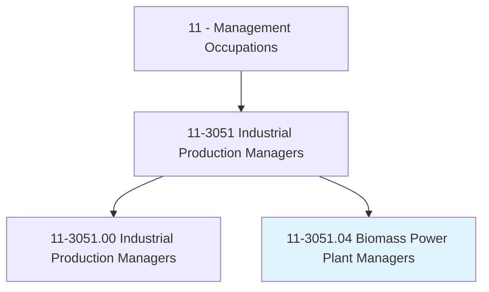
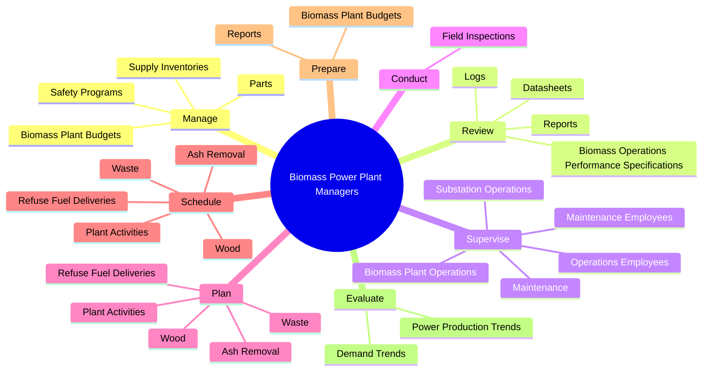
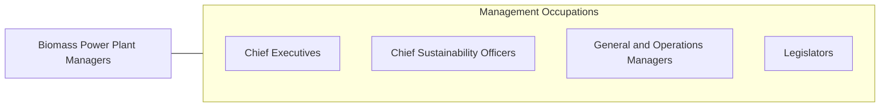

# Biomass Power Plant Managers

> Manage operations at biomass power generation facilities. Direct work activities at plant, including supervision of operations and maintenance staff.

## Overview

Biomass Power Plant Managers is a specialized variant within the Management Occupations category. Manage operations at biomass power generation facilities. 

## Classification Hierarchy

## Key Statistics

| Metric | Value |
|--------|-------|
| SOC Code | 11-3051.04 |
| Category | [Management Occupations](/occupations/Management/index) |
| Task Count | 101 |
| Source | O*NET |

## Core Tasks

### manage.SafetyPrograms

Biomass Power Plant Managers manage safety programs as part of their core responsibilities.

**Actions:**
- `manage.SafetyPrograms.at.PowerGenerationFacilities`
- `manage.BiomassPlantBudgets`
- `manage.Parts.for.BiomassPlants`
- `manage.SupplyInventories.for.BiomassPlants`

### review.BiomassOperationsPerformanceSpecifications

Biomass Power Plant Managers review biomass operations performance specifications as part of their core responsibilities.

**Actions:**
- `review.BiomassOperationsPerformanceSpecifications.to.ensure.ComplianceWithRegulatoryRequirements`
- `review.Logs.to.ensure.AdequateProductionLevelsProductionEnvironmentsToIdentifyAbnormalitiesWithPowerProductionEquipmentProcesses`
- `review.Logs.to.SafeProductionEnvironmentsToIdentifyAbnormalitiesWithPowerProductionEquipmentProcesses`
- `review.Datasheets.to.ensure.AdequateProductionLevelsProductionEnvironmentsToIdentifyAbnormalitiesWithPowerProductionEquipmentProcesses`

### supervise.OperationsEmployees

Biomass Power Plant Managers supervise operations employees as part of their core responsibilities.

**Actions:**
- `supervise.OperationsEmployees.in.Production.of.PowerFromBiomass`
- `supervise.OperationsEmployees.in.Wood`
- `supervise.OperationsEmployees.in.Coal`
- `supervise.OperationsEmployees.in.PaperSludge`

## Skills & Competencies

### Technical Skills
- **Strategic Planning** - Advanced
- **Financial Management** - Advanced
- **Operations Management** - Advanced

### Soft Skills
- **Communication** - Essential
- **Problem Solving** - Essential
- **Critical Thinking** - Important
- **Teamwork** - Important
- **Adaptability** - Important

## Related Occupations

## Industries

This occupation is found across multiple industries. See [Industries](/industries) for sector-specific employment data.

## Career Progression

---

*Source: O*NET 11-3051.04 - ONETOccupation*
