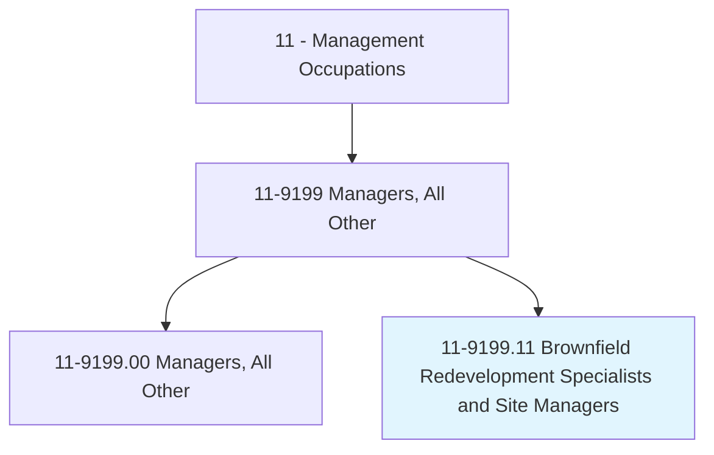
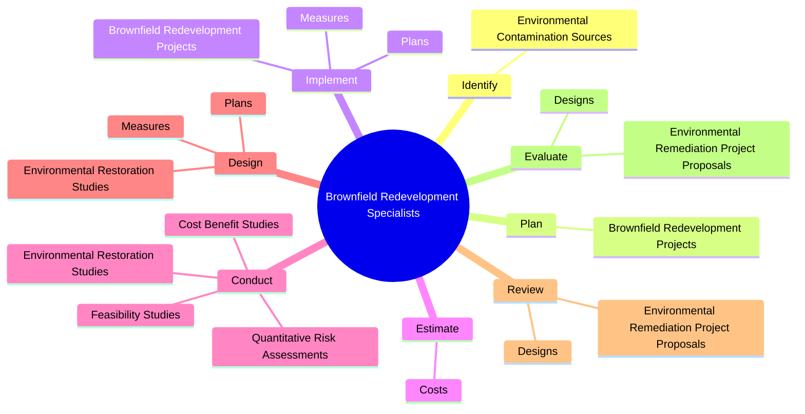
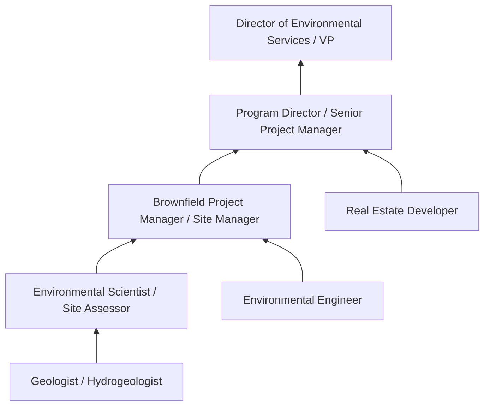
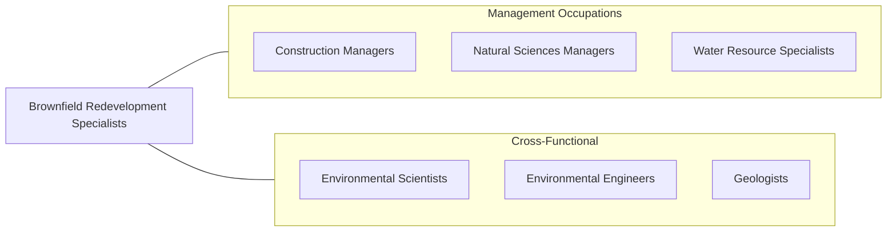

# Brownfield Redevelopment Specialists and Site Managers

> Plan and direct cleanup and redevelopment of contaminated properties for reuse. Does not include properties sufficiently contaminated to qualify as Superfund sites.

## Overview

Brownfield Redevelopment Specialists and Site Managers lead the assessment, cleanup, and repurposing of contaminated properties -- former industrial sites, gas stations, dry cleaners, and other locations where hazardous substances may be present. They transform environmental liabilities into community assets by managing remediation projects that enable safe reuse for commercial, residential, or public purposes. Their work revitalizes communities while protecting public health and the environment.

These specialists conduct environmental site assessments, develop remediation strategies, manage cleanup contractors, navigate regulatory approval processes, and coordinate with stakeholders including property owners, developers, government agencies, and community groups. They must balance technical remediation requirements with project economics, regulatory timelines, and community expectations. Federal and state brownfield programs provide funding incentives, but projects require careful management to meet liability protections and compliance requirements.

The field has grown as communities increasingly seek to redevelop underutilized urban properties rather than develop greenfield sites. Brownfield redevelopment supports urban revitalization, reduces sprawl, and can generate significant economic and environmental benefits. Specialists must integrate knowledge of environmental science, real estate development, regulatory frameworks, and community engagement to deliver successful projects.

## Classification Hierarchy

## Key Statistics

| Metric | Value |
|--------|-------|
| SOC Code | 11-9199.11 |
| Job Zone | 4 (Considerable Preparation) |
| Category | [Management Occupations](/occupations/Management/index) |
| Task Count | 77 |
| Salary Range | $65,000 - $125,000+ |
| Employment Level | Small |
| Growth Outlook | Average |
| Source | O*NET |

## Core Tasks

### identify.EnvironmentalContaminationSources

Brownfield Redevelopment Specialists identify the types, extent, and sources of environmental contamination through Phase I and Phase II environmental site assessments.

**Actions:**
- `identify.EnvironmentalContaminationSources`

### plan.BrownfieldRedevelopmentProjects

Brownfield Redevelopment Specialists plan remediation and redevelopment projects to ensure safety, quality, and compliance with environmental standards.

**Actions:**
- `plan.BrownfieldRedevelopmentProjects.to.ensure.Safety`
- `plan.BrownfieldRedevelopmentProjects.to.Quality`
- `plan.BrownfieldRedevelopmentProjects.to.ComplianceWithApplicableStandards`
- `plan.BrownfieldRedevelopmentProjects.to.Requirements`

### conduct.QuantitativeRiskAssessments

Brownfield Redevelopment Specialists conduct risk assessments, feasibility studies, and cost-benefit analyses to evaluate remediation approaches and project viability.

**Actions:**
- No specific sub-actions listed for this task group.

## Skills & Competencies

### Technical Skills
- **Environmental Site Assessment (Phase I/II)** - Expert
- **Remediation Technologies** - Expert
- **Environmental Regulations (CERCLA, RCRA, State Programs)** - Advanced
- **Risk Assessment** - Advanced
- **Project Management** - Advanced
- **Cost Estimation** - Advanced
- **Real Estate Development Knowledge** - Advanced

### Soft Skills
- **Problem Solving** - Critical
- **Communication** - Critical
- **Stakeholder Management** - Essential
- **Analytical Thinking** - Essential
- **Negotiation** - Essential
- **Community Engagement** - Important
- **Leadership** - Important

## Education & Certifications

| Requirement | Details |
|-------------|---------|
| Typical Education | Bachelor's or Master's degree in Environmental Science, Environmental Engineering, Geology, or related field |
| Work Experience | 5-10 years in environmental consulting, remediation, or site management |
| Common Certifications | PE (Professional Engineer - NCEES), PG (Professional Geologist - state boards), CHMM (Certified Hazardous Materials Manager - IHMM), LEED AP (USGBC), 40-Hour HAZWOPER (OSHA) |

## Career Progression

## Industry Variations

- **Environmental Consulting** - Client project delivery; multi-site portfolio management; technical consulting; expert witness services
- **Government (EPA, State DEQ)** - Program administration; grant management; enforcement coordination; community outreach
- **Real Estate Development** - Due diligence; liability management; financing with environmental conditions; adaptive reuse planning
- **Nonprofit / Community Development** - Community benefit analysis; grant-funded cleanups; equitable development; community land trusts

## Technology & Tools

- **Environmental Software** - BREEZE (air modeling), GMS (groundwater modeling), RBCA Toolkit
- **GIS** - ArcGIS, Google Earth Pro, environmental data management systems
- **Data Management** - EQuIS, Geotracker, state environmental databases
- **Project Management** - Microsoft Project, Smartsheet, Primavera
- **Field Equipment** - Sampling equipment, PID meters, GPS surveying, drilling oversight
- **Regulatory** - EPA Brownfields Program tools, state VCP (Voluntary Cleanup Program) portals

## Related Occupations

## Industries

- [Professional, Scientific, and Technical Services](/industries/ProfessionalServices) - High Employment
- [Government (EPA, State Environmental Agencies)](/industries/Government) - Moderate Employment
- [Real Estate](/industries/RealEstate) - Low Employment

## Departments

This occupation typically works in:
- [Environmental Services](/departments/EnvironmentalServices)
- [Remediation / Site Management](/departments/Remediation)
- [Real Estate Development](/departments/RealEstateDev)

---

*Source: O*NET 11-9199.11 - ONETOccupation*
