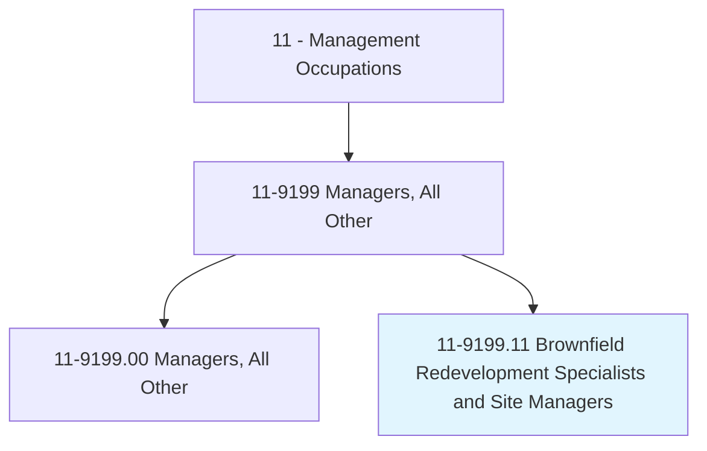
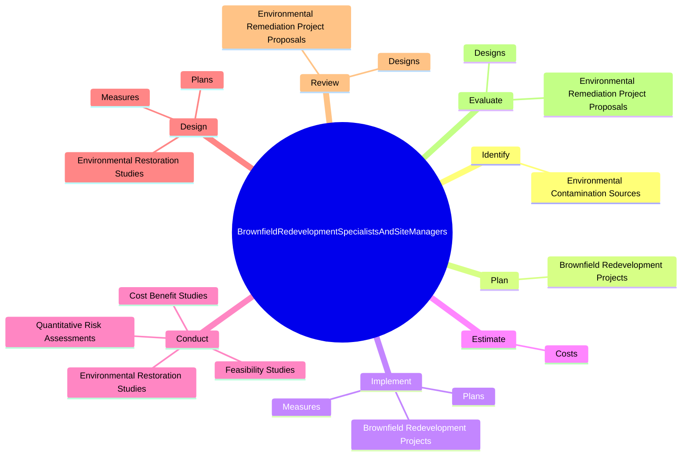
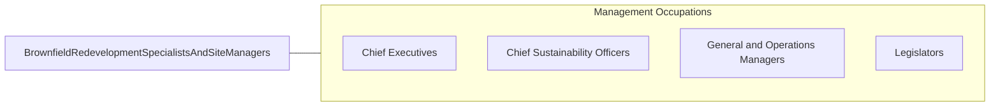

# Brownfield Redevelopment Specialists and Site Managers

> Plan and direct cleanup and redevelopment of contaminated properties for reuse. Does not include properties sufficiently contaminated to qualify as Superfund sites.

## Overview

Brownfield Redevelopment Specialists and Site Managers is a specialized variant within the Management Occupations category. Plan and direct cleanup and redevelopment of contaminated properties for reuse. 

## Classification Hierarchy

## Key Statistics

| Metric | Value |
|--------|-------|
| SOC Code | 11-9199.11 |
| Category | [Management Occupations](/occupations/Management) |
| Task Count | 77 |
| Source | O*NET |

## Core Tasks

### identify.EnvironmentalContaminationSources

Brownfield Redevelopment Specialists and Site Managers identify environmental contamination sources as part of their core responsibilities.

**Actions:**
- `identify.EnvironmentalContaminationSources`

### plan.BrownfieldRedevelopmentProjects

Brownfield Redevelopment Specialists and Site Managers plan brownfield redevelopment projects as part of their core responsibilities.

**Actions:**
- `plan.BrownfieldRedevelopmentProjects.to.ensure.Safety`
- `plan.BrownfieldRedevelopmentProjects.to.Quality`
- `plan.BrownfieldRedevelopmentProjects.to.ComplianceWithApplicableStandards`
- `plan.BrownfieldRedevelopmentProjects.to.Requirements`

### implement.BrownfieldRedevelopmentProjects

Brownfield Redevelopment Specialists and Site Managers implement brownfield redevelopment projects as part of their core responsibilities.

**Actions:**
- `implement.BrownfieldRedevelopmentProjects.to.ensure.Safety`
- `implement.BrownfieldRedevelopmentProjects.to.Quality`
- `implement.BrownfieldRedevelopmentProjects.to.ComplianceWithApplicableStandards`
- `implement.BrownfieldRedevelopmentProjects.to.Requirements`

## Skills & Competencies

### Technical Skills
- **Strategic Planning** - Advanced
- **Financial Management** - Advanced
- **Operations Management** - Advanced

### Soft Skills
- **Communication** - Essential
- **Problem Solving** - Essential
- **Critical Thinking** - Important
- **Teamwork** - Important
- **Adaptability** - Important

## Related Occupations

## Industries

This occupation is found across multiple industries. See [Industries](/industries) for sector-specific employment data.

## Career Progression

---

*Source: O*NET 11-9199.11 - ONETOccupation*
