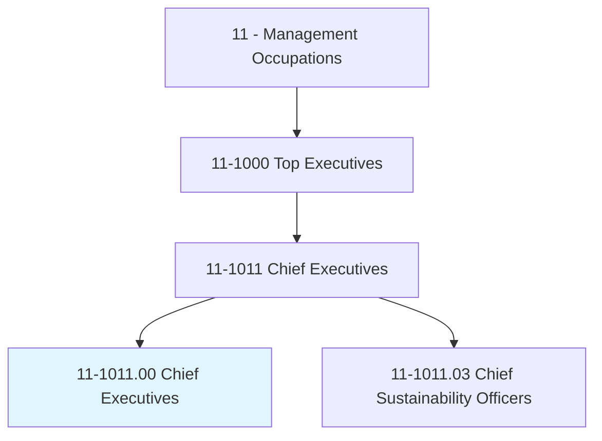
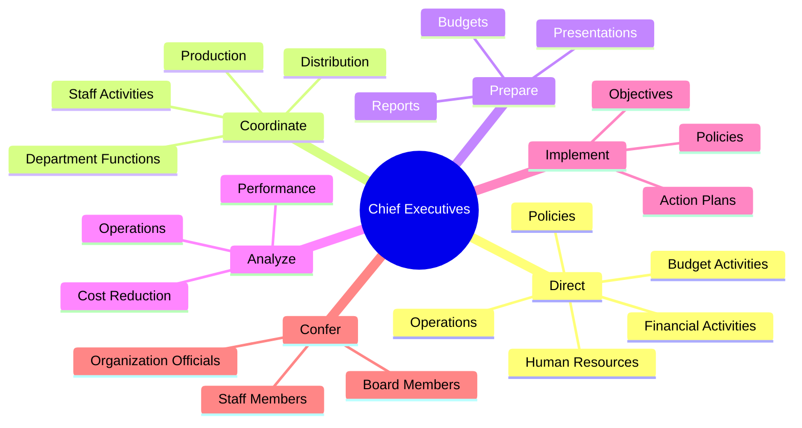
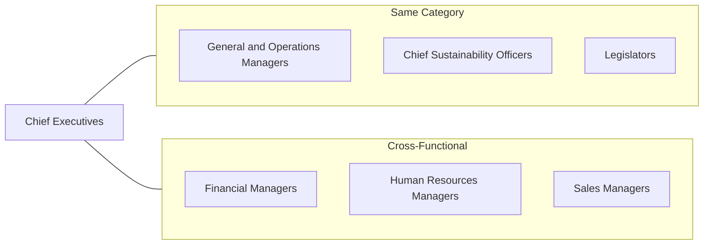
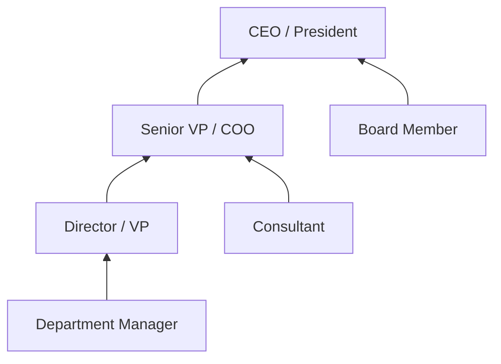

# Chief Executives

> Determine and formulate policies and provide overall direction of companies or private and public sector organizations within guidelines set up by a board of directors or similar governing body. Plan, direct, or coordinate operational activities at the highest level of management with the help of subordinate executives and staff managers.

## Overview

Chief Executives serve as the top leadership of organizations, responsible for setting strategic direction, making high-stakes decisions, and ensuring organizational success. They work across all sectors including corporations, nonprofits, and government agencies, translating board directives into actionable strategies while managing complex stakeholder relationships. This role demands exceptional leadership, strategic thinking, and the ability to balance short-term operational needs with long-term organizational vision.

## Classification Hierarchy

## Key Statistics

| Metric | Value |
|--------|-------|
| SOC Code | 11-1011.00 |
| Job Zone | 5 (Extensive Preparation) |
| Category | [Management](/occupations/Management/index) |
| Core Tasks | 15+ |
| Source | O*NET |

## Core Tasks

### direct.OrganizationsFinancial

Chief Executives direct the organization's financial and budget activities to ensure fiscal health and strategic resource allocation.

**Actions:**
- `direct.OrganizationsFinancial.to.fund.Operations` - Allocate financial resources to support ongoing operational needs
- `direct.OrganizationsFinancial.to.maximize.Investments` - Optimize investment strategies for maximum returns
- `direct.OrganizationsFinancial.to.increase.Efficiency` - Drive cost efficiency across all financial operations
- `direct.BudgetActivities.to.fund.Operations` - Manage budgets to ensure adequate operational funding

### confer.OrganizationOfficials

Chief Executives maintain strategic communication with key stakeholders to align organizational efforts.

**Actions:**
- `confer.OrganizationOfficials.to.discuss.Issues` - Engage leadership in strategic discussions
- `confer.OrganizationOfficials.to.coordinate.Activities` - Synchronize cross-functional initiatives
- `confer.StaffMembers.to.resolve.Problems` - Address operational challenges through staff engagement

### prepare.Budgets

Chief Executives develop comprehensive budgets that support organizational objectives.

**Actions:**
- `prepare.Budgets.for.Approval` - Create budgets for board review and approval
- `prepare.Budgets.for.Funding.of.Programs` - Develop program-specific budget allocations
- `prepare.Budgets.for.Implementation.of.Programs` - Budget for new initiative rollouts

### direct.Policies

Chief Executives establish and implement policies that govern organizational operations.

**Actions:**
- `direct.Policies.of.Organizations.to.ensure.ContinuingOperations` - Create policies for operational continuity
- `direct.Policies.of.maximize.ReturnsOnInvestments` - Develop ROI-focused policy frameworks
- `direct.Policies.of.increase.Productivity` - Implement productivity enhancement policies

### analyze.Operations

Chief Executives evaluate organizational performance to identify improvement opportunities.

**Actions:**
- `analyze.Operations.to.evaluate.Performance` - Assess company and staff performance against objectives
- `analyze.Operations.to.program.Improvement` - Identify program enhancement opportunities
- `analyze.Operations.to.PolicyChange` - Determine when policy adjustments are needed

## Skills & Competencies

### Technical Skills
- **Strategic Planning** - Expert
- **Financial Management** - Advanced
- **Operations Management** - Advanced
- **Business Development** - Advanced
- **Risk Management** - Advanced

### Soft Skills
- **Leadership** - Critical
- **Decision Making** - Critical
- **Communication** - Critical
- **Negotiation** - Essential
- **Problem Solving** - Essential

## Related Occupations

## Industries

- [Professional, Scientific, and Technical Services](/industries/Scientific) - High Employment
- [Manufacturing](/industries/Manufacturing/index) - High Employment
- [Finance and Insurance](/industries/Finance) - High Employment
- [Healthcare and Social Assistance](/industries/Healthcare/index) - Moderate Employment
- [Retail Trade](/industries/Retail/index) - Moderate Employment

## Career Progression

## Education & Training

| Requirement | Details |
|-------------|---------|
| Typical Education | Bachelor's or Master's degree in Business, Finance, or related field |
| Work Experience | 10+ years in progressively senior management roles |
| On-the-Job Training | Extensive executive coaching and leadership development |
| Common Certifications | MBA, Executive Education Programs |

## Departments

This occupation typically works in:
- [Executive Office](/departments/Executive/index)
- [Corporate Strategy](/departments/Strategy/index)
- Board Relations

---

*Source: O*NET 11-1011.00 - ONETOccupation*
