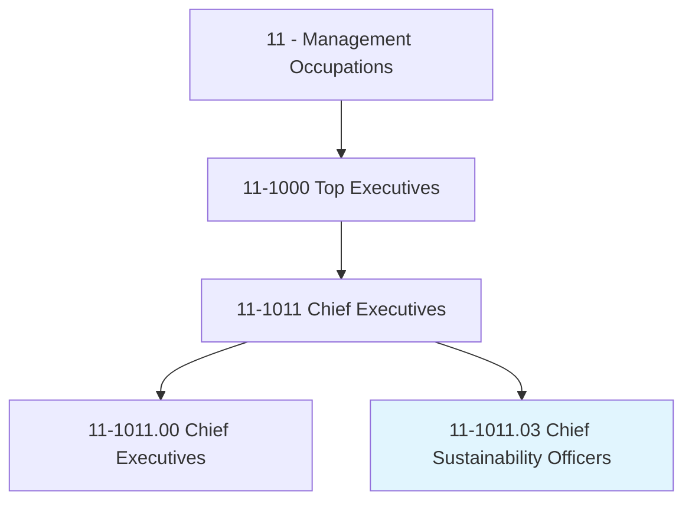
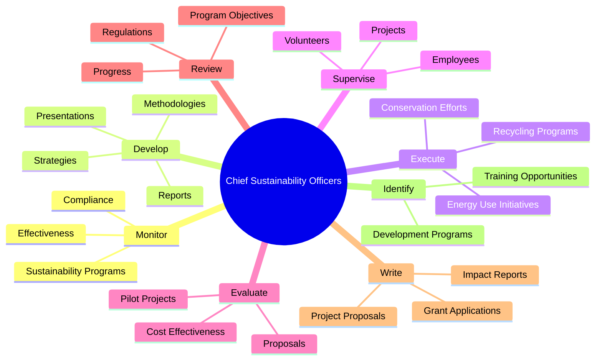
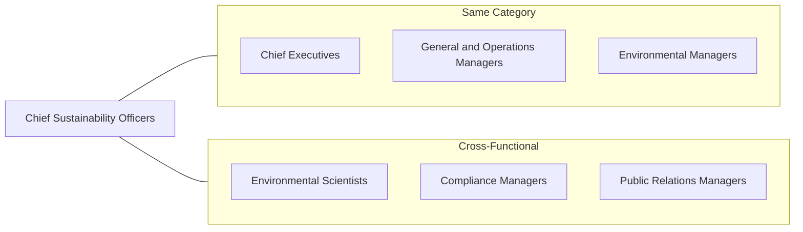
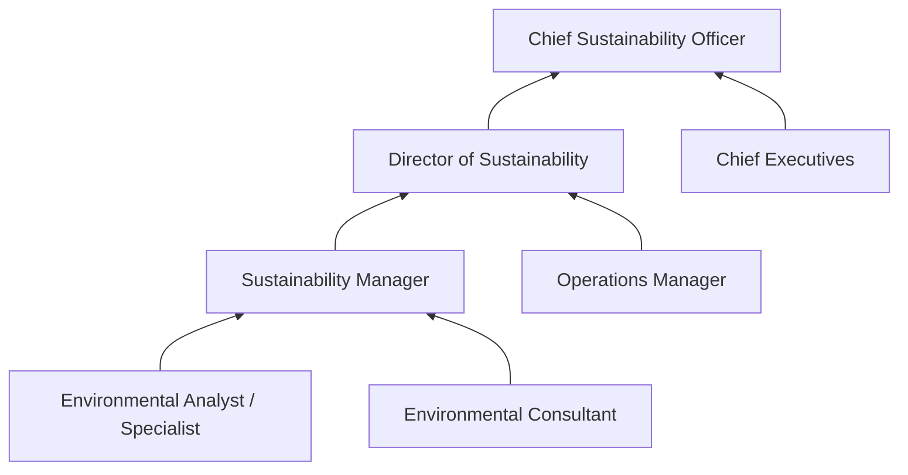

# Chief Sustainability Officers

> Communicate and coordinate with management, shareholders, customers, and employees to address sustainability issues. Enact or oversee a corporate sustainability strategy.

## Overview

Chief Sustainability Officers (CSOs) are executive-level leaders responsible for developing and implementing organizational strategies that address environmental, social, and governance (ESG) concerns. They bridge the gap between business objectives and sustainability goals, working across all departments to embed sustainable practices into operations, supply chains, and corporate culture. CSOs monitor regulatory compliance, track sustainability metrics, and communicate progress to stakeholders including investors, regulators, and the public.

## Classification Hierarchy

## Key Statistics

| Metric | Value |
|--------|-------|
| SOC Code | 11-1011.03 |
| Job Zone | 5 (Extensive Preparation) |
| Category | [Management](/occupations/Management/index) |
| Core Tasks | 20+ |
| Source | O*NET |

## Core Tasks

### monitor.Effectiveness

Chief Sustainability Officers continuously assess the performance and impact of sustainability initiatives.

**Actions:**
- `monitor.Effectiveness.of.SustainabilityPrograms` - Track key performance indicators for environmental programs
- `evaluate.Effectiveness.of.SustainabilityPrograms` - Assess program outcomes against established goals

### develop.Strategies

Chief Sustainability Officers create comprehensive strategies to address environmental challenges.

**Actions:**
- `develop.Strategies.to.address.Issues` - Create solutions for sustainability challenges
- `develop.Strategies.to.EnergyUse` - Design energy efficiency programs
- `develop.Strategies.to.resource.Conservation` - Plan resource optimization initiatives
- `develop.Strategies.to.Recycling` - Implement waste reduction programs
- `develop.Strategies.to.PollutionReduction` - Address emissions and pollution
- `develop.Strategies.to.WasteElimination` - Minimize organizational waste
- `develop.Strategies.to.BuildingDesign` - Guide sustainable facility development

### execute.Strategies

Chief Sustainability Officers implement environmental initiatives across the organization.

**Actions:**
- `execute.Strategies.to.EnergyUse` - Roll out energy management programs
- `execute.Strategies.to.resource.Conservation` - Implement conservation measures
- `execute.Strategies.to.Recycling` - Activate recycling initiatives
- `execute.Strategies.to.transportation` - Deploy sustainable transportation options

### develop.SustainabilityReports

Chief Sustainability Officers create documentation and communications for diverse stakeholders.

**Actions:**
- `develop.SustainabilityReports.for.Supplier` - Prepare supplier sustainability scorecards
- `develop.SustainabilityReports.for.Employee` - Create internal sustainability communications
- `develop.SustainabilityReports.for.Academia` - Contribute to research partnerships
- `develop.SustainabilityReports.for.Media` - Develop press and media materials
- `develop.SustainabilityReports.for.Government` - Prepare regulatory compliance reports

### evaluate.Proposals

Chief Sustainability Officers assess and approve sustainability project proposals.

**Actions:**
- `evaluate.Proposals.for.SustainabilityProjects` - Review project viability
- `evaluate.Proposals.for.CostEffectiveness` - Analyze financial sustainability
- `evaluate.Proposals.for.TechnicalFeasibility` - Assess implementation practicality
- `approve.Proposals.for.Integration.with.OtherInitiatives` - Ensure strategic alignment

### direct.SustainabilityProgramOperations

Chief Sustainability Officers ensure programs meet regulatory and organizational requirements.

**Actions:**
- `direct.SustainabilityProgramOperations.to.ensure.ComplianceWithEnvironmentalRegulations` - Maintain regulatory compliance
- `direct.SustainabilityProgramOperations.to.GovernmentalRegulations` - Navigate government requirements

### write.ImpactReports

Chief Sustainability Officers document and communicate organizational impact.

**Actions:**
- `write.FinancialImpactReports` - Quantify financial benefits of sustainability
- `write.EnvironmentalImpactReports` - Document environmental outcomes
- `write.ProjectProposals.to.pursue.FundingForEnvironmentalInitiatives` - Secure funding for new programs
- `write.GrantApplications.to.pursue.FundingForEnvironmentalInitiatives` - Apply for sustainability grants

## Skills & Competencies

### Technical Skills
- **Environmental Science** - Advanced
- **Sustainability Metrics & Reporting** - Expert
- **Regulatory Compliance** - Advanced
- **Project Management** - Advanced
- **Data Analysis** - Advanced
- **Carbon Accounting** - Advanced

### Soft Skills
- **Strategic Thinking** - Critical
- **Stakeholder Management** - Critical
- **Communication** - Critical
- **Change Management** - Essential
- **Cross-Functional Leadership** - Essential
- **Influence & Persuasion** - Essential

## Related Occupations

## Industries

- [Professional, Scientific, and Technical Services](/industries/Scientific) - High Employment
- [Manufacturing](/industries/Manufacturing/index) - High Employment
- [Utilities](/industries/Utilities/index) - High Employment
- Mining, Quarrying, and Oil and Gas - Moderate Employment
- [Finance and Insurance](/industries/Finance) - Growing Employment

## Career Progression

## Education & Training

| Requirement | Details |
|-------------|---------|
| Typical Education | Bachelor's or Master's degree in Environmental Science, Business, or Engineering |
| Work Experience | 10+ years in sustainability, environmental management, or related fields |
| On-the-Job Training | Extensive experience with ESG frameworks and sustainability reporting |
| Common Certifications | LEED AP, CDP Certification, GRI Standards, SASB FSA Credential |

## Departments

This occupation typically works in:
- [Executive Office](/departments/Executive/index)
- Sustainability / ESG
- [Corporate Strategy](/departments/Strategy/index)
- [Operations](/departments/Operations/index)

---

*Source: O*NET 11-1011.03 - ONETOccupation*
