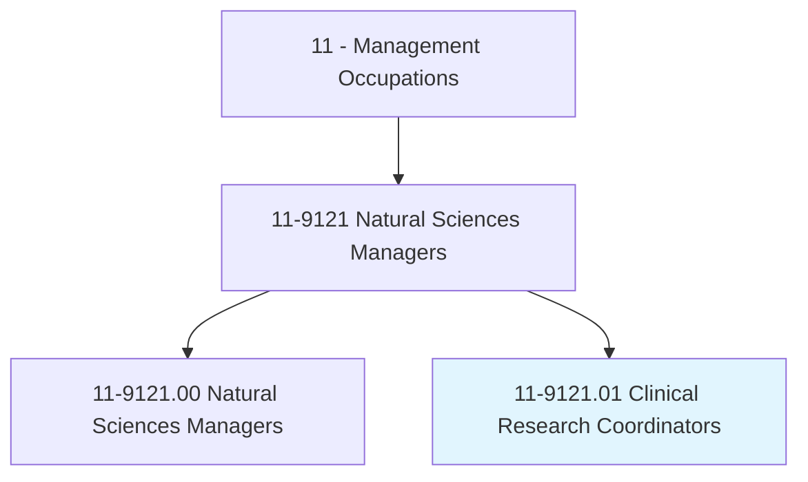
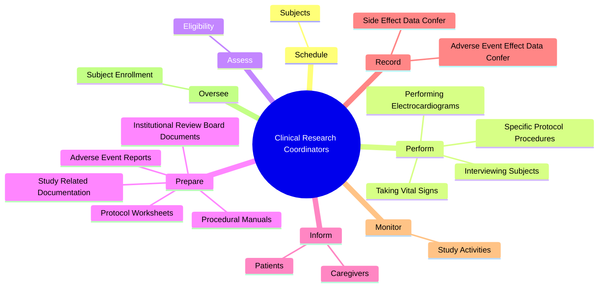
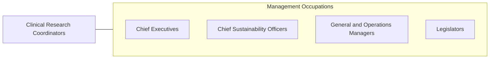

# Clinical Research Coordinators

> Plan, direct, or coordinate clinical research projects. Direct the activities of workers engaged in clinical research projects to ensure compliance with protocols and overall clinical objectives. May evaluate and analyze clinical data.

## Overview

Clinical Research Coordinators is a specialized variant within the Management Occupations category. Plan, direct, or coordinate clinical research projects. Direct the activities of workers engaged in clinical research projects to ensure compliance with protocols and overall clinical objectives.

## Classification Hierarchy

## Key Statistics

| Metric | Value |
|--------|-------|
| SOC Code | 11-9121.01 |
| Category | [Management Occupations](/occupations/Management/index) |
| Task Count | 95 |
| Source | O*NET |

## Core Tasks

### schedule.Subjects

Clinical Research Coordinators schedule subjects as part of their core responsibilities.

**Actions:**
- `schedule.Subjects.for.Appointments`
- `schedule.Subjects.for.Procedures`
- `schedule.Subjects.for.InpatientStaysAsRequired.by.StudyProtocols`

### perform.SpecificProtocolProcedures

Clinical Research Coordinators perform specific protocol procedures as part of their core responsibilities.

**Actions:**
- `perform.SpecificProtocolProcedures`
- `perform.InterviewingSubjects`
- `perform.TakingVitalSigns`
- `perform.PerformingElectrocardiograms`

### assess.Eligibility

Clinical Research Coordinators assess eligibility as part of their core responsibilities.

**Actions:**
- `assess.Eligibility.of.PotentialSubjectsThroughMethods`
- `assess.Eligibility.of.ScreeningInterviews`
- `assess.Eligibility.of.Reviews.of.MedicalRecords`
- `assess.Eligibility.of.Discussions.with.Physicians`

## Skills & Competencies

### Technical Skills
- **Strategic Planning** - Advanced
- **Financial Management** - Advanced
- **Operations Management** - Advanced

### Soft Skills
- **Communication** - Essential
- **Problem Solving** - Essential
- **Critical Thinking** - Important
- **Teamwork** - Important
- **Adaptability** - Important

## Related Occupations

## Industries

This occupation is found across multiple industries. See [Industries](/industries) for sector-specific employment data.

## Career Progression

---

*Source: O*NET 11-9121.01 - ONETOccupation*
