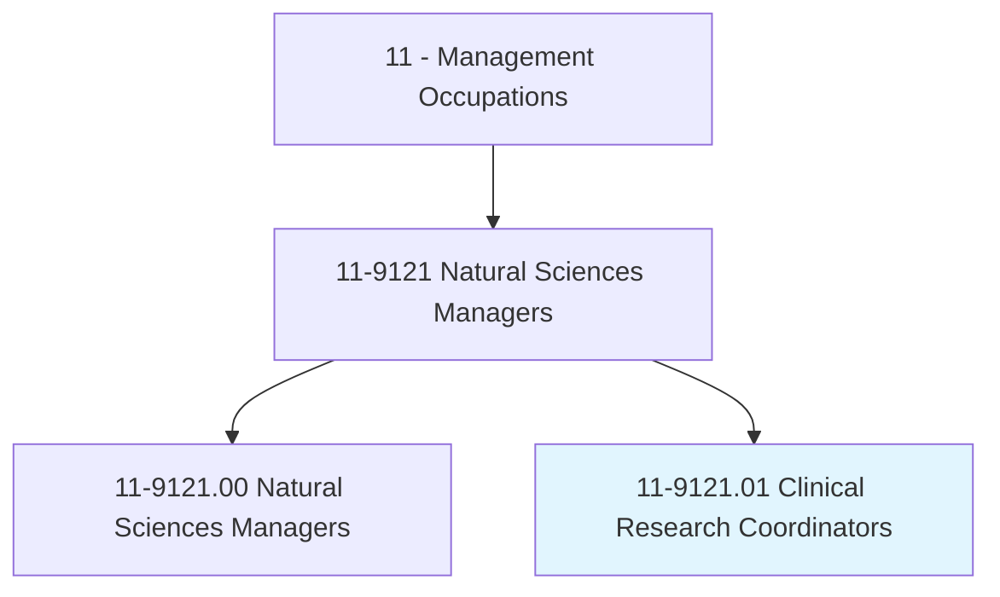
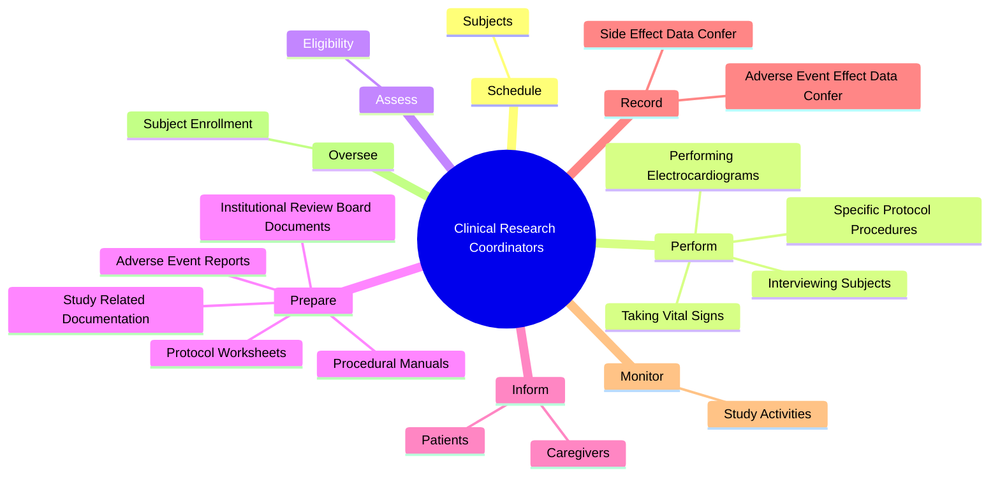
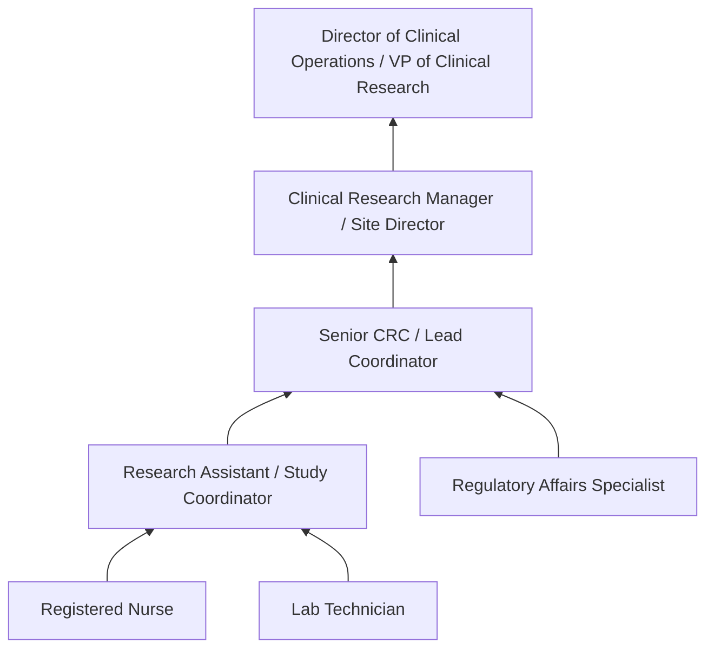
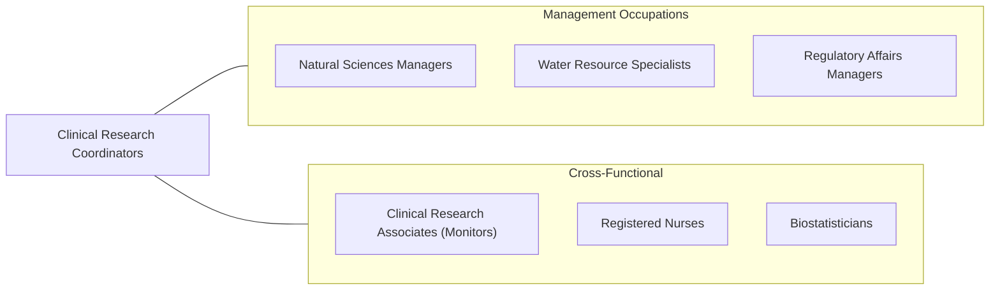

# Clinical Research Coordinators

> Plan, direct, or coordinate clinical research projects. Direct the activities of workers engaged in clinical research projects to ensure compliance with protocols and overall clinical objectives. May evaluate and analyze clinical data.

## Overview

Clinical Research Coordinators (CRCs) manage the day-to-day operations of clinical trials and research studies. They serve as the primary point of contact between research sponsors, investigators, regulatory bodies, and study participants. Their work ensures that clinical trials are conducted in compliance with Good Clinical Practice (GCP) guidelines, FDA regulations, and Institutional Review Board (IRB) requirements while maintaining the safety and well-being of research subjects.

CRCs handle the full lifecycle of clinical studies: screening and enrolling participants, administering study protocols, collecting and documenting data, managing adverse event reporting, and preparing regulatory submissions. They must maintain meticulous documentation, as the integrity of clinical trial data underpins regulatory decisions about new drugs, devices, and treatments. The role requires both scientific literacy and exceptional organizational skills.

The demand for Clinical Research Coordinators has grown significantly with the expansion of pharmaceutical and biotech research, including cell and gene therapies, precision medicine, and decentralized clinical trials. CRCs increasingly leverage electronic data capture systems, remote monitoring tools, and telehealth platforms to manage complex, multi-site studies across global populations.

## Classification Hierarchy

## Key Statistics

| Metric | Value |
|--------|-------|
| SOC Code | 11-9121.01 |
| Job Zone | 4 (Considerable Preparation) |
| Category | [Management Occupations](/occupations/Management/index) |
| Task Count | 95 |
| Salary Range | $50,000 - $95,000+ |
| Employment Level | Growing |
| Growth Outlook | Faster than average |
| Source | O*NET |

## Core Tasks

### schedule.Subjects

Clinical Research Coordinators schedule study participants for appointments, procedures, and inpatient stays as required by study protocols.

**Actions:**
- `schedule.Subjects.for.Appointments`
- `schedule.Subjects.for.Procedures`
- `schedule.Subjects.for.InpatientStaysAsRequired.by.StudyProtocols`

### assess.Eligibility

Clinical Research Coordinators evaluate potential study participants through screening interviews, medical record reviews, and physician consultations to determine protocol eligibility.

**Actions:**
- `assess.Eligibility.of.PotentialSubjectsThroughMethods`
- `assess.Eligibility.of.ScreeningInterviews`
- `assess.Eligibility.of.Reviews.of.MedicalRecords`
- `assess.Eligibility.of.Discussions.with.Physicians`

### prepare.StudyRelatedDocumentation

Clinical Research Coordinators prepare and maintain comprehensive study documentation including protocol worksheets, procedural manuals, adverse event reports, and IRB submissions.

**Actions:**
- No specific sub-actions listed for this task group.

## Skills & Competencies

### Technical Skills
- **Good Clinical Practice (GCP)** - Expert
- **Protocol Management** - Expert
- **Regulatory Compliance (FDA, ICH)** - Advanced
- **Data Collection & Documentation** - Advanced
- **Informed Consent Process** - Advanced
- **Adverse Event Reporting** - Advanced
- **Medical Terminology** - Advanced

### Soft Skills
- **Attention to Detail** - Critical
- **Communication** - Critical
- **Organizational Skills** - Essential
- **Ethical Judgment** - Essential
- **Patient Interaction** - Essential
- **Problem Solving** - Important
- **Multitasking** - Important

## Education & Certifications

| Requirement | Details |
|-------------|---------|
| Typical Education | Bachelor's degree in Nursing, Life Sciences, Public Health, or related field |
| Advanced Education | Master's in Clinical Research or Public Health for senior roles |
| Work Experience | 1-3 years in clinical research, healthcare, or related field |
| Common Certifications | CCRC (Certified Clinical Research Coordinator - ACRP), CCRA (Certified Clinical Research Associate - ACRP), CCRP (Certified Clinical Research Professional - SoCRA), GCP Training Certificate |

## Career Progression

## Industry Variations

- **Academic Medical Centers** - Investigator-initiated studies; NIH-funded research; multi-disciplinary trials; IRB coordination
- **Pharmaceutical Companies** - Sponsor-driven protocols; multi-site coordination; global study management; NDA support
- **Contract Research Organizations (CROs)** - Multi-sponsor portfolio management; site selection; monitoring visits; flexible therapeutic areas
- **Medical Device Companies** - IDE trials; 510(k) studies; post-market surveillance; device-specific protocol design

## Technology & Tools

- **Electronic Data Capture** - Medidata Rave, Oracle InForm, REDCap, Veeva Vault CDMS
- **Clinical Trial Management** - Veeva Vault CTMS, Oracle Siebel CTMS, Medidata
- **eConsent** - Medidata Rave eConsent, Florence, Signant Health
- **CTMS / IRB** - IRBManager, IRBNET, Advarra
- **Regulatory** - FDA CDER databases, ClinicalTrials.gov, EudraVigilance
- **Communication** - REDCap, patient portals, telehealth platforms

## Related Occupations

## Industries

- [Professional, Scientific, and Technical Services](/industries/ProfessionalServices) - High Employment
- [Healthcare and Social Assistance](/industries/Healthcare/index) - High Employment
- [Manufacturing (Pharmaceutical)](/industries/Manufacturing/index) - Moderate Employment
- [Educational Services (Academic Research)](/industries/Education) - Moderate Employment

## Departments

This occupation typically works in:
- [Clinical Research / Clinical Operations](/departments/ClinicalResearch)
- [Research Administration](/departments/ResearchAdmin)
- [Regulatory Affairs](/departments/RegulatoryAffairs)

---

*Source: O*NET 11-9121.01 - ONETOccupation*
