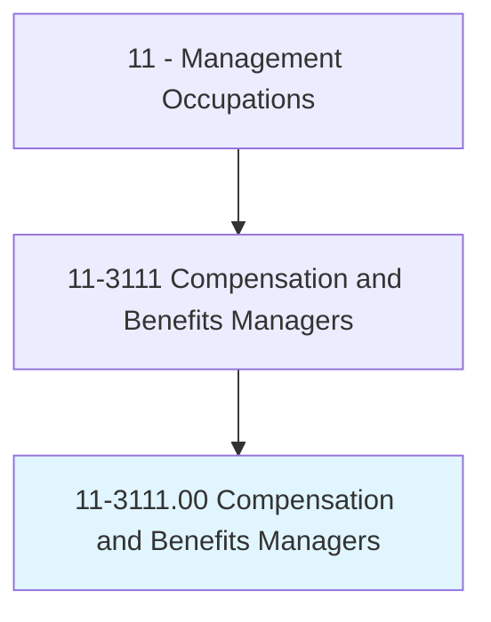
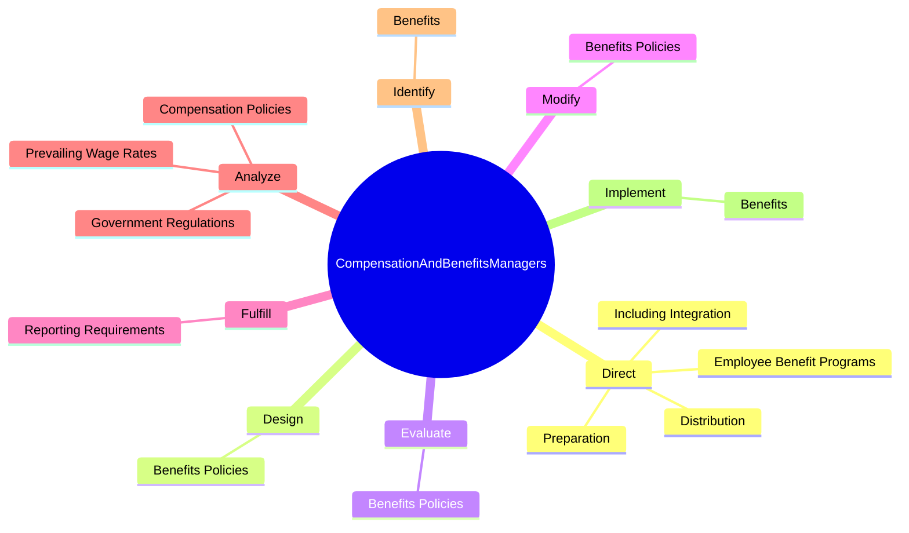
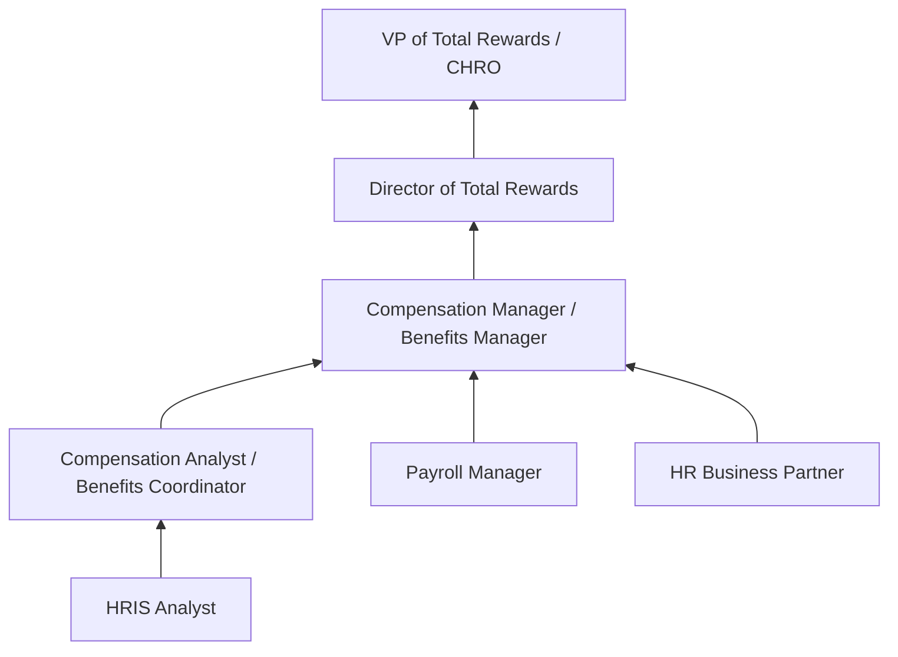
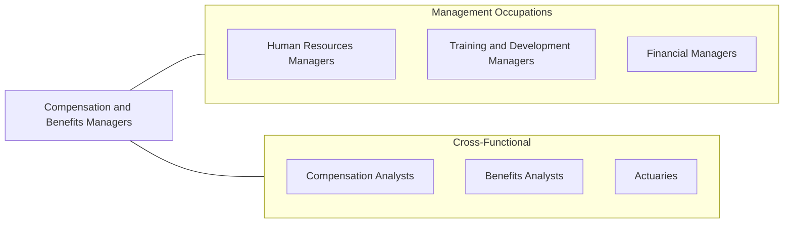

# Compensation and Benefits Managers

> Plan, direct, or coordinate compensation and benefits activities of an organization.

## Overview

Compensation and Benefits Managers design and oversee the programs that determine how employees are paid and what benefits they receive. They ensure that an organization's total rewards strategy attracts top talent, retains high performers, and aligns with the company's financial objectives and market positioning. This includes base pay structures, incentive programs, health insurance, retirement plans, and non-traditional benefits.

These managers conduct extensive market research and benchmarking to ensure compensation remains competitive within their industry and geographic region. They analyze job descriptions, evaluate positions, and develop pay grades and salary ranges. On the benefits side, they negotiate with insurance carriers, manage retirement plan compliance, and evaluate emerging benefit offerings such as mental health programs, student loan repayment, and flexible work arrangements.

The role requires deep knowledge of tax law, ERISA regulations, FLSA requirements, and state-specific compensation rules. Compensation and Benefits Managers must also communicate complex plan details to employees and collaborate with finance, legal, and HR teams to align total rewards with organizational strategy.

## Classification Hierarchy

## Key Statistics

| Metric | Value |
|--------|-------|
| SOC Code | 11-3111.00 |
| Job Zone | 4 (Considerable Preparation) |
| Category | [Management Occupations](/occupations/Management/index) |
| Task Count | 107 |
| Salary Range | $85,000 - $165,000+ |
| Employment Level | Small - approximately 17,000 |
| Growth Outlook | Average |
| Source | O*NET |

## Core Tasks

### direct.Preparation

Compensation and Benefits Managers direct the preparation and distribution of compensation and benefits information to ensure employees understand their total rewards package.

**Actions:**
- `direct.Preparation.of.WrittenInformation.to.inform.EmployeesOfBenefits`
- `direct.Preparation.of.VerbalInformation.to.inform.EmployeesOfBenefits`
- `direct.Preparation.of.Compensation`
- `direct.Preparation.of.PersonnelPolicies`

### design.BenefitsPolicies

Compensation and Benefits Managers design benefits policies that balance competitiveness, legal compliance, and organizational affordability.

**Actions:**
- `design.BenefitsPolicies.to.ensure.ProgramsAreCurrent`
- `design.BenefitsPolicies.to.Competitive`
- `design.BenefitsPolicies.to.InComplianceWithLegalRequirements`

### evaluate.BenefitsPolicies

Compensation and Benefits Managers evaluate existing policies against market benchmarks and regulatory changes to identify areas for improvement.

**Actions:**
- `evaluate.BenefitsPolicies.to.ensure.ProgramsAreCurrent`
- `evaluate.BenefitsPolicies.to.Competitive`
- `evaluate.BenefitsPolicies.to.InComplianceWithLegalRequirements`

## Skills & Competencies

### Technical Skills
- **Compensation Analysis & Design** - Expert
- **Benefits Administration** - Expert
- **Job Evaluation & Classification** - Advanced
- **Tax & ERISA Compliance** - Advanced
- **Statistical Analysis** - Advanced
- **Market Benchmarking** - Advanced
- **HRIS & Payroll Systems** - Advanced

### Soft Skills
- **Analytical Thinking** - Critical
- **Attention to Detail** - Critical
- **Communication** - Essential
- **Negotiation** - Essential
- **Strategic Planning** - Essential
- **Discretion & Confidentiality** - Essential

## Education & Certifications

| Requirement | Details |
|-------------|---------|
| Typical Education | Bachelor's degree in Human Resources, Business, Finance, or Accounting |
| Advanced Education | Master's degree or MBA frequently preferred |
| Work Experience | 5-8 years in compensation, benefits, or HR with increasing responsibility |
| On-the-Job Training | Moderate - ongoing regulatory and market knowledge development |
| Common Certifications | CCP (Certified Compensation Professional - WorldatWork), CBP (Certified Benefits Professional - WorldatWork), CEBS (Certified Employee Benefit Specialist - IFEBP/Wharton), SHRM-SCP (SHRM), PHR/SPHR (HRCI) |

## Career Progression

## Industry Variations

- **Technology** - Complex equity compensation (RSUs, stock options); global pay parity; innovative benefits (wellness stipends, unlimited PTO)
- **Financial Services** - Performance-based bonus structures; deferred compensation; regulatory requirements for executive pay disclosure
- **Healthcare** - Shift differentials; tuition reimbursement; malpractice coverage; complex benefits for clinical and non-clinical staff
- **Government / Public Sector** - Defined benefit pension plans; pay grade systems (GS scale); union-negotiated benefits packages

## Technology & Tools

- **Compensation Platforms** - PayScale, Salary.com CompAnalyst, Mercer WIN, Radford
- **Benefits Administration** - Benefitfocus, bswift, Businessolver, PlanSource
- **HRIS / Payroll** - Workday, ADP, SAP SuccessFactors, UKG
- **Analytics** - Excel (advanced modeling), Tableau, Power BI
- **Survey Tools** - Mercer, Willis Towers Watson, Aon Hewitt compensation surveys
- **Compliance** - ERISA compliance tools, ACA reporting systems

## Related Occupations

## Industries

- [Professional, Scientific, and Technical Services](/industries/ProfessionalServices) - High Employment
- [Finance and Insurance](/industries/FinanceInsurance) - High Employment
- [Healthcare and Social Assistance](/industries/Healthcare/index) - Moderate Employment
- [Manufacturing](/industries/Manufacturing/index) - Moderate Employment
- [Government](/industries/Government) - Moderate Employment

## Departments

This occupation typically works in:
- [Human Resources](/departments/HumanResources/index)
- [Total Rewards](/departments/TotalRewards)
- [Finance](/departments/Finance/index)
- [Payroll](/departments/Payroll)

---

*Source: O*NET 11-3111.00 - ONETOccupation*
