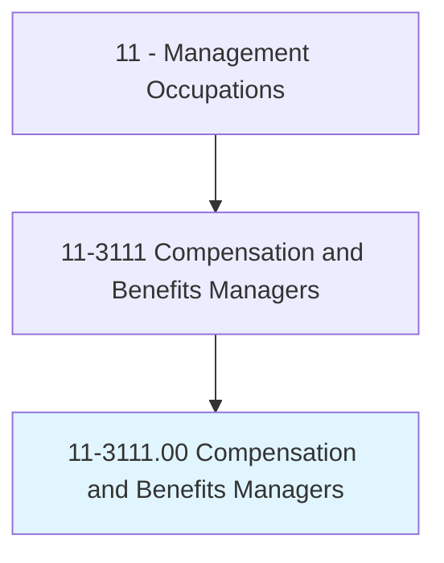
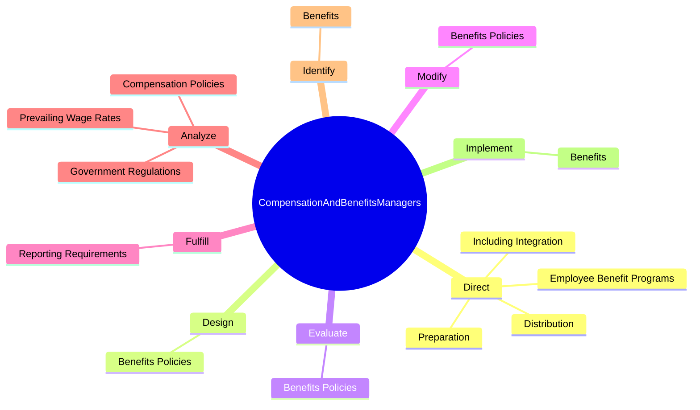
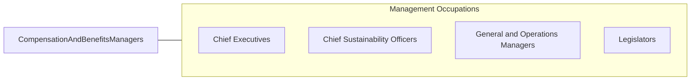

# Compensation and Benefits Managers

> Plan, direct, or coordinate compensation and benefits activities of an organization.

## Overview

Compensation and Benefits Managers is classified under Management Occupations (SOC 11). Plan, direct, or coordinate compensation and benefits activities of an organization.

## Classification Hierarchy

## Key Statistics

| Metric | Value |
|--------|-------|
| SOC Code | 11-3111.00 |
| Category | [Management Occupations](/occupations/Management) |
| Task Count | 107 |
| Source | O*NET |

## Core Tasks

### direct.Preparation

Compensation and Benefits Managers direct preparation as part of their core responsibilities.

**Actions:**
- `direct.Preparation.of.WrittenInformation.to.inform.EmployeesOfBenefits`
- `direct.Preparation.of.VerbalInformation.to.inform.EmployeesOfBenefits`
- `direct.Preparation.of.Compensation`
- `direct.Preparation.of.PersonnelPolicies`

### design.BenefitsPolicies

Compensation and Benefits Managers design benefits policies as part of their core responsibilities.

**Actions:**
- `design.BenefitsPolicies.to.ensure.ProgramsAreCurrent`
- `design.BenefitsPolicies.to.Competitive`
- `design.BenefitsPolicies.to.InComplianceWithLegalRequirements`

### evaluate.BenefitsPolicies

Compensation and Benefits Managers evaluate benefits policies as part of their core responsibilities.

**Actions:**
- `evaluate.BenefitsPolicies.to.ensure.ProgramsAreCurrent`
- `evaluate.BenefitsPolicies.to.Competitive`
- `evaluate.BenefitsPolicies.to.InComplianceWithLegalRequirements`

## Skills & Competencies

### Technical Skills
- **Strategic Planning** - Advanced
- **Financial Management** - Advanced
- **Operations Management** - Advanced

### Soft Skills
- **Communication** - Essential
- **Problem Solving** - Essential
- **Critical Thinking** - Important
- **Teamwork** - Important
- **Adaptability** - Important

## Related Occupations

## Industries

This occupation is found across multiple industries. See [Industries](/industries) for sector-specific employment data.

## Career Progression

---

*Source: O*NET 11-3111.00 - ONETOccupation*
