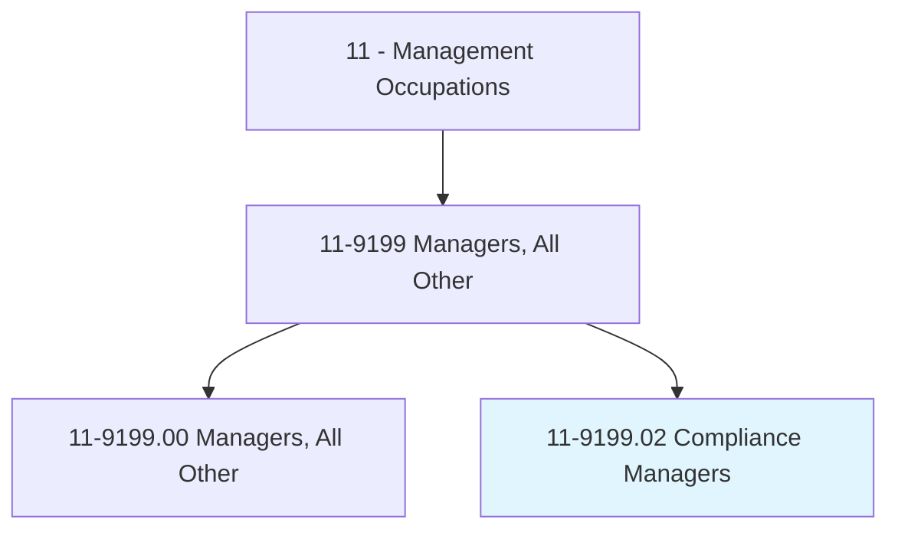
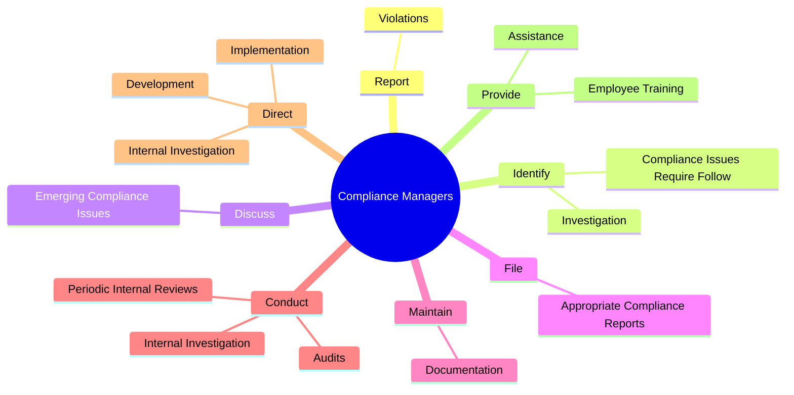
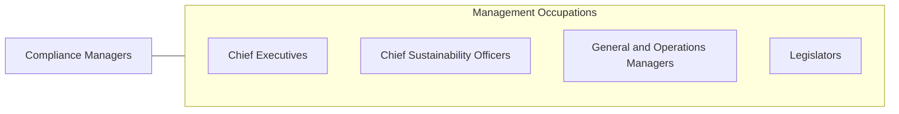

# Compliance Managers

> Plan, direct, or coordinate activities of an organization to ensure compliance with ethical or regulatory standards.

## Overview

Compliance Managers is classified under Management Occupations (SOC 11). Plan, direct, or coordinate activities of an organization to ensure compliance with ethical or regulatory standards.

## Classification Hierarchy

## Key Statistics

| Metric | Value |
|--------|-------|
| SOC Code | 11-9199.02 |
| Category | [Management Occupations](/occupations/Management/index) |
| Task Count | 90 |
| Source | O*NET |

## Core Tasks

### report.Violations

Compliance Managers report violations as part of their core responsibilities.

**Actions:**
- `report.Violations.of.ComplianceStandardsToDulyAuthorizedEnforcementAgenciesAsAppropriateRequired`
- `report.Violations.of.RegulatorystandardsToDulyAuthorizedEnforcementAgenciesAsAppropriateRequired`

### identify.ComplianceIssuesRequireFollow

Compliance Managers identify compliance issues require follow as part of their core responsibilities.

**Actions:**
- `identify.ComplianceIssuesRequireFollow.up`
- `identify.Investigation`

### discuss.EmergingComplianceIssues

Compliance Managers discuss emerging compliance issues as part of their core responsibilities.

**Actions:**
- `discuss.EmergingComplianceIssues.to.ensure.ManagementAreInformedAboutComplianceReportingSystems`
- `discuss.EmergingComplianceIssues.to.EmployeesAreInformedAboutComplianceReportingSystems`
- `discuss.EmergingComplianceIssues.to.Policies`
- `discuss.EmergingComplianceIssues.to.practices`

## Skills & Competencies

### Technical Skills
- **Strategic Planning** - Advanced
- **Financial Management** - Advanced
- **Operations Management** - Advanced

### Soft Skills
- **Communication** - Essential
- **Problem Solving** - Essential
- **Critical Thinking** - Important
- **Teamwork** - Important
- **Adaptability** - Important

## Related Occupations

## Industries

This occupation is found across multiple industries. See [Industries](/industries) for sector-specific employment data.

## Career Progression

---

*Source: O*NET 11-9199.02 - ONETOccupation*
