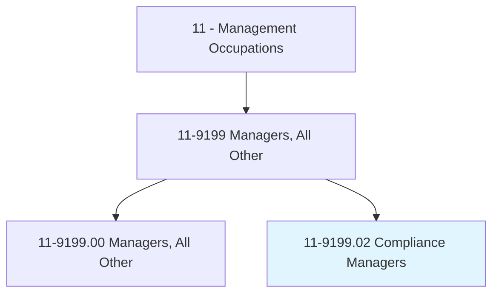
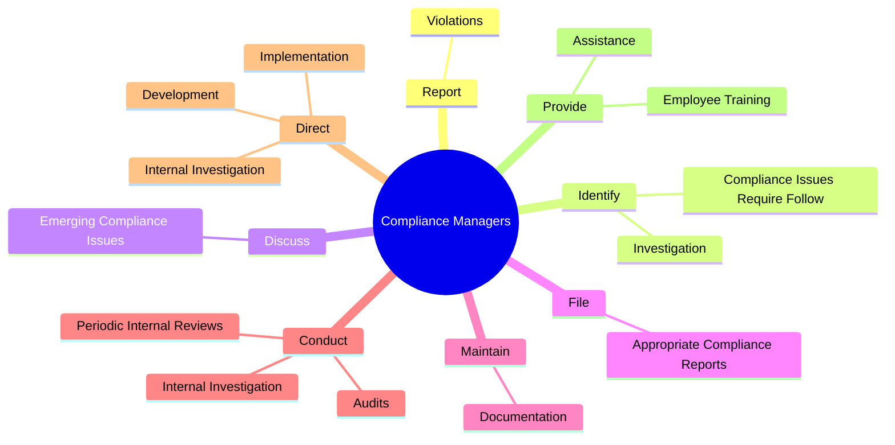
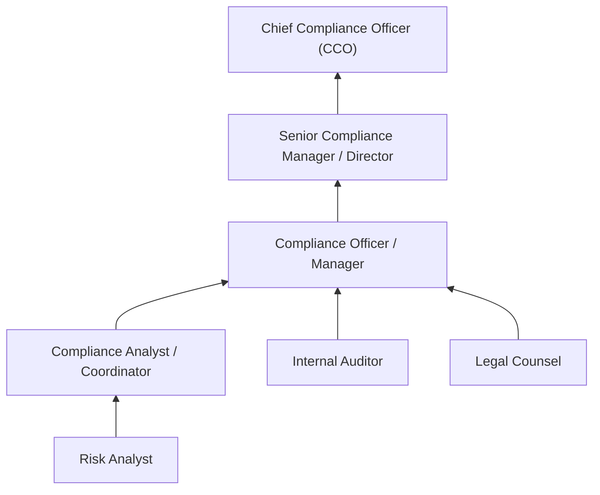
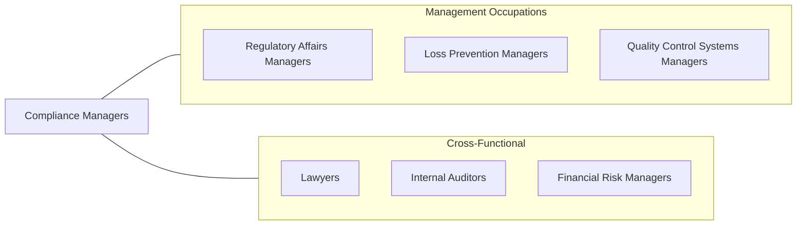

# Compliance Managers

> Plan, direct, or coordinate activities of an organization to ensure compliance with ethical or regulatory standards.

## Overview

Compliance Managers serve as the organizational guardians of ethical conduct and regulatory adherence. They design, implement, and oversee compliance programs that ensure organizations operate within the boundaries of applicable laws, regulations, and internal policies. Their work spans anti-corruption measures, data privacy, financial regulations, environmental standards, and industry-specific requirements.

In an era of increasing regulatory complexity, Compliance Managers play a critical role in protecting organizations from legal exposure, financial penalties, and reputational damage. They work closely with legal counsel, senior leadership, and departmental managers to embed a culture of compliance throughout the organization. This includes conducting risk assessments, developing training programs, investigating potential violations, and maintaining relationships with regulatory bodies.

The role requires a unique blend of legal knowledge, analytical thinking, and interpersonal skills. Compliance Managers must stay current with evolving regulations across multiple jurisdictions while communicating complex requirements in accessible terms to employees at all levels of the organization.

## Classification Hierarchy

## Key Statistics

| Metric | Value |
|--------|-------|
| SOC Code | 11-9199.02 |
| Job Zone | 4 (Considerable Preparation) |
| Category | [Management Occupations](/occupations/Management/index) |
| Task Count | 90 |
| Salary Range | $75,000 - $145,000+ |
| Employment Level | Moderate - Growing |
| Growth Outlook | Faster than average |
| Source | O*NET |

## Core Tasks

### report.Violations

Compliance Managers report violations of regulatory and ethical standards to appropriate enforcement agencies, ensuring that the organization meets its legal obligations for disclosure and self-reporting.

**Actions:**
- `report.Violations.of.ComplianceStandardsToDulyAuthorizedEnforcementAgenciesAsAppropriateRequired`
- `report.Violations.of.RegulatorystandardsToDulyAuthorizedEnforcementAgenciesAsAppropriateRequired`

### identify.ComplianceIssuesRequireFollow

Compliance Managers proactively identify compliance gaps and emerging issues that require investigation or remediation, using monitoring systems, audits, and employee reports.

**Actions:**
- `identify.ComplianceIssuesRequireFollow.up`
- `identify.Investigation`

### discuss.EmergingComplianceIssues

Compliance Managers communicate emerging regulatory changes and compliance risks to management and employees, ensuring organizational awareness of reporting systems and evolving policy requirements.

**Actions:**
- `discuss.EmergingComplianceIssues.to.ensure.ManagementAreInformedAboutComplianceReportingSystems`
- `discuss.EmergingComplianceIssues.to.EmployeesAreInformedAboutComplianceReportingSystems`
- `discuss.EmergingComplianceIssues.to.Policies`
- `discuss.EmergingComplianceIssues.to.practices`

## Skills & Competencies

### Technical Skills
- **Regulatory Analysis** - Expert
- **Risk Assessment & Management** - Expert
- **Audit & Investigation** - Advanced
- **Policy Development** - Advanced
- **Legal Research** - Advanced
- **Data Privacy & Security** - Advanced
- **Internal Controls Design** - Advanced

### Soft Skills
- **Ethical Judgment** - Critical
- **Communication** - Critical
- **Attention to Detail** - Critical
- **Analytical Thinking** - Essential
- **Stakeholder Management** - Essential
- **Conflict Resolution** - Important
- **Influence & Persuasion** - Important

## Education & Certifications

| Requirement | Details |
|-------------|---------|
| Typical Education | Bachelor's degree in Law, Business Administration, Finance, or related field |
| Advanced Education | J.D. or Master's degree often preferred for senior roles |
| Work Experience | 5-10 years in compliance, legal, audit, or risk management |
| On-the-Job Training | Moderate - ongoing regulatory education required |
| Common Certifications | CCEP (Compliance & Ethics Professional - SCCE), CRCM (Certified Regulatory Compliance Manager - ABA), CFE (Certified Fraud Examiner - ACFE), CAMS (Certified Anti-Money Laundering Specialist - ACAMS) |

## Career Progression

## Industry Variations

- **Financial Services** - Focus on SEC, FINRA, and banking regulations; BSA/AML compliance; Dodd-Frank requirements; consumer protection laws
- **Healthcare** - HIPAA privacy and security; FDA compliance; Medicare/Medicaid fraud prevention; clinical trial regulations
- **Pharmaceutical** - FDA submissions; Good Manufacturing Practice (GMP); adverse event reporting; anti-kickback statutes
- **Technology** - Data privacy (GDPR, CCPA); export controls; intellectual property compliance; AI governance

## Technology & Tools

- **GRC Platforms** - ServiceNow GRC, SAP GRC, RSA Archer, MetricStream
- **Case Management** - NAVEX Global, Convercent, ComplianceBridge
- **Regulatory Intelligence** - Thomson Reuters Regulatory Intelligence, LexisNexis
- **Training Platforms** - SAI Global, Skillcast, Traliant
- **Data Analytics** - Tableau, Power BI for compliance metrics and trending
- **Document Management** - SharePoint, OpenText for policy and audit documentation

## Related Occupations

## Industries

- [Financial Services](/industries/FinanceInsurance) - High Employment
- [Healthcare and Social Assistance](/industries/Healthcare/index) - High Employment
- [Manufacturing](/industries/Manufacturing/index) - Moderate Employment
- [Professional, Scientific, and Technical Services](/industries/ProfessionalServices) - Moderate Employment
- [Government](/industries/Government) - Moderate Employment

## Departments

This occupation typically works in:
- [Legal & Compliance](/departments/Legal/index)
- [Risk Management](/departments/RiskManagement)
- [Internal Audit](/departments/InternalAudit)
- [Corporate Governance](/departments/Governance)

---

*Source: O*NET 11-9199.02 - ONETOccupation*
