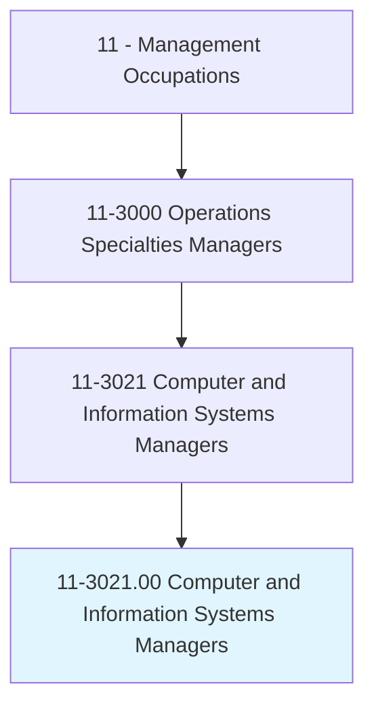
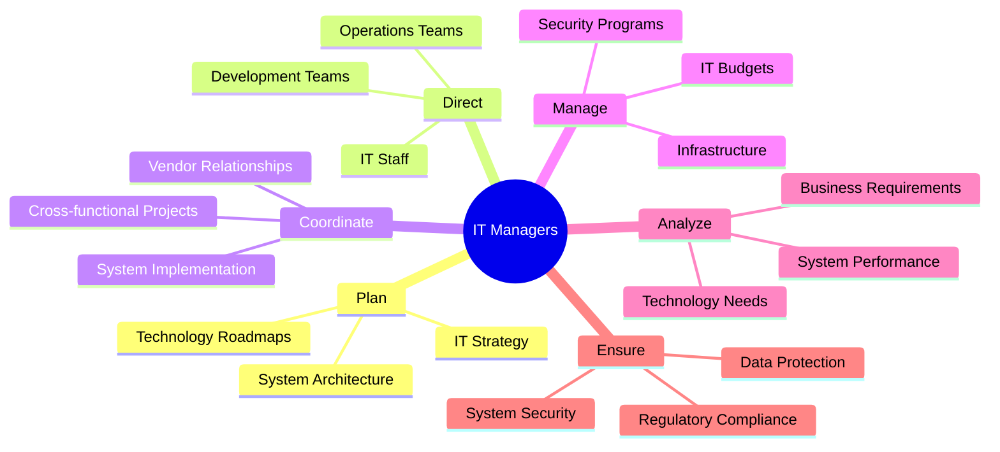
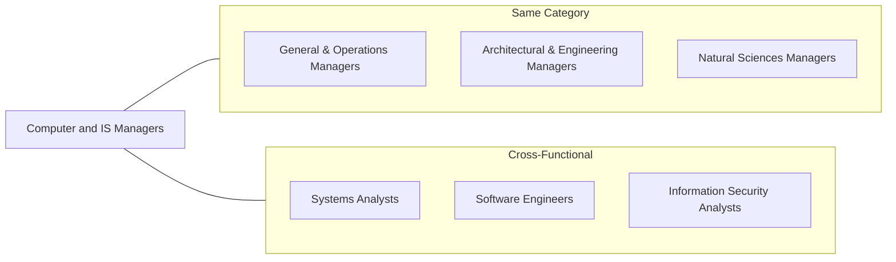
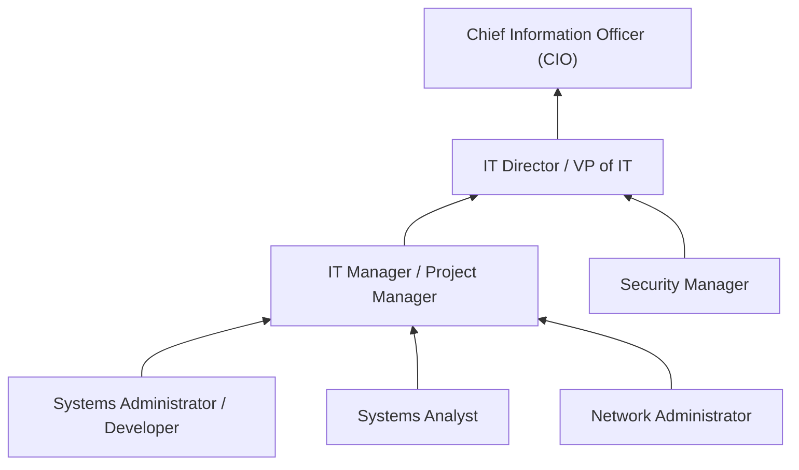

# Computer and Information Systems Managers

> Plan, direct, or coordinate activities in such fields as electronic data processing, information systems, systems analysis, and computer programming.

## Overview

Computer and Information Systems Managers (often called IT Managers, IT Directors, or Chief Information Officers) lead technology teams and oversee an organization's computing infrastructure. They align technology initiatives with business objectives, manage IT budgets, ensure system security and reliability, and drive digital transformation. This role requires both technical expertise and business acumen to make strategic decisions about technology investments, vendor partnerships, and system architectures that enable organizational success.

## Classification Hierarchy

## Key Statistics

| Metric | Value |
|--------|-------|
| SOC Code | 11-3021.00 |
| Job Zone | 5 (Extensive Preparation) |
| Category | [Management](/occupations/Management/index) |
| Core Tasks | 20+ |
| Source | O*NET |

## Core Tasks

### plan.ITStrategy

Computer and Information Systems Managers develop technology strategies aligned with business goals.

**Actions:**
- `plan.ITStrategy.for.BusinessAlignment` - Align technology with objectives
- `plan.SystemArchitecture.for.Scalability` - Design infrastructure
- `plan.TechnologyRoadmaps.for.Innovation` - Chart future direction
- `plan.DigitalTransformation.for.Competitiveness` - Drive modernization

### direct.ITStaff

Computer and Information Systems Managers lead diverse technology teams.

**Actions:**
- `direct.DevelopmentTeams.in.SoftwareProjects` - Oversee application development
- `direct.OperationsTeams.in.Infrastructure` - Manage system operations
- `direct.SecurityTeams.in.Protection` - Lead cybersecurity efforts
- `direct.SupportTeams.in.ServiceDelivery` - Ensure user assistance

### coordinate.SystemImplementation

Computer and Information Systems Managers oversee technology deployments.

**Actions:**
- `coordinate.SystemImplementation.for.Adoption` - Guide rollouts
- `coordinate.VendorRelationships.for.Solutions` - Manage technology partners
- `coordinate.CrossFunctionalProjects.for.Integration` - Bridge departments
- `coordinate.DataMigrations.for.Continuity` - Move information safely

### manage.ITBudgets

Computer and Information Systems Managers control technology spending.

**Actions:**
- `manage.ITBudgets.for.CostOptimization` - Allocate resources efficiently
- `manage.CapitalExpenses.for.Infrastructure` - Fund major investments
- `manage.OperatingExpenses.for.Services` - Control ongoing costs
- `negotiate.VendorContracts.for.Value` - Optimize procurement

### ensure.SystemSecurity

Computer and Information Systems Managers protect organizational technology assets.

**Actions:**
- `ensure.SystemSecurity.against.CyberThreats` - Defend against attacks
- `ensure.DataProtection.for.Privacy` - Safeguard information
- `ensure.RegulatoryCompliance.with.Standards` - Meet requirements
- `ensure.DisasterRecovery.for.Continuity` - Plan for disruptions

## Skills & Competencies

### Technical Skills
- **IT Strategy** - Expert
- **Systems Architecture** - Expert
- **Cybersecurity** - Advanced
- **Cloud Computing** - Advanced
- **Project Management** - Advanced
- **Data Management** - Advanced

### Soft Skills
- **Leadership** - Critical
- **Strategic Thinking** - Critical
- **Communication** - Critical
- **Problem Solving** - Essential
- **Vendor Management** - Essential
- **Change Management** - Essential

## Related Occupations

## Industries

- [Information Technology](/industries/InformationTechnology) - High Employment
- [Finance and Insurance](/industries/FinanceInsurance) - High Employment
- [Professional Services](/industries/ProfessionalServices) - High Employment
- [Healthcare](/industries/Healthcare/index) - Moderate Employment
- [Manufacturing](/industries/Manufacturing/index) - Moderate Employment
- [Government](/industries/Government) - Moderate Employment

## Career Progression

## Education & Training

| Requirement | Details |
|-------------|---------|
| Typical Education | Bachelor's degree in Computer Science, Information Systems, or related field |
| Work Experience | 5-10 years in IT with progressive leadership responsibility |
| On-the-Job Training | Extensive; continuous technology learning |
| Common Certifications | PMP, CISSP, ITIL, AWS/Azure certifications, MBA |

## Departments

This occupation typically works in:
- [Information Technology](/departments/InformationTechnology)
- [Infrastructure](/departments/Infrastructure)
- [Application Development](/departments/ApplicationDevelopment)
- [Information Security](/departments/InformationSecurity)

---

*Source: O*NET 11-3021.00 - ONETOccupation*
