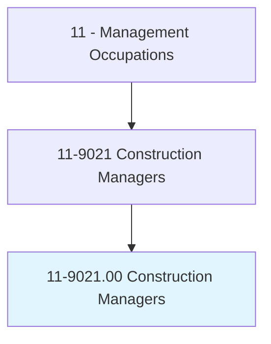
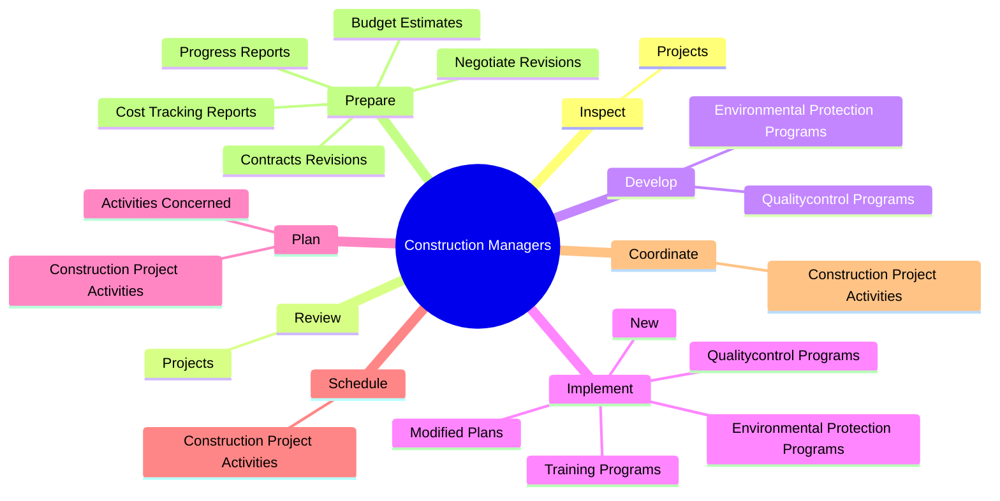
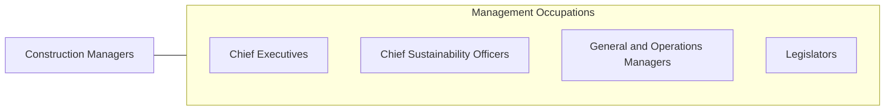

# Construction Managers

> Plan, direct, or coordinate, usually through subordinate supervisory personnel, activities concerned with the construction and maintenance of structures, facilities, and systems. Participate in the conceptual development of a construction project and oversee its organization, scheduling, budgeting, and implementation. Includes managers in specialized construction fields, such as carpentry or plumbing.

## Overview

Construction Managers is an occupation within the Management Occupations category. Plan, direct, or coordinate, usually through subordinate supervisory personnel, activities concerned with the construction and maintenance of structures, facilities, and systems. Participate in the conceptual development of a construction project and oversee its organization, scheduling, budgeting, and implementation.

## Classification Hierarchy

## Key Statistics

| Metric | Value |
|--------|-------|
| SOC Code | 11-9021.00 |
| Category | [Management Occupations](/occupations/Management) |
| Task Count | 122 |
| Source | O*NET |

## Core Tasks

### inspect.Projects

Construction Managers inspect projects as part of their core responsibilities.

**Actions:**
- `inspect.Projects.to.monitor.ComplianceWithBuildingCodesOtherRegulations`
- `inspect.Projects.to.SafetyCodesOtherRegulations`
- `inspect.Projects.to.monitor.ComplianceWithEnvironmentalRegulations`

### review.Projects

Construction Managers review projects as part of their core responsibilities.

**Actions:**
- `review.Projects.to.monitor.ComplianceWithBuildingCodesOtherRegulations`
- `review.Projects.to.SafetyCodesOtherRegulations`
- `review.Projects.to.monitor.ComplianceWithEnvironmentalRegulations`

### develop.QualitycontrolPrograms

Construction Managers develop qualitycontrol programs as part of their core responsibilities.

**Actions:**
- `develop.QualitycontrolPrograms`
- `develop.EnvironmentalProtectionPrograms`

## Skills & Competencies

### Technical Skills
- **Strategic Planning** - Advanced
- **Financial Management** - Advanced
- **Operations Management** - Advanced

### Soft Skills
- **Communication** - Essential
- **Problem Solving** - Essential
- **Critical Thinking** - Important
- **Teamwork** - Important
- **Adaptability** - Important

## Related Occupations

## Industries

This occupation is found across multiple industries. See [Industries](/industries) for sector-specific employment data.

## Career Progression

---

*Source: O*NET 11-9021.00 - ONETOccupation*
