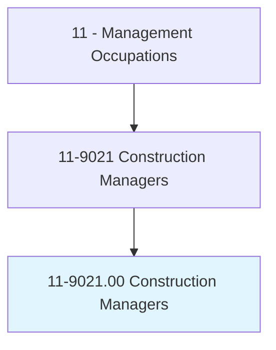
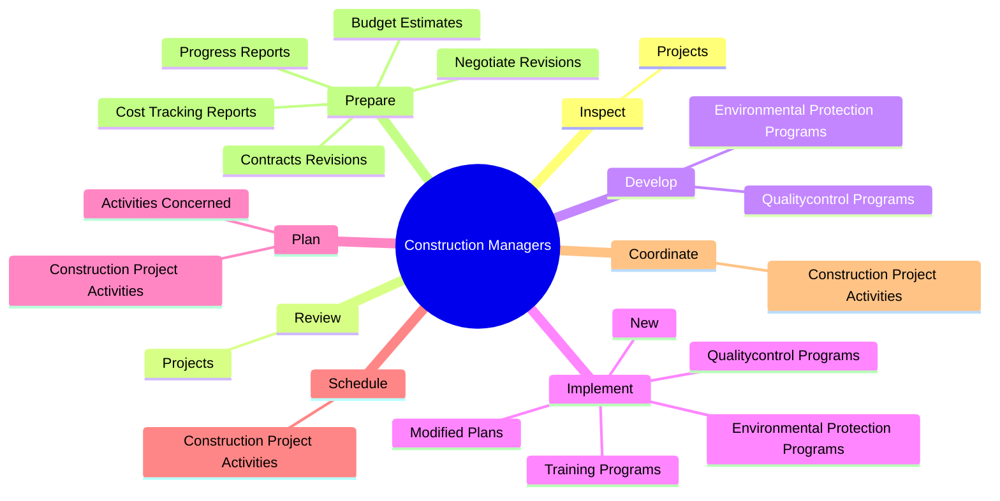
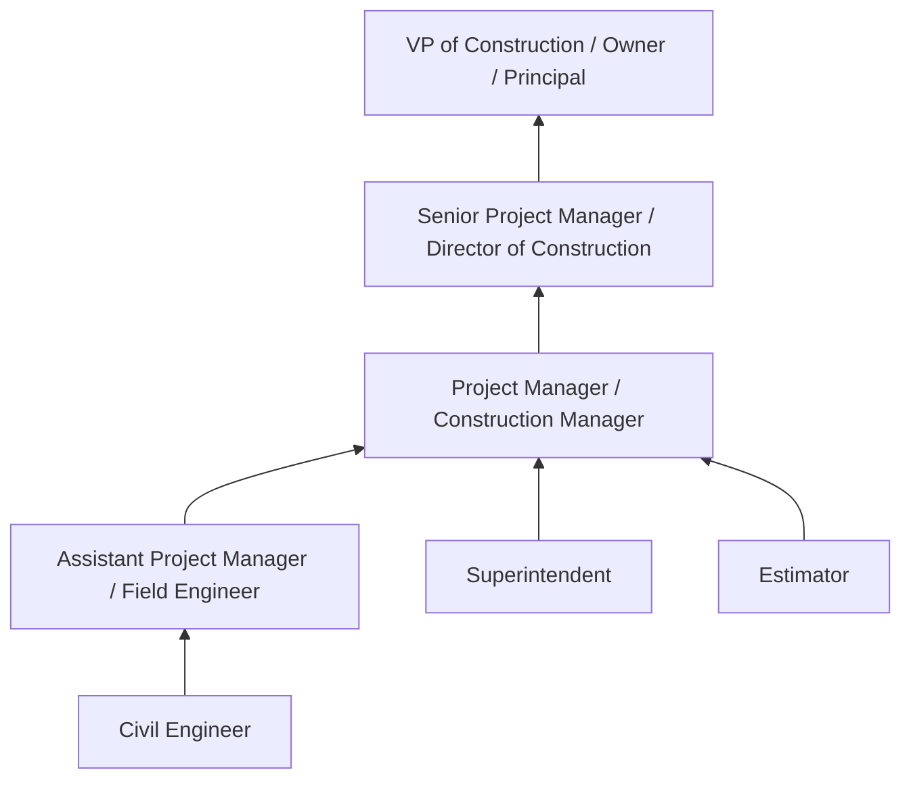
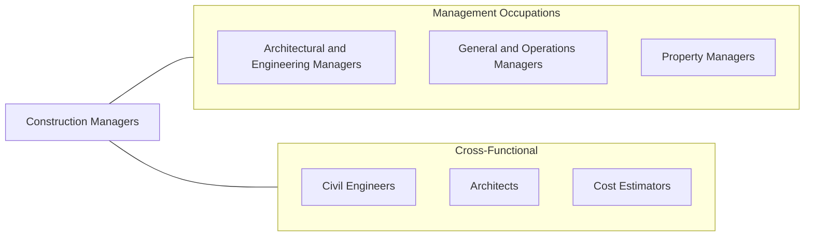

# Construction Managers

> Plan, direct, or coordinate, usually through subordinate supervisory personnel, activities concerned with the construction and maintenance of structures, facilities, and systems. Participate in the conceptual development of a construction project and oversee its organization, scheduling, budgeting, and implementation. Includes managers in specialized construction fields, such as carpentry or plumbing.

## Overview

Construction Managers plan, coordinate, and oversee construction projects from inception to completion. They are responsible for ensuring that projects are delivered on time, within budget, and to the required quality and safety standards. Their work spans residential, commercial, industrial, and infrastructure projects, requiring them to coordinate diverse teams of architects, engineers, subcontractors, and tradespeople.

The role demands strong project management capabilities combined with deep technical knowledge of construction methods, materials, building codes, and regulatory requirements. Construction Managers must balance competing priorities including cost control, schedule adherence, quality assurance, and workplace safety. They serve as the primary point of contact between project owners, design professionals, and the construction workforce.

Modern construction management increasingly involves digital technologies such as Building Information Modeling (BIM), drone surveys, and project management software. Construction Managers must also navigate environmental regulations, sustainability requirements, and the growing complexity of supply chain logistics for construction materials.

## Classification Hierarchy

## Key Statistics

| Metric | Value |
|--------|-------|
| SOC Code | 11-9021.00 |
| Job Zone | 4 (Considerable Preparation) |
| Category | [Management Occupations](/occupations/Management/index) |
| Task Count | 122 |
| Salary Range | $65,000 - $150,000+ |
| Employment Level | Large - over 400,000 |
| Growth Outlook | Faster than average |
| Source | O*NET |

## Core Tasks

### inspect.Projects

Construction Managers conduct regular site inspections to verify compliance with building codes, safety regulations, and environmental standards, identifying potential issues before they escalate.

**Actions:**
- `inspect.Projects.to.monitor.ComplianceWithBuildingCodesOtherRegulations`
- `inspect.Projects.to.SafetyCodesOtherRegulations`
- `inspect.Projects.to.monitor.ComplianceWithEnvironmentalRegulations`

### review.Projects

Construction Managers review project plans, specifications, and progress to ensure that construction activities align with design intent and regulatory requirements.

**Actions:**
- `review.Projects.to.monitor.ComplianceWithBuildingCodesOtherRegulations`
- `review.Projects.to.SafetyCodesOtherRegulations`
- `review.Projects.to.monitor.ComplianceWithEnvironmentalRegulations`

### develop.QualitycontrolPrograms

Construction Managers establish quality control and environmental protection programs to maintain construction standards and minimize environmental impact.

**Actions:**
- `develop.QualitycontrolPrograms`
- `develop.EnvironmentalProtectionPrograms`

## Skills & Competencies

### Technical Skills
- **Project Management** - Expert
- **Cost Estimation & Budgeting** - Expert
- **Building Codes & Regulations** - Advanced
- **Construction Methods & Materials** - Advanced
- **Blueprint & Specification Reading** - Advanced
- **Contract Administration** - Advanced
- **Safety Management (OSHA)** - Advanced

### Soft Skills
- **Leadership** - Critical
- **Communication** - Critical
- **Problem Solving** - Essential
- **Negotiation** - Essential
- **Time Management** - Essential
- **Decision Making** - Essential
- **Conflict Resolution** - Important

## Education & Certifications

| Requirement | Details |
|-------------|---------|
| Typical Education | Bachelor's degree in Construction Management, Civil Engineering, Architecture, or related field |
| Work Experience | 5+ years in construction, often progressing from field roles |
| On-the-Job Training | Moderate - continuous learning in codes, methods, and technology |
| Common Certifications | CCM (Certified Construction Manager - CMAA), PMP (Project Management Professional - PMI), LEED AP (USGBC), OSHA 30 (OSHA), CPC (Certified Professional Constructor - AIC) |

## Career Progression

## Industry Variations

- **Residential Construction** - Focus on homebuilding, subdivisions, and multi-family developments; customer interaction and local code compliance
- **Commercial Construction** - Office buildings, retail, and mixed-use projects; emphasis on tenant coordination and complex scheduling
- **Heavy Civil / Infrastructure** - Highways, bridges, tunnels, and utilities; government contracting, prevailing wage compliance, and environmental permitting
- **Industrial Construction** - Manufacturing plants, refineries, and power facilities; specialized safety requirements and process integration

## Technology & Tools

- **BIM Software** - Autodesk Revit, Navisworks, Tekla Structures
- **Project Management** - Procore, PlanGrid, Buildertrend, Oracle Primavera P6
- **Estimating** - Sage Estimating, ProEst, RSMeans
- **Scheduling** - Microsoft Project, Primavera P6, Smartsheet
- **Accounting** - Sage 300 Construction, Foundation Software, Viewpoint
- **Site Technology** - Drones (DJI), GPS surveying, laser scanning

## Related Occupations

## Industries

- [Construction](/industries/Construction) - Very High Employment
- [Real Estate and Rental and Leasing](/industries/RealEstate) - Moderate Employment
- [Government](/industries/PublicAdministration) - Moderate Employment
- [Professional, Scientific, and Technical Services](/industries/Scientific) - Moderate Employment

## Departments

This occupation typically works in:
- Construction / Project Management
- [Facilities & Real Estate](/departments/Operations)
- [Operations](/departments/Operations/index)

---

*Source: O*NET 11-9021.00 - ONETOccupation*
