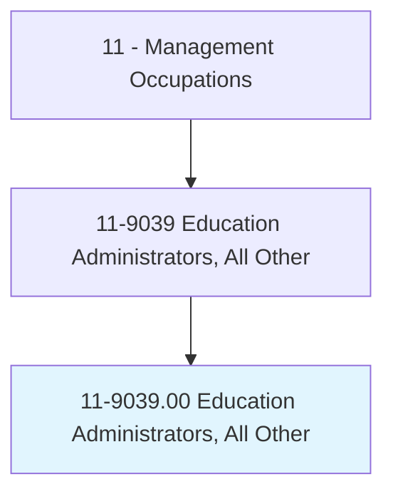
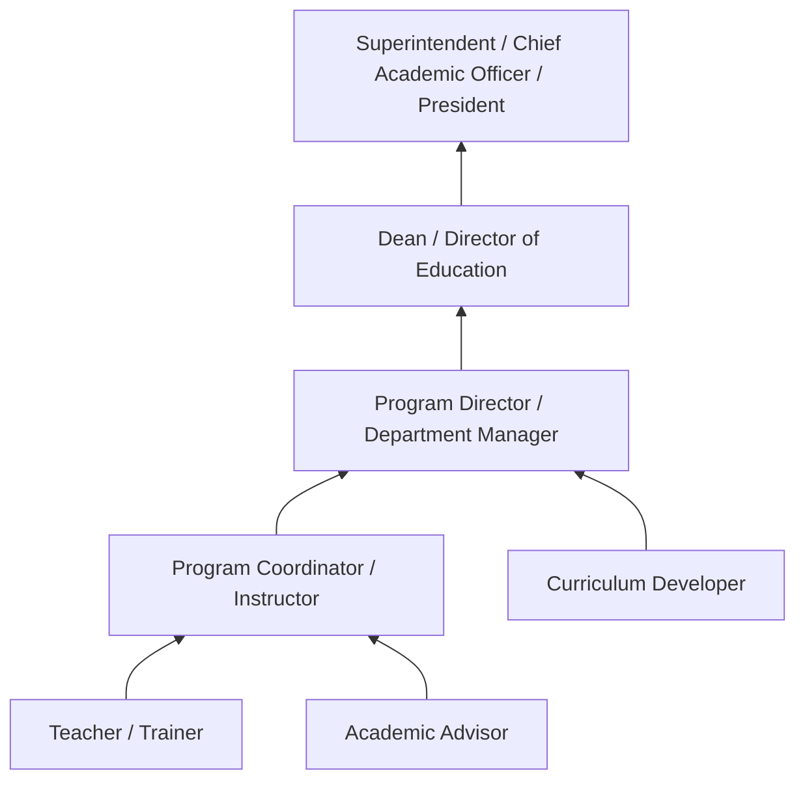
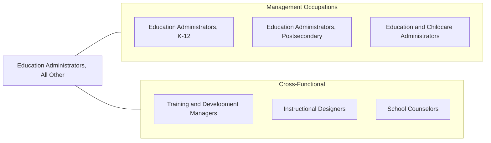

# Education Administrators, All Other

> All education administrators not listed separately.

## Overview

Education Administrators in this residual category manage educational programs, departments, or institutions that do not fall neatly into K-12, postsecondary, or preschool/daycare classifications. This includes administrators of vocational and technical schools, corporate training centers, continuing education programs, online learning platforms, test preparation companies, and specialty educational organizations such as museums, libraries, and professional development institutes.

These administrators are responsible for program development, staff management, budget oversight, enrollment management, and ensuring educational quality standards are met. They work in diverse settings where education is the primary mission but the structure falls outside traditional academic institutions. Their role often requires adapting educational delivery methods to non-traditional learners, adult students, or specialized professional audiences.

The growing importance of lifelong learning, workforce development, and credentialing has expanded opportunities for education administrators in non-traditional settings. They must stay current with educational technology, accreditation requirements, and evolving workforce needs while managing the business operations of their programs or institutions.

## Classification Hierarchy

## Key Statistics

| Metric | Value |
|--------|-------|
| SOC Code | 11-9039.00 |
| Job Zone | 4 (Considerable Preparation) |
| Category | [Management Occupations](/occupations/Management/index) |
| Task Count | 0 (Residual category) |
| Salary Range | $60,000 - $120,000+ |
| Employment Level | Moderate |
| Growth Outlook | Average |
| Source | O*NET |

## Core Tasks

This is a residual category ("All Other") that encompasses education administrators whose specific roles are not covered by other SOC codes. Common tasks across this category include:

- Planning and implementing educational programs and curricula
- Managing staff recruitment, training, and evaluation
- Overseeing budgets and financial operations
- Ensuring compliance with accreditation and regulatory standards
- Developing enrollment and retention strategies
- Coordinating with community organizations and stakeholders
- Evaluating program effectiveness and outcomes

See [O*NET 11-9039.00](https://www.onetonline.org/link/summary/11-9039.00) for detailed task information.

## Skills & Competencies

### Technical Skills
- **Program Development & Management** - Expert
- **Curriculum Design** - Advanced
- **Budget & Financial Management** - Advanced
- **Accreditation & Compliance** - Advanced
- **Educational Technology** - Advanced
- **Enrollment Management** - Advanced
- **Assessment & Evaluation** - Advanced

### Soft Skills
- **Leadership** - Critical
- **Communication** - Critical
- **Strategic Planning** - Essential
- **Problem Solving** - Essential
- **Stakeholder Management** - Essential
- **Adaptability** - Important
- **Cultural Competency** - Important

## Education & Certifications

| Requirement | Details |
|-------------|---------|
| Typical Education | Master's degree in Education Administration, Educational Leadership, or related field |
| Work Experience | 5+ years in education with administrative or supervisory experience |
| On-the-Job Training | Moderate - program-specific knowledge development |
| Common Certifications | State Administrator License (varies by state), EdD or PhD for senior roles, PMP (PMI) for program management roles |

## Career Progression

## Industry Variations

- **Vocational / Technical Schools** - Industry partnership development; apprenticeship coordination; job placement rates; equipment and lab management
- **Corporate Training Centers** - Alignment with business objectives; ROI measurement; executive education; learning management systems
- **Online Education** - Platform management; instructional design for digital delivery; student engagement metrics; scalability
- **Community Education** - Grant writing; community needs assessment; accessibility; diverse learner populations

## Technology & Tools

- **Learning Management Systems** - Canvas, Blackboard, Moodle, D2L Brightspace
- **Student Information Systems** - PowerSchool, Ellucian Banner, Jenzabar
- **Assessment Platforms** - Examsoft, ProctorU, Pearson MyLab
- **Communication** - Microsoft Teams, Zoom, Google Workspace for Education
- **Analytics** - Tableau, Power BI for enrollment and outcomes reporting
- **Accreditation** - WEAVE Online, Compliance Assist

## Related Occupations

## Industries

- [Educational Services](/industries/Education) - High Employment
- [Professional, Scientific, and Technical Services](/industries/ProfessionalServices) - Moderate Employment
- [Healthcare and Social Assistance](/industries/Healthcare/index) - Moderate Employment
- [Government](/industries/Government) - Moderate Employment

## Departments

This occupation typically works in:
- [Education / Academic Affairs](/departments/AcademicAffairs)
- [Program Administration](/departments/ProgramAdmin)
- [Student Services](/departments/StudentServices)
- [Continuing Education](/departments/ContinuingEd)

---

*Source: O*NET 11-9039.00 - ONETOccupation*
