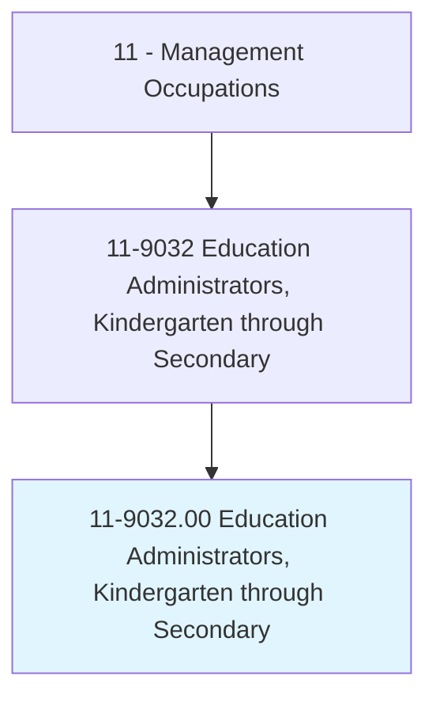
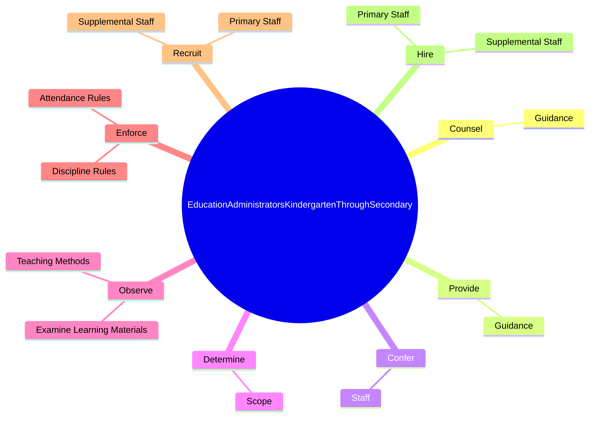
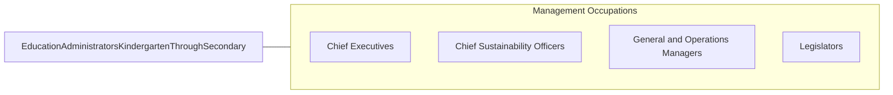

# Education Administrators, Kindergarten through Secondary

> Plan, direct, or coordinate the academic, administrative, or auxiliary activities of kindergarten, elementary, or secondary schools.

## Overview

Education Administrators, Kindergarten through Secondary is classified under Management Occupations (SOC 11). Plan, direct, or coordinate the academic, administrative, or auxiliary activities of kindergarten, elementary, or secondary schools.

## Classification Hierarchy

## Key Statistics

| Metric | Value |
|--------|-------|
| SOC Code | 11-9032.00 |
| Category | [Management Occupations](/occupations/Management) |
| Task Count | 199 |
| Source | O*NET |

## Core Tasks

### counsel.Guidance

Education Administrators, Kindergarten through Secondary counsel guidance as part of their core responsibilities.

**Actions:**
- `counsel.Guidance.to.StudentsRegardingPersonal`
- `counsel.Guidance.to.Academic`
- `counsel.Guidance.to.Vocational`
- `counsel.Guidance.to.BehavioralIssues`

### provide.Guidance

Education Administrators, Kindergarten through Secondary provide guidance as part of their core responsibilities.

**Actions:**
- `provide.Guidance.to.StudentsRegardingPersonal`
- `provide.Guidance.to.Academic`
- `provide.Guidance.to.Vocational`
- `provide.Guidance.to.BehavioralIssues`

### confer.Staff

Education Administrators, Kindergarten through Secondary confer staff as part of their core responsibilities.

**Actions:**
- `confer.Staff.to.discuss.EducationalActivities`
- `confer.Staff.to.Policies`
- `confer.Staff.to.StudentBehavior`
- `confer.Staff.to.LearningProblems`

## Skills & Competencies

### Technical Skills
- **Strategic Planning** - Advanced
- **Financial Management** - Advanced
- **Operations Management** - Advanced

### Soft Skills
- **Communication** - Essential
- **Problem Solving** - Essential
- **Critical Thinking** - Important
- **Teamwork** - Important
- **Adaptability** - Important

## Related Occupations

## Industries

This occupation is found across multiple industries. See [Industries](/industries) for sector-specific employment data.

## Career Progression

---

*Source: O*NET 11-9032.00 - ONETOccupation*
