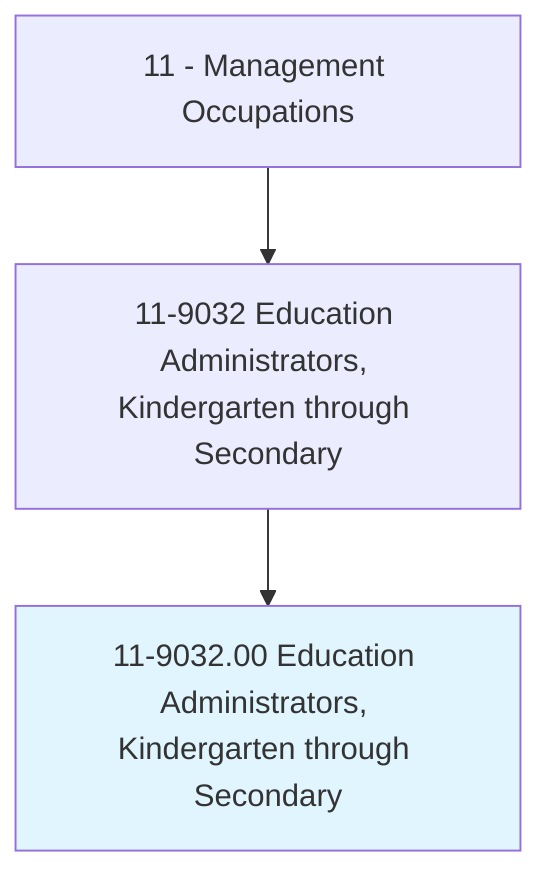
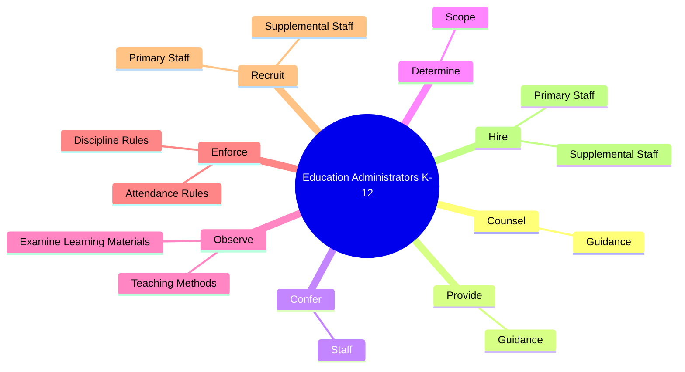
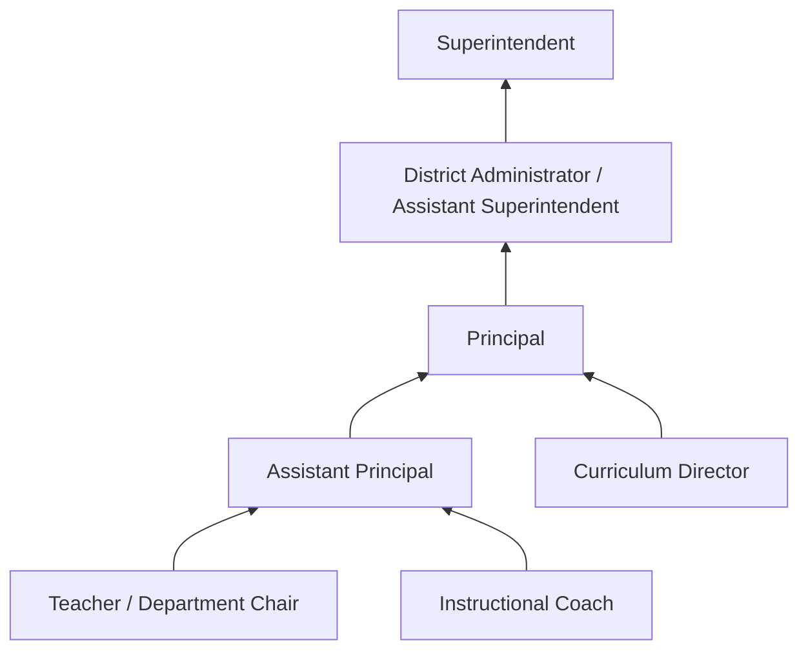
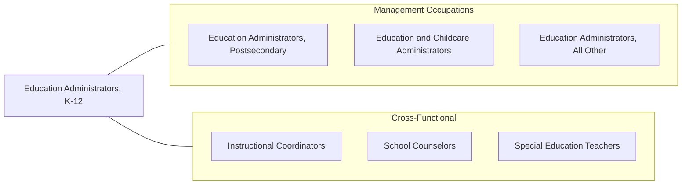

# Education Administrators, Kindergarten through Secondary

> Plan, direct, or coordinate the academic, administrative, or auxiliary activities of kindergarten, elementary, or secondary schools.

## Overview

Education Administrators at the K-12 level -- including principals, assistant principals, and district administrators -- are responsible for the academic success, safety, and well-being of students in public and private schools. They set educational standards, develop curricula, evaluate teachers, manage school budgets, and create environments conducive to learning. Their leadership directly impacts student achievement, teacher retention, and community engagement.

These administrators navigate a complex landscape of federal and state education mandates, standardized testing requirements, special education regulations, and evolving pedagogical approaches. They must balance instructional leadership with operational management, handling everything from discipline issues and parent conferences to facility maintenance and emergency preparedness. The role requires strong interpersonal skills to build relationships with students, parents, teachers, support staff, and community members.

The modern K-12 administrator also addresses challenges including technology integration, mental health services, school safety, equity and inclusion, and the growing diversity of student populations. They serve as the public face of their school, communicating with local media, school boards, and community organizations while advocating for the resources their students and staff need to succeed.

## Classification Hierarchy

## Key Statistics

| Metric | Value |
|--------|-------|
| SOC Code | 11-9032.00 |
| Job Zone | 5 (Extensive Preparation) |
| Category | [Management Occupations](/occupations/Management/index) |
| Task Count | 199 |
| Salary Range | $70,000 - $130,000+ |
| Employment Level | Large - over 280,000 |
| Growth Outlook | Average |
| Source | O*NET |

## Core Tasks

### counsel.Guidance

Education Administrators provide counseling and guidance to students on personal, academic, vocational, and behavioral issues, supporting their overall development.

**Actions:**
- `counsel.Guidance.to.StudentsRegardingPersonal`
- `counsel.Guidance.to.Academic`
- `counsel.Guidance.to.Vocational`
- `counsel.Guidance.to.BehavioralIssues`

### provide.Guidance

Education Administrators also provide guidance as a broader function, supporting both students and staff in achieving educational objectives.

**Actions:**
- `provide.Guidance.to.StudentsRegardingPersonal`
- `provide.Guidance.to.Academic`
- `provide.Guidance.to.Vocational`
- `provide.Guidance.to.BehavioralIssues`

### confer.Staff

Education Administrators regularly confer with teaching and support staff to discuss educational activities, policies, student behavior, and learning challenges.

**Actions:**
- `confer.Staff.to.discuss.EducationalActivities`
- `confer.Staff.to.Policies`
- `confer.Staff.to.StudentBehavior`
- `confer.Staff.to.LearningProblems`

## Skills & Competencies

### Technical Skills
- **Instructional Leadership** - Expert
- **Curriculum Development** - Expert
- **Student Assessment & Data Analysis** - Advanced
- **Special Education Law (IDEA, Section 504)** - Advanced
- **School Finance & Budgeting** - Advanced
- **Teacher Evaluation Systems** - Advanced
- **School Safety & Crisis Management** - Advanced

### Soft Skills
- **Leadership** - Critical
- **Communication** - Critical
- **Empathy & Emotional Intelligence** - Critical
- **Decision Making** - Essential
- **Conflict Resolution** - Essential
- **Community Engagement** - Essential
- **Cultural Competency** - Essential

## Education & Certifications

| Requirement | Details |
|-------------|---------|
| Typical Education | Master's degree in Educational Administration, Educational Leadership, or Curriculum and Instruction |
| Work Experience | 3-5 years of classroom teaching experience; additional administrative experience preferred |
| Licensure | State Principal / Administrator License (required - state department of education) |
| Common Certifications | NBCT (National Board Certification), EdD or PhD for superintendent roles, state-specific endorsements |

## Career Progression

## Industry Variations

- **Public Schools** - Compliance with ESSA, state accountability systems, school board governance, union relations, Title I/Title III programs
- **Private / Independent Schools** - Board of trustees governance; fundraising and development; admissions management; accreditation (NAIS, regional)
- **Charter Schools** - Performance-based accountability; charter renewal processes; innovative curriculum models; community engagement
- **International Schools** - IB/AP curriculum coordination; expatriate staff management; multi-cultural student body; host country regulations

## Technology & Tools

- **Student Information Systems** - PowerSchool, Infinite Campus, Skyward, Tyler SIS
- **Learning Management** - Google Classroom, Canvas, Schoology
- **Assessment** - NWEA MAP, Renaissance Star, state testing platforms
- **Communication** - ParentSquare, Remind, ClassDojo, Seesaw
- **Safety** - Raptor Visitor Management, Navigate360, SchoolMessenger
- **Analytics** - Tableau, PowerSchool Analytics, Ed-Fi data systems

## Related Occupations

## Industries

- [Educational Services (K-12)](/industries/Education) - Very High Employment
- [Government (State and Local)](/industries/Government) - High Employment

## Departments

This occupation typically works in:
- [School Administration](/departments/SchoolAdmin)
- [Curriculum & Instruction](/departments/CurriculumInstruction)
- [Student Services](/departments/StudentServices)
- [District Office](/departments/DistrictOffice)

---

*Source: O*NET 11-9032.00 - ONETOccupation*
