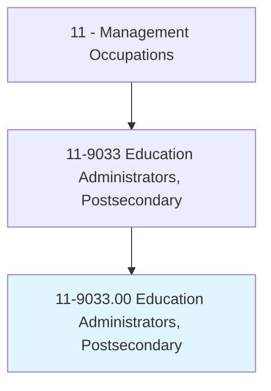
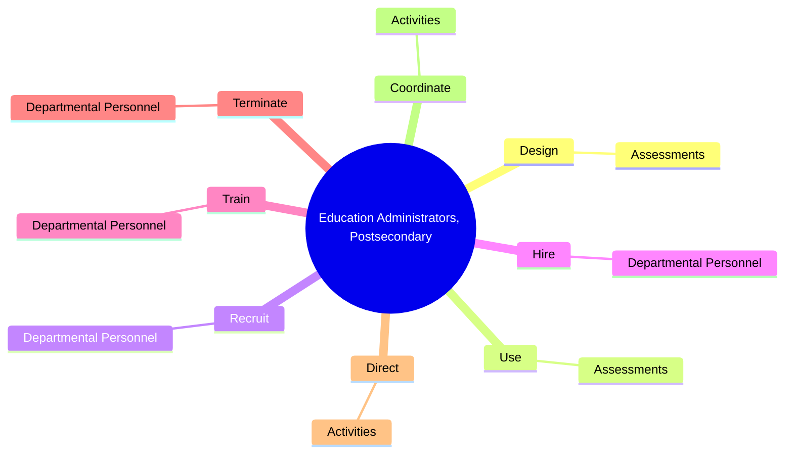
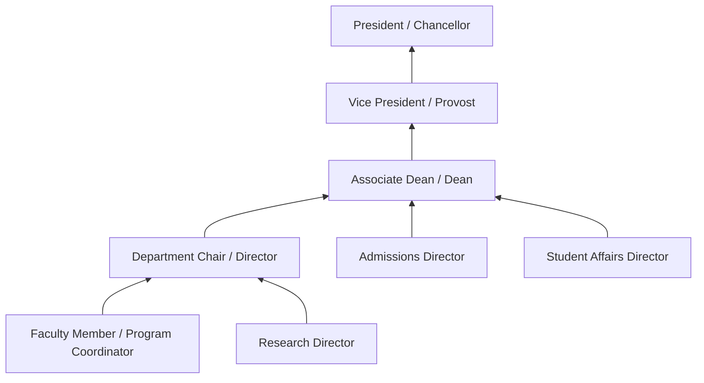
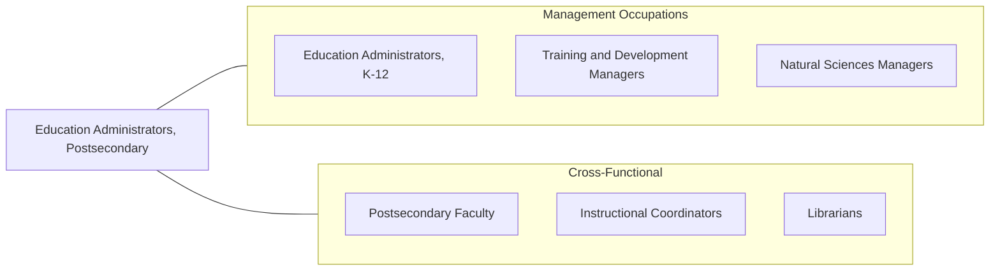

# Education Administrators, Postsecondary

> Plan, direct, or coordinate student instruction, administration, and services, as well as other research and educational activities, at postsecondary institutions, including universities, colleges, and junior and community colleges.

## Overview

Postsecondary Education Administrators lead academic departments, student services divisions, and administrative units within colleges and universities. Their roles range from academic deans and department chairs to registrars, admissions directors, and student affairs professionals. They shape the educational experience of millions of students while managing the complex operations of institutions that often function as small cities.

These administrators balance academic mission with financial sustainability. They develop curricula, manage faculty hiring and tenure processes, oversee research programs, and ensure institutional accreditation. On the administrative side, they manage enrollment strategies, student retention programs, financial aid, campus facilities, and alumni relations. The increasing cost of higher education and growing competition for students make strategic planning and institutional differentiation essential competencies.

The landscape of postsecondary education is rapidly evolving with the growth of online learning, competency-based education, micro-credentials, and alternative pathways to workforce readiness. Administrators must navigate these changes while addressing concerns about student debt, equity and access, academic freedom, and the evolving expectations of students, employers, and policymakers.

## Classification Hierarchy

## Key Statistics

| Metric | Value |
|--------|-------|
| SOC Code | 11-9033.00 |
| Job Zone | 5 (Extensive Preparation) |
| Category | [Management Occupations](/occupations/Management/index) |
| Task Count | 104 |
| Salary Range | $70,000 - $175,000+ |
| Employment Level | Large - over 190,000 |
| Growth Outlook | Average |
| Source | O*NET |

## Core Tasks

### design.Assessments

Postsecondary Education Administrators design assessment instruments and frameworks to monitor student learning outcomes and institutional effectiveness.

**Actions:**
- `design.Assessments.to.monitor.StudentLearningOutcomes`

### use.Assessments

Postsecondary Education Administrators use assessment data to evaluate program quality, inform curriculum revisions, and demonstrate institutional accountability.

**Actions:**
- `use.Assessments.to.monitor.StudentLearningOutcomes`

### recruit.DepartmentalPersonnel

Postsecondary Education Administrators lead faculty and staff recruitment, ensuring departments are staffed with qualified professionals who advance the institution's academic mission.

**Actions:**
- `recruit.DepartmentalPersonnel`

## Skills & Competencies

### Technical Skills
- **Academic Program Management** - Expert
- **Accreditation & Institutional Assessment** - Expert
- **Enrollment Management** - Advanced
- **Research Administration** - Advanced
- **Higher Education Law & Policy** - Advanced
- **Budget & Grant Management** - Advanced
- **Curriculum Development** - Advanced

### Soft Skills
- **Leadership** - Critical
- **Communication** - Critical
- **Strategic Thinking** - Essential
- **Collaborative Decision Making** - Essential
- **Political Acumen** - Essential
- **Public Speaking** - Important
- **Fundraising & Relationship Building** - Important

## Education & Certifications

| Requirement | Details |
|-------------|---------|
| Typical Education | Master's degree minimum; Doctoral degree (PhD or EdD) typically required for dean or senior administrative roles |
| Work Experience | 5-15 years in higher education, often including faculty experience |
| On-the-Job Training | Moderate - institutional governance, accreditation processes |
| Common Certifications | No universal certification; professional development through ACE (American Council on Education), NACUBO, NASPA, or AACRAO |

## Career Progression

## Industry Variations

- **Research Universities** - Grant management; tenure and promotion processes; graduate program oversight; research compliance (IRB, export controls)
- **Community Colleges** - Workforce development alignment; transfer articulation; open-access admissions; community partnerships
- **Private Liberal Arts** - Alumni engagement; fundraising and endowment management; distinctive program development; small class pedagogy
- **Online / For-Profit Institutions** - Enrollment optimization; regulatory compliance (Title IV); student retention analytics; scalable program delivery

## Technology & Tools

- **Student Information Systems** - Ellucian Banner, PeopleSoft, Workday Student
- **Learning Management** - Canvas, Blackboard, D2L Brightspace, Moodle
- **CRM / Enrollment** - Slate (Technolutions), Salesforce for Higher Ed, EAB Navigate
- **Research Administration** - Cayuse, Kuali Research, InfoEd
- **Analytics** - Tableau, Power BI, EAB, IPEDS data tools
- **Accreditation** - WEAVE Online, Compliance Assist, Watermark

## Related Occupations

## Industries

- [Educational Services (Postsecondary)](/industries/Education) - Very High Employment
- [Government](/industries/PublicAdministration) - Moderate Employment

## Departments

This occupation typically works in:
- Academic Affairs / Provost Office
- Student Affairs
- Enrollment Management
- Institutional Research

---

*Source: O*NET 11-9033.00 - ONETOccupation*
