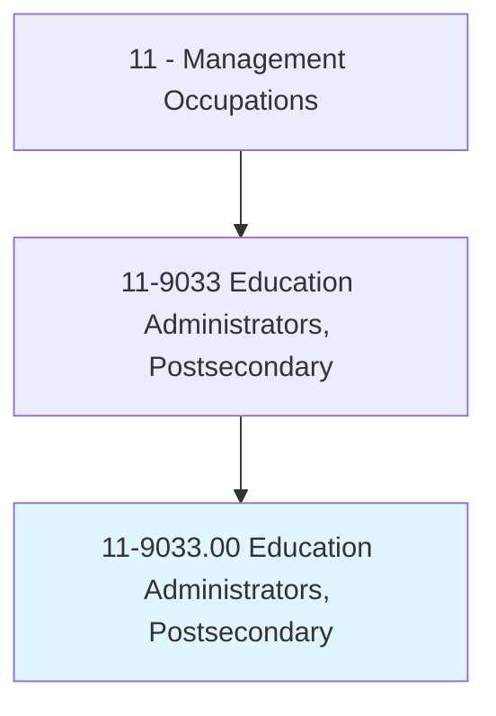
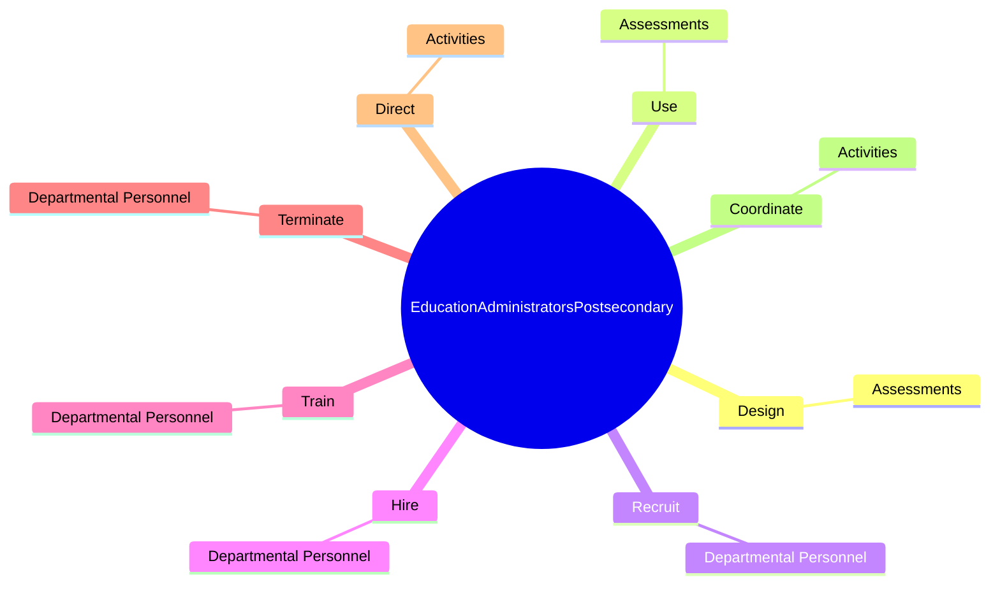
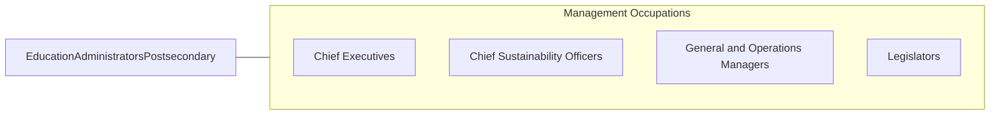

# Education Administrators, Postsecondary

> Plan, direct, or coordinate student instruction, administration, and services, as well as other research and educational activities, at postsecondary institutions, including universities, colleges, and junior and community colleges.

## Overview

Education Administrators, Postsecondary is classified under Management Occupations (SOC 11). Plan, direct, or coordinate student instruction, administration, and services, as well as other research and educational activities, at postsecondary institutions, including universities, colleges, and junior and community colleges.

## Classification Hierarchy

## Key Statistics

| Metric | Value |
|--------|-------|
| SOC Code | 11-9033.00 |
| Category | [Management Occupations](/occupations/Management) |
| Task Count | 104 |
| Source | O*NET |

## Core Tasks

### design.Assessments

Education Administrators, Postsecondary design assessments as part of their core responsibilities.

**Actions:**
- `design.Assessments.to.monitor.StudentLearningOutcomes`

### use.Assessments

Education Administrators, Postsecondary use assessments as part of their core responsibilities.

**Actions:**
- `use.Assessments.to.monitor.StudentLearningOutcomes`

### recruit.DepartmentalPersonnel

Education Administrators, Postsecondary recruit departmental personnel as part of their core responsibilities.

**Actions:**
- `recruit.DepartmentalPersonnel`

## Skills & Competencies

### Technical Skills
- **Strategic Planning** - Advanced
- **Financial Management** - Advanced
- **Operations Management** - Advanced

### Soft Skills
- **Communication** - Essential
- **Problem Solving** - Essential
- **Critical Thinking** - Important
- **Teamwork** - Important
- **Adaptability** - Important

## Related Occupations

## Industries

This occupation is found across multiple industries. See [Industries](/industries) for sector-specific employment data.

## Career Progression

---

*Source: O*NET 11-9033.00 - ONETOccupation*
