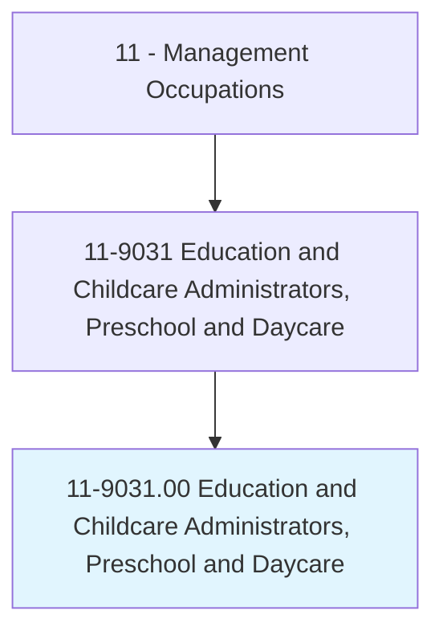
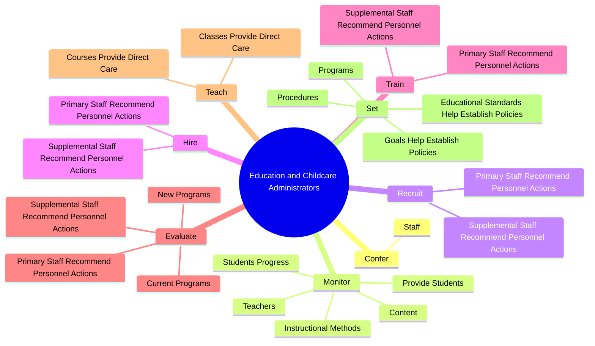
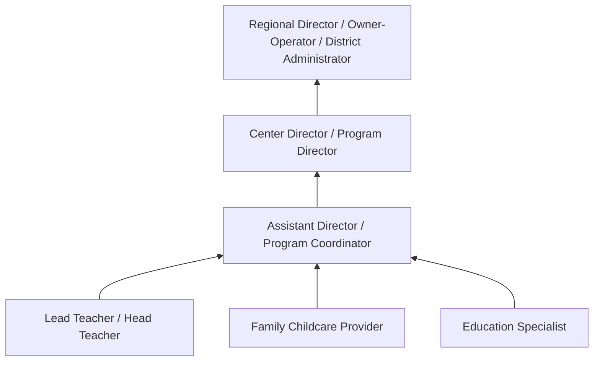
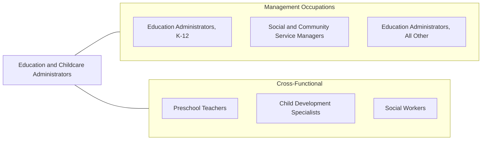

# Education and Childcare Administrators, Preschool and Daycare

> Plan, direct, or coordinate academic or nonacademic activities of preschools or childcare centers and programs, including before- and after-school care.

## Overview

Education and Childcare Administrators manage the operations of preschools, daycare centers, Head Start programs, and before- and after-school care facilities. They oversee curriculum development, staff management, regulatory compliance, and the daily operations needed to provide safe, nurturing, and developmentally appropriate environments for young children. These administrators serve a critical societal function, enabling parents to participate in the workforce while ensuring quality early childhood education.

The role requires balancing educational objectives with business operations. Administrators develop age-appropriate curricula, hire and train qualified caregivers and teachers, manage parent communications, and maintain facilities that meet licensing and health standards. They must comply with a complex web of local, state, and federal regulations covering child-to-staff ratios, facility safety, food service, and mandatory reporting requirements.

Early childhood education has gained increasing recognition for its impact on child development and school readiness. Administrators in this field must stay current with research on early learning, implement evidence-based practices, and often navigate government subsidy programs and quality rating systems. The role demands patience, organizational skills, and a genuine commitment to child welfare and development.

## Classification Hierarchy

## Key Statistics

| Metric | Value |
|--------|-------|
| SOC Code | 11-9031.00 |
| Job Zone | 4 (Considerable Preparation) |
| Category | [Management Occupations](/occupations/Management/index) |
| Task Count | 192 |
| Salary Range | $35,000 - $75,000+ |
| Employment Level | Moderate - approximately 70,000 |
| Growth Outlook | Average |
| Source | O*NET |

## Core Tasks

### confer.Staff

Education and Childcare Administrators regularly meet with teaching and support staff to discuss educational activities, center policies, and individual student behavioral or learning challenges.

**Actions:**
- `confer.Staff.to.discuss.EducationalActivitiesStudentsBehavioralLearningProblems`
- `confer.Staff.to.PoliciesStudentsBehavioralLearningProblems`

### monitor.StudentsProgress

Education and Childcare Administrators track student developmental milestones and provide assistance to students, teachers, and parents in resolving challenges.

**Actions:**
- `monitor.StudentsProgress.with.Assistance.in.ResolvingProblems`
- `monitor.ProvideStudents.with.Assistance.in.ResolvingProblems`
- `monitor.Teachers.with.Assistance.in.ResolvingProblems`
- `monitor.InstructionalMethods.of.Educational`

### recruit.PrimaryStaffRecommendPersonnelActions

Education and Childcare Administrators recruit, hire, train, and evaluate both primary and supplemental staff for programs and services.

**Actions:**
- `recruit.PrimaryStaffRecommendPersonnelActions.for.Programs`
- `recruit.PrimaryStaffRecommendPersonnelActions.for.Services`
- `recruit.SupplementalStaffRecommendPersonnelActions.for.Programs`
- `recruit.SupplementalStaffRecommendPersonnelActions.for.Services`

## Skills & Competencies

### Technical Skills
- **Early Childhood Education Principles** - Expert
- **Child Development Knowledge** - Expert
- **Licensing & Regulatory Compliance** - Advanced
- **Curriculum Development (Ages 0-5)** - Advanced
- **Health & Safety Standards** - Advanced
- **Budget Management** - Advanced
- **Parent Communication & Engagement** - Advanced

### Soft Skills
- **Leadership** - Critical
- **Patience & Empathy** - Critical
- **Communication** - Essential
- **Organizational Skills** - Essential
- **Problem Solving** - Essential
- **Relationship Building** - Important
- **Crisis Management** - Important

## Education & Certifications

| Requirement | Details |
|-------------|---------|
| Typical Education | Bachelor's degree in Early Childhood Education, Child Development, or Education |
| Advanced Education | Master's degree preferred for larger programs or directors |
| Work Experience | 3-5 years in early childhood education or childcare settings |
| Licensure | State Childcare Director License or Credential (required - state-specific) |
| Common Certifications | CDA (Child Development Associate - Council for Professional Recognition), NAEYC Accreditation Administrator, National Director Credential (McCormick Center) |

## Career Progression

## Industry Variations

- **Private Childcare Centers** - Tuition-based revenue management; marketing and enrollment; parent satisfaction; competitive differentiation
- **Head Start / Government Programs** - Federal performance standards; grant management; community needs assessments; family services coordination
- **Faith-Based Programs** - Integration of religious education; church/temple governance; volunteer management; community ministry alignment
- **Corporate Childcare** - Employer subsidy management; workplace integration; employee benefit coordination; extended hours programming

## Technology & Tools

- **Childcare Management Software** - Brightwheel, HiMama, Procare, Kangarootime
- **Curriculum Planning** - Creative Curriculum, HighScope, Teaching Strategies GOLD
- **Communication** - Brightwheel (parent messaging), Remind, ClassDojo
- **Accounting** - QuickBooks, FreshBooks for small center financial management
- **Compliance** - State licensing portals, Quality Rating and Improvement System (QRIS) tools
- **Assessment** - ASQ (Ages & Stages Questionnaire), Teaching Strategies GOLD assessments

## Related Occupations

## Industries

- [Educational Services](/industries/Education) - High Employment
- [Healthcare and Social Assistance](/industries/Healthcare/index) - Moderate Employment
- Religious, Grantmaking, and Civic Organizations - Moderate Employment
- [Government](/industries/PublicAdministration) - Moderate Employment

## Departments

This occupation typically works in:
- [Early Childhood Education](/departments/Operations)
- Program Administration
- Family Services

---

*Source: O*NET 11-9031.00 - ONETOccupation*
