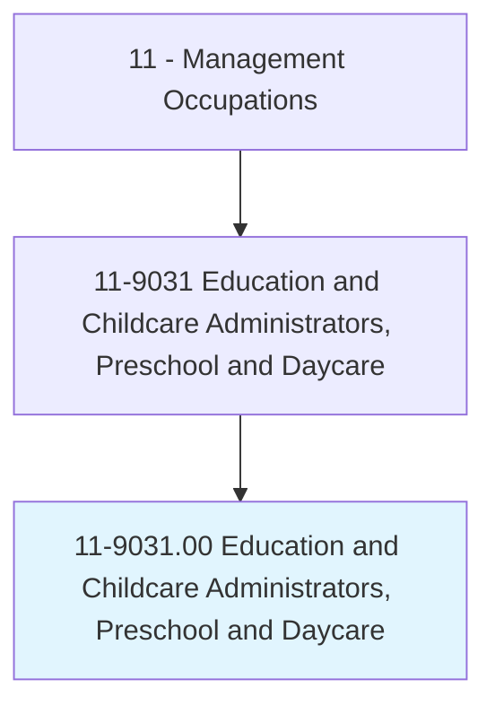
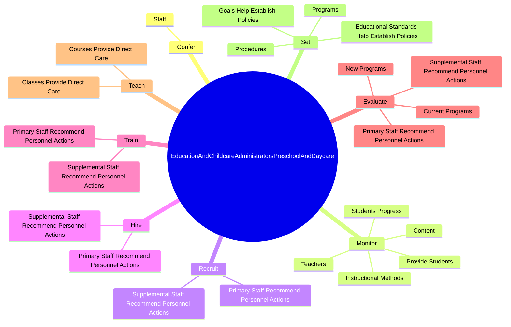
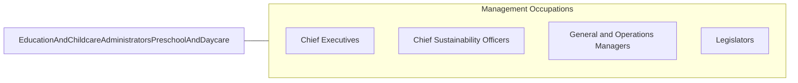

# Education and Childcare Administrators, Preschool and Daycare

> Plan, direct, or coordinate academic or nonacademic activities of preschools or childcare centers and programs, including before- and after-school care.

## Overview

Education and Childcare Administrators, Preschool and Daycare is classified under Management Occupations (SOC 11). Plan, direct, or coordinate academic or nonacademic activities of preschools or childcare centers and programs, including before- and after-school care.

## Classification Hierarchy

## Key Statistics

| Metric | Value |
|--------|-------|
| SOC Code | 11-9031.00 |
| Category | [Management Occupations](/occupations/Management) |
| Task Count | 192 |
| Source | O*NET |

## Core Tasks

### confer.Staff

Education and Childcare Administrators, Preschool and Daycare confer staff as part of their core responsibilities.

**Actions:**
- `confer.Staff.to.discuss.EducationalActivitiesStudentsBehavioralLearningProblems`
- `confer.Staff.to.PoliciesStudentsBehavioralLearningProblems`

### monitor.StudentsProgress

Education and Childcare Administrators, Preschool and Daycare monitor students progress as part of their core responsibilities.

**Actions:**
- `monitor.StudentsProgress.with.Assistance.in.ResolvingProblems`
- `monitor.ProvideStudents.with.Assistance.in.ResolvingProblems`
- `monitor.Teachers.with.Assistance.in.ResolvingProblems`
- `monitor.InstructionalMethods.of.Educational`

### recruit.PrimaryStaffRecommendPersonnelActions

Education and Childcare Administrators, Preschool and Daycare recruit primary staff recommend personnel actions as part of their core responsibilities.

**Actions:**
- `recruit.PrimaryStaffRecommendPersonnelActions.for.Programs`
- `recruit.PrimaryStaffRecommendPersonnelActions.for.Services`
- `recruit.SupplementalStaffRecommendPersonnelActions.for.Programs`
- `recruit.SupplementalStaffRecommendPersonnelActions.for.Services`

## Skills & Competencies

### Technical Skills
- **Strategic Planning** - Advanced
- **Financial Management** - Advanced
- **Operations Management** - Advanced

### Soft Skills
- **Communication** - Essential
- **Problem Solving** - Essential
- **Critical Thinking** - Important
- **Teamwork** - Important
- **Adaptability** - Important

## Related Occupations

## Industries

This occupation is found across multiple industries. See [Industries](/industries) for sector-specific employment data.

## Career Progression

---

*Source: O*NET 11-9031.00 - ONETOccupation*
