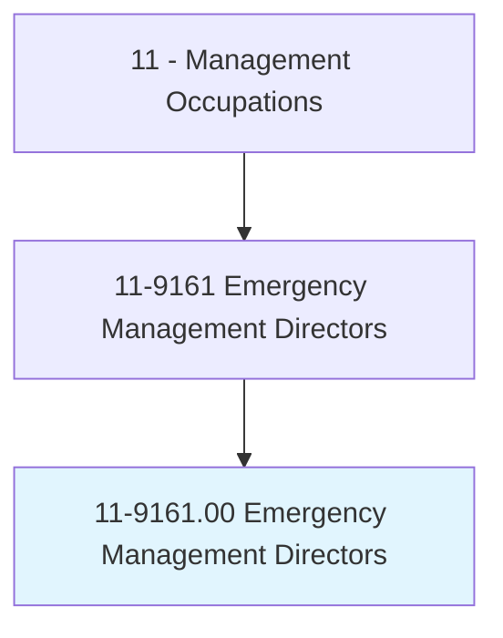
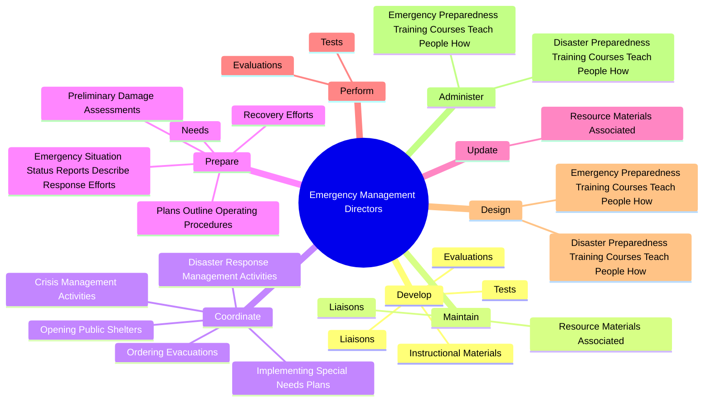
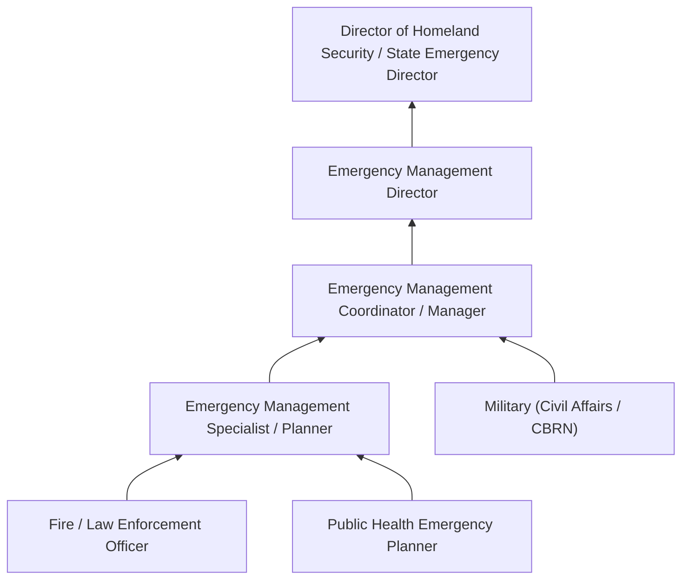
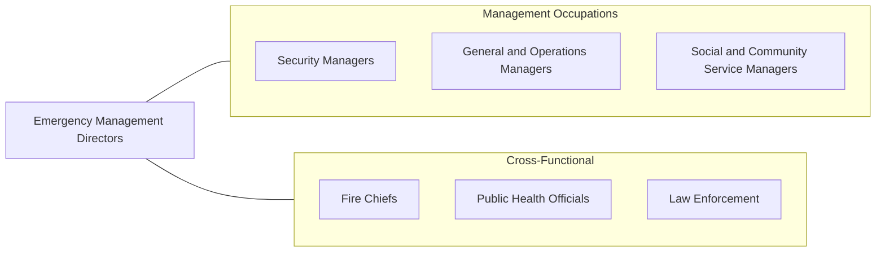

# Emergency Management Directors

> Plan and direct disaster response or crisis management activities, provide disaster preparedness training, and prepare emergency plans and procedures for natural (e.g., hurricanes, floods, earthquakes), wartime, or technological (e.g., nuclear power plant emergencies or hazardous materials spills) disasters or hostage situations.

## Overview

Emergency Management Directors coordinate an organization's or jurisdiction's response to disasters and emergencies, whether natural, technological, or human-caused. They develop comprehensive emergency plans, conduct preparedness exercises, coordinate multi-agency response efforts, and manage recovery operations. Their work spans the full emergency management cycle: mitigation, preparedness, response, and recovery.

These directors serve as the focal point for crisis coordination, working with fire departments, law enforcement, public health agencies, hospitals, utilities, nonprofits, and volunteer organizations. During active emergencies, they may coordinate evacuations, open shelters, activate emergency operations centers, manage resource allocation, and communicate with the public through media briefings. Between events, they focus on risk assessment, plan development, training, and community education.

The role has grown in complexity due to climate change increasing the frequency and severity of natural disasters, emerging threats such as cyberattacks and pandemics, and the need for resilience planning across interconnected critical infrastructure systems. Emergency Management Directors must stay current with federal emergency management frameworks (NIMS, ICS), grant programs (FEMA), and evolving best practices in disaster science.

## Classification Hierarchy

## Key Statistics

| Metric | Value |
|--------|-------|
| SOC Code | 11-9161.00 |
| Job Zone | 4 (Considerable Preparation) |
| Category | [Management Occupations](/occupations/Management/index) |
| Task Count | 113 |
| Salary Range | $55,000 - $120,000+ |
| Employment Level | Small - approximately 11,000 |
| Growth Outlook | Average |
| Source | O*NET |

## Core Tasks

### develop.Liaisons

Emergency Management Directors build and maintain relationships with municipal, county, state, and federal agencies to facilitate coordinated emergency planning and response.

**Actions:**
- `develop.Liaisons.with.Municipalities`
- `develop.Liaisons.with.CountyDepartments`
- `develop.Liaisons.with.SimilarEntities.to.facilitate.PlanDevelopment`
- `develop.Liaisons.with.ResponseEffortCoordination`

### coordinate.DisasterResponseManagementActivities

Emergency Management Directors coordinate all aspects of disaster response including evacuations, shelter operations, resource deployment, and special needs population support.

**Actions:**
- `coordinate.DisasterResponseManagementActivities`
- `coordinate.CrisisManagementActivities`
- `coordinate.OrderingEvacuations`
- `coordinate.OpeningPublicShelters`

### prepare.EmergencySituationStatusReports

Emergency Management Directors prepare comprehensive status reports, damage assessments, and operational plans that guide response and recovery decision-making.

**Actions:**
- No specific sub-actions listed for this task group.

## Skills & Competencies

### Technical Skills
- **Emergency Planning & Operations** - Expert
- **Incident Command System (ICS/NIMS)** - Expert
- **Hazard & Risk Assessment** - Advanced
- **Crisis Communication** - Advanced
- **Grant Management (FEMA, DHS)** - Advanced
- **Continuity of Operations (COOP)** - Advanced
- **GIS & Mapping** - Advanced

### Soft Skills
- **Leadership Under Pressure** - Critical
- **Communication** - Critical
- **Decision Making** - Critical
- **Coordination & Collaboration** - Essential
- **Public Speaking** - Essential
- **Adaptability** - Essential
- **Composure in Crisis** - Essential

## Education & Certifications

| Requirement | Details |
|-------------|---------|
| Typical Education | Bachelor's degree in Emergency Management, Public Administration, Homeland Security, or related field |
| Advanced Education | Master's degree in Emergency Management or Public Administration preferred for senior roles |
| Work Experience | 5+ years in emergency management, public safety, or military |
| Common Certifications | CEM (Certified Emergency Manager - IAEM), FEMA Professional Development Series, ICS 100/200/300/400 (FEMA), CPP (Certified Protection Professional - ASIS) |

## Career Progression

## Industry Variations

- **Local Government** - County/city emergency operations center management; multi-hazard planning; community outreach; mutual aid coordination
- **State Government** - Statewide disaster coordination; FEMA liaison; state emergency operations plans; resource allocation across counties
- **Federal Government** - National-level policy; interagency coordination; disaster declaration processes; federal assistance programs
- **Healthcare** - Hospital emergency preparedness; pandemic planning; mass casualty response; Joint Commission compliance

## Technology & Tools

- **Emergency Management Software** - WebEOC, NC4, D4H, Veoci
- **Mass Notification** - Everbridge, CodeRED, Alert Media, Rave Mobile Safety
- **GIS & Mapping** - ArcGIS, Google Earth, FEMA HAZUS
- **Communication** - Interoperable radio systems, satellite phones, FirstNet
- **Situational Awareness** - NC4 E Team, Dataminr, social media monitoring
- **Planning** - Comprehensive Preparedness Guide (CPG) tools, FEMA planning templates

## Related Occupations

## Industries

- [Government (Local, State, Federal)](/industries/PublicAdministration) - Very High Employment
- [Healthcare and Social Assistance](/industries/Healthcare/index) - Moderate Employment
- [Educational Services](/industries/Education) - Low Employment
- [Utilities](/industries/Utilities/index) - Low Employment

## Departments

This occupation typically works in:
- Emergency Management / Homeland Security
- Public Safety
- Risk Management
- Business Continuity

---

*Source: O*NET 11-9161.00 - ONETOccupation*
