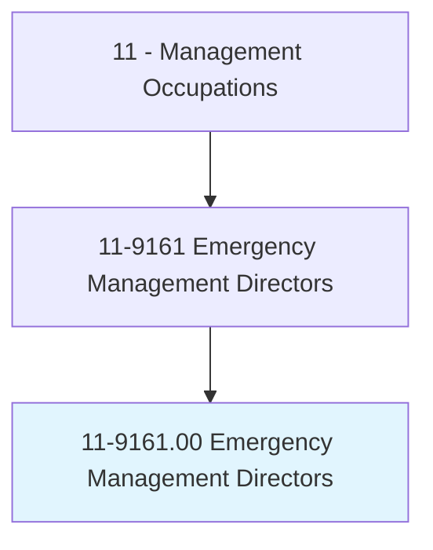
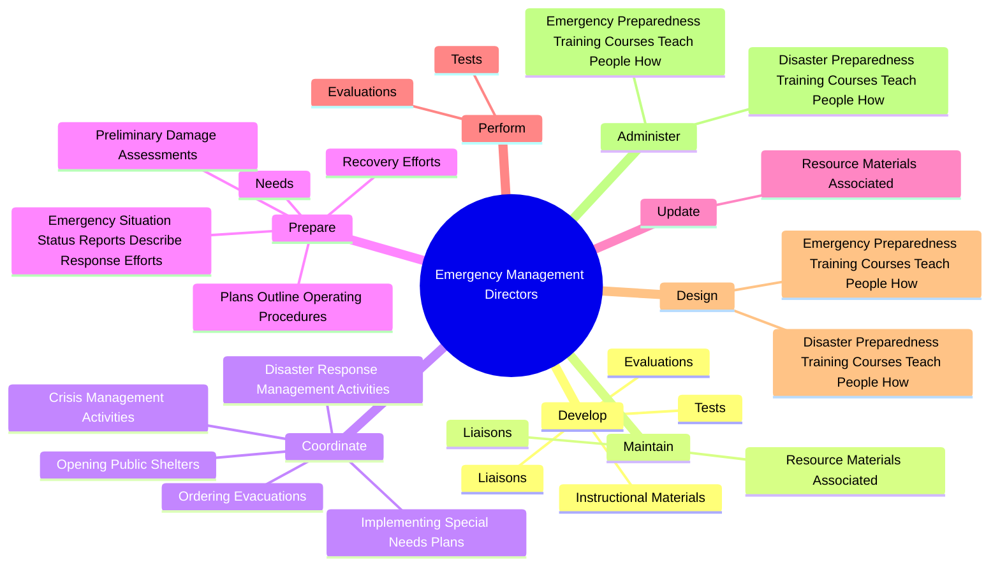
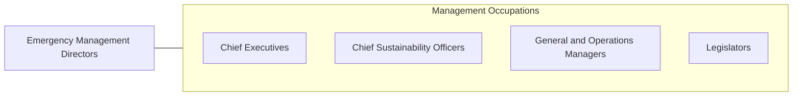

# Emergency Management Directors

> Plan and direct disaster response or crisis management activities, provide disaster preparedness training, and prepare emergency plans and procedures for natural (e.g., hurricanes, floods, earthquakes), wartime, or technological (e.g., nuclear power plant emergencies or hazardous materials spills) disasters or hostage situations.

## Overview

Emergency Management Directors is classified under Management Occupations (SOC 11). Plan and direct disaster response or crisis management activities, provide disaster preparedness training, and prepare emergency plans and procedures for natural (e.g., hurricanes, floods, earthquakes), wartime, or technological (e.g., nuclear power plant emergencies or hazardous materials spills) disasters or hostage situations.

## Classification Hierarchy

## Key Statistics

| Metric | Value |
|--------|-------|
| SOC Code | 11-9161.00 |
| Category | [Management Occupations](/occupations/Management) |
| Task Count | 113 |
| Source | O*NET |

## Core Tasks

### develop.Liaisons

Emergency Management Directors develop liaisons as part of their core responsibilities.

**Actions:**
- `develop.Liaisons.with.Municipalities`
- `develop.Liaisons.with.CountyDepartments`
- `develop.Liaisons.with.SimilarEntities.to.facilitate.PlanDevelopment`
- `develop.Liaisons.with.ResponseEffortCoordination`

### maintain.Liaisons

Emergency Management Directors maintain liaisons as part of their core responsibilities.

**Actions:**
- `maintain.Liaisons.with.Municipalities`
- `maintain.Liaisons.with.CountyDepartments`
- `maintain.Liaisons.with.SimilarEntities.to.facilitate.PlanDevelopment`
- `maintain.Liaisons.with.ResponseEffortCoordination`

### coordinate.DisasterResponseManagementActivities

Emergency Management Directors coordinate disaster response management activities as part of their core responsibilities.

**Actions:**
- `coordinate.DisasterResponseManagementActivities`
- `coordinate.CrisisManagementActivities`
- `coordinate.OrderingEvacuations`
- `coordinate.OpeningPublicShelters`

## Skills & Competencies

### Technical Skills
- **Strategic Planning** - Advanced
- **Financial Management** - Advanced
- **Operations Management** - Advanced

### Soft Skills
- **Communication** - Essential
- **Problem Solving** - Essential
- **Critical Thinking** - Important
- **Teamwork** - Important
- **Adaptability** - Important

## Related Occupations

## Industries

This occupation is found across multiple industries. See [Industries](/industries) for sector-specific employment data.

## Career Progression

---

*Source: O*NET 11-9161.00 - ONETOccupation*
