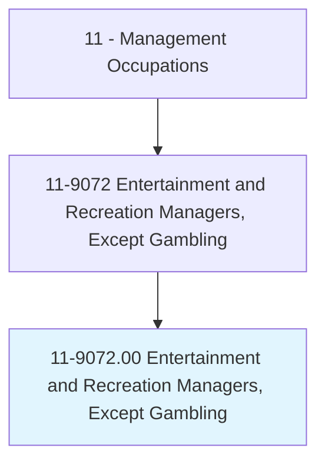
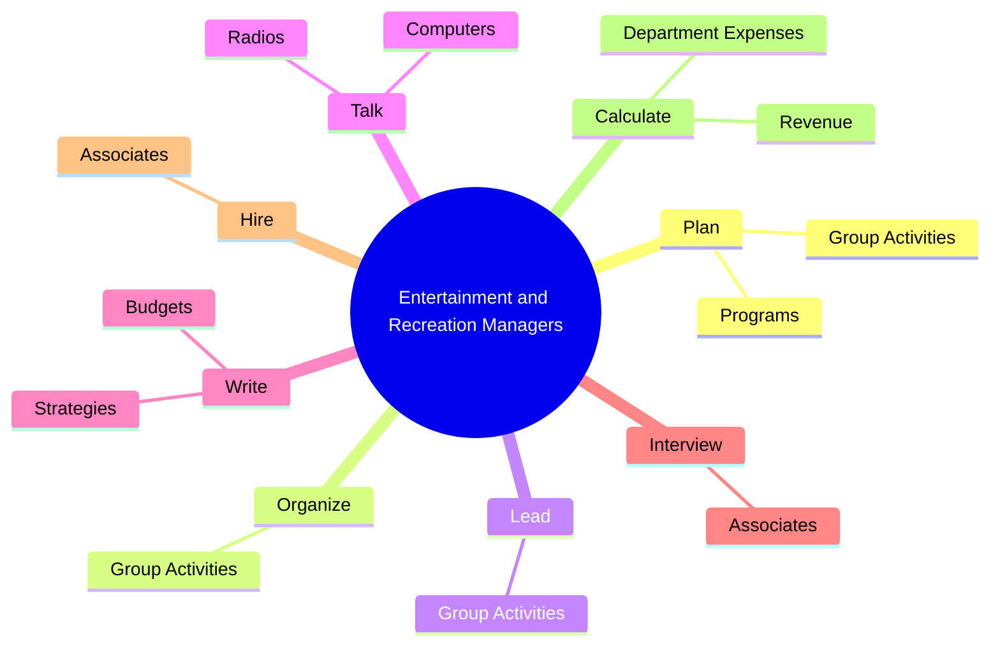
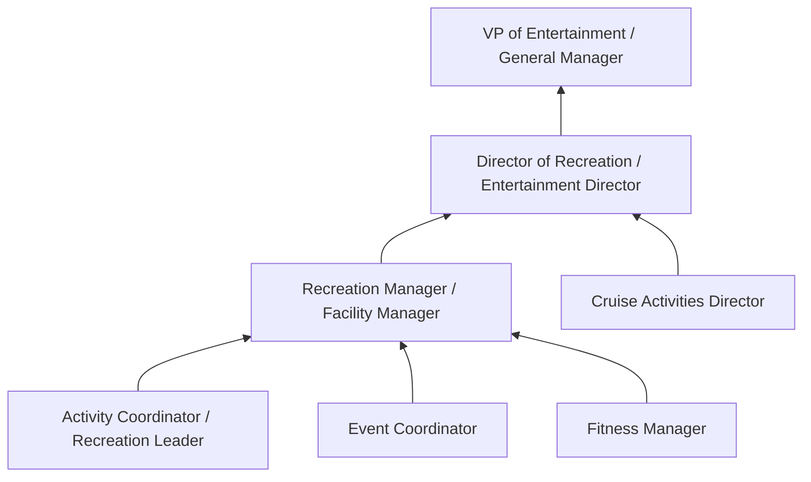
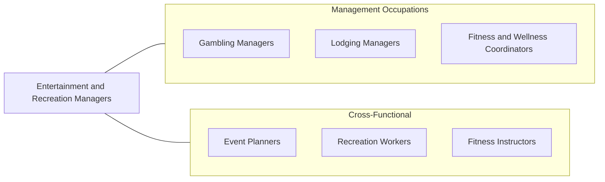

# Entertainment and Recreation Managers, Except Gambling

> Plan, direct, or coordinate entertainment and recreational activities and operations of a recreational facility, including cruise ships and parks.

## Overview

Entertainment and Recreation Managers oversee the operations of facilities and programs designed for leisure, fitness, and entertainment. They manage venues such as recreation centers, amusement parks, cruise ship activity programs, bowling alleys, fitness clubs, aquatic centers, and community recreation departments. Their role combines program development, facility management, staff supervision, and customer experience optimization.

These managers are responsible for planning and organizing activities that engage diverse audiences, from children's programs and fitness classes to live entertainment and special events. They balance creative programming with operational efficiency, ensuring facilities are safe, well-maintained, and financially viable. Revenue management through memberships, admissions, food and beverage, and merchandise is a key part of the role.

The entertainment and recreation industry is highly seasonal and customer-driven. Managers must adapt programming to changing consumer preferences, weather conditions, and demographic trends. They increasingly leverage technology for booking, marketing, and customer engagement while maintaining the personal touch that defines great recreational experiences.

## Classification Hierarchy

## Key Statistics

| Metric | Value |
|--------|-------|
| SOC Code | 11-9072.00 |
| Job Zone | 3 (Medium Preparation) |
| Category | [Management Occupations](/occupations/Management/index) |
| Task Count | 73 |
| Salary Range | $40,000 - $90,000+ |
| Employment Level | Moderate |
| Growth Outlook | Faster than average |
| Source | O*NET |

## Core Tasks

### plan.GroupActivities

Entertainment and Recreation Managers plan diverse group activities including exercise routines, athletic events, arts programs, and social gatherings tailored to their facility's audience.

**Actions:**
- `plan.GroupActivities.for.Customers`
- `plan.GroupActivities.for.ExerciseRoutines`
- `plan.GroupActivities.for.AthleticEvents`
- `plan.GroupActivities.for.Arts`

### organize.GroupActivities

Entertainment and Recreation Managers organize the logistics, staffing, equipment, and scheduling needed to execute planned activities successfully.

**Actions:**
- `organize.GroupActivities.for.Customers`
- `organize.GroupActivities.for.ExerciseRoutines`
- `organize.GroupActivities.for.AthleticEvents`
- `organize.GroupActivities.for.Arts`

### lead.GroupActivities

Entertainment and Recreation Managers directly lead or facilitate group activities, ensuring participant engagement, safety, and enjoyment.

**Actions:**
- `lead.GroupActivities.for.Customers`
- `lead.GroupActivities.for.ExerciseRoutines`
- `lead.GroupActivities.for.AthleticEvents`
- `lead.GroupActivities.for.Arts`

## Skills & Competencies

### Technical Skills
- **Program Development & Management** - Expert
- **Facility Operations** - Advanced
- **Event Planning & Coordination** - Advanced
- **Budget Management** - Advanced
- **Safety & Risk Management** - Advanced
- **Marketing & Promotions** - Advanced
- **Customer Service Management** - Advanced

### Soft Skills
- **Creativity** - Critical
- **Leadership** - Critical
- **Communication** - Essential
- **Customer Service** - Essential
- **Organizational Skills** - Essential
- **Energy & Enthusiasm** - Important
- **Flexibility** - Important

## Education & Certifications

| Requirement | Details |
|-------------|---------|
| Typical Education | Bachelor's degree in Recreation Management, Hospitality, Sports Management, or Business |
| Work Experience | 3-5 years in recreation, entertainment, or hospitality operations |
| On-the-Job Training | Moderate - facility-specific and seasonal program knowledge |
| Common Certifications | CPRP (Certified Park and Recreation Professional - NRPA), CPO (Certified Pool Operator - NSPF), First Aid/CPR/AED (American Red Cross), CAPE (Certified Attractions Professional Executive - IAAPA) |

## Career Progression

## Industry Variations

- **Municipal Parks & Recreation** - Community programming; grant-funded activities; inclusive recreation; inter-agency partnerships
- **Amusement / Theme Parks** - Ride operations; seasonal staffing (thousands); entertainment scheduling; guest safety protocols
- **Cruise Lines** - Shipboard entertainment coordination; port-of-call excursions; multi-cultural guest programs; maritime safety compliance
- **Fitness / Health Clubs** - Membership retention; group fitness scheduling; personal training oversight; facility maintenance

## Technology & Tools

- **Recreation Management** - RecDesk, CivicRec, ActiveNet, DASH Platform
- **Event Management** - Eventbrite, Cvent, Social Tables
- **Membership / POS** - Mindbody, ClubReady, ABC Fitness Solutions
- **Marketing** - Mailchimp, Canva, Social media management tools
- **Scheduling** - When I Work, Deputy, Sling
- **Safety** - Incident reporting systems, AED/safety monitoring equipment

## Related Occupations

## Industries

- [Arts, Entertainment, and Recreation](/industries/Entertainment) - Very High Employment
- [Government (Local Parks & Recreation)](/industries/Government) - High Employment
- [Accommodation and Food Services](/industries/AccommodationFood) - Moderate Employment
- [Educational Services](/industries/Education) - Low Employment

## Departments

This occupation typically works in:
- [Recreation / Activities](/departments/Recreation)
- [Entertainment](/departments/Entertainment)
- [Guest Services](/departments/GuestServices)
- [Parks & Recreation](/departments/ParksRec)

---

*Source: O*NET 11-9072.00 - ONETOccupation*
