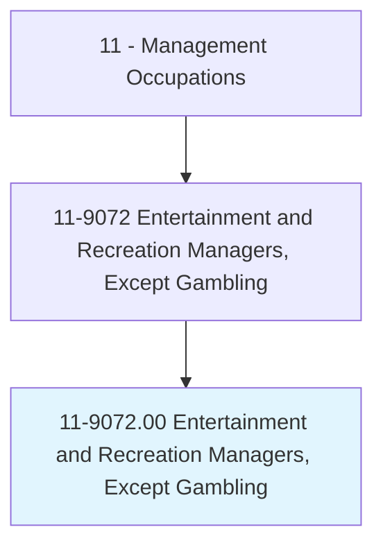
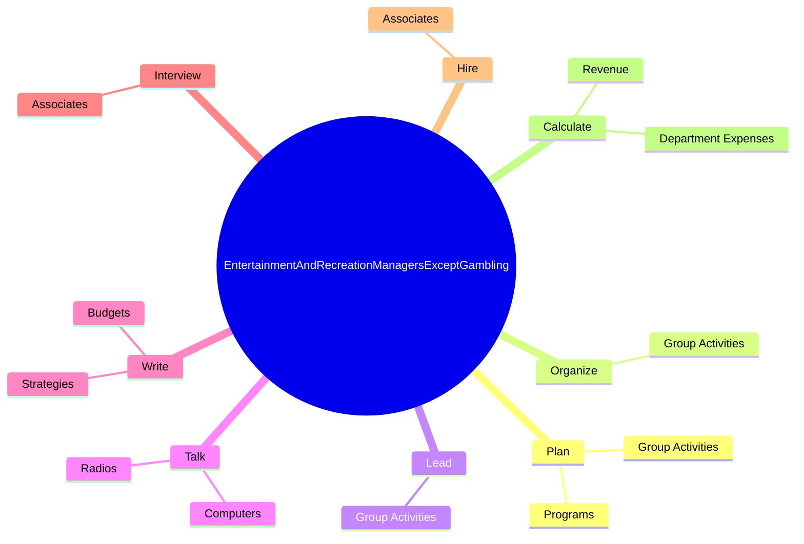
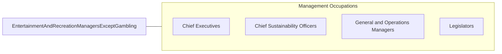

# Entertainment and Recreation Managers, Except Gambling

> Plan, direct, or coordinate entertainment and recreational activities and operations of a recreational facility, including cruise ships and parks.

## Overview

Entertainment and Recreation Managers, Except Gambling is classified under Management Occupations (SOC 11). Plan, direct, or coordinate entertainment and recreational activities and operations of a recreational facility, including cruise ships and parks.

## Classification Hierarchy

## Key Statistics

| Metric | Value |
|--------|-------|
| SOC Code | 11-9072.00 |
| Category | [Management Occupations](/occupations/Management) |
| Task Count | 73 |
| Source | O*NET |

## Core Tasks

### plan.GroupActivities

Entertainment and Recreation Managers, Except Gambling plan group activities as part of their core responsibilities.

**Actions:**
- `plan.GroupActivities.for.Customers`
- `plan.GroupActivities.for.ExerciseRoutines`
- `plan.GroupActivities.for.AthleticEvents`
- `plan.GroupActivities.for.Arts`

### organize.GroupActivities

Entertainment and Recreation Managers, Except Gambling organize group activities as part of their core responsibilities.

**Actions:**
- `organize.GroupActivities.for.Customers`
- `organize.GroupActivities.for.ExerciseRoutines`
- `organize.GroupActivities.for.AthleticEvents`
- `organize.GroupActivities.for.Arts`

### lead.GroupActivities

Entertainment and Recreation Managers, Except Gambling lead group activities as part of their core responsibilities.

**Actions:**
- `lead.GroupActivities.for.Customers`
- `lead.GroupActivities.for.ExerciseRoutines`
- `lead.GroupActivities.for.AthleticEvents`
- `lead.GroupActivities.for.Arts`

## Skills & Competencies

### Technical Skills
- **Strategic Planning** - Advanced
- **Financial Management** - Advanced
- **Operations Management** - Advanced

### Soft Skills
- **Communication** - Essential
- **Problem Solving** - Essential
- **Critical Thinking** - Important
- **Teamwork** - Important
- **Adaptability** - Important

## Related Occupations

## Industries

This occupation is found across multiple industries. See [Industries](/industries) for sector-specific employment data.

## Career Progression

---

*Source: O*NET 11-9072.00 - ONETOccupation*
