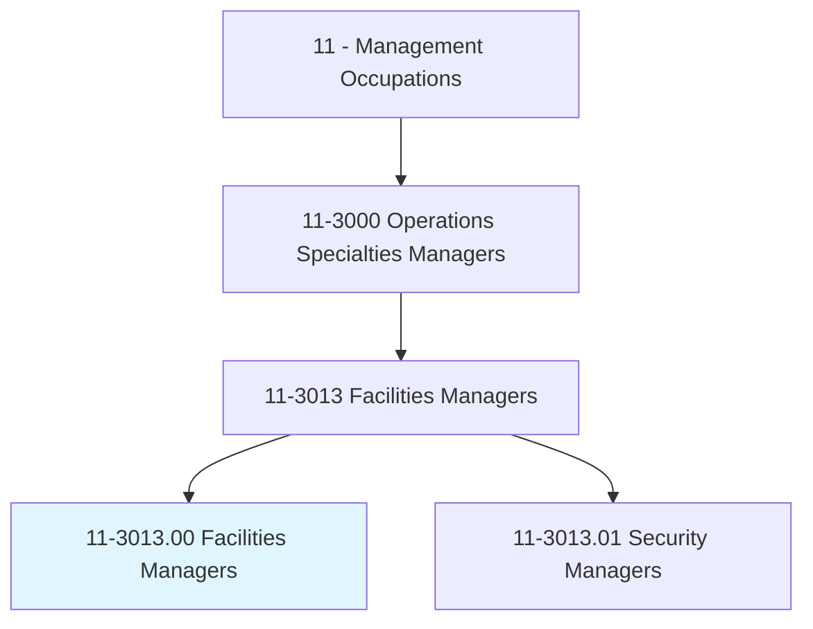
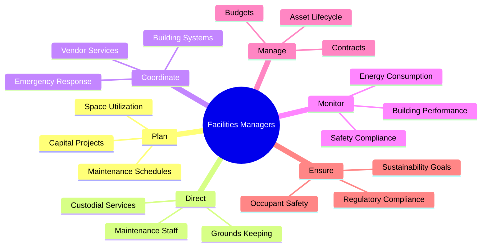
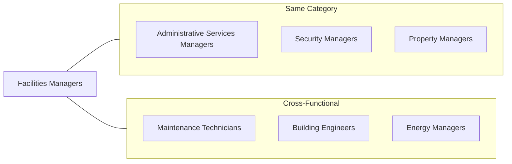
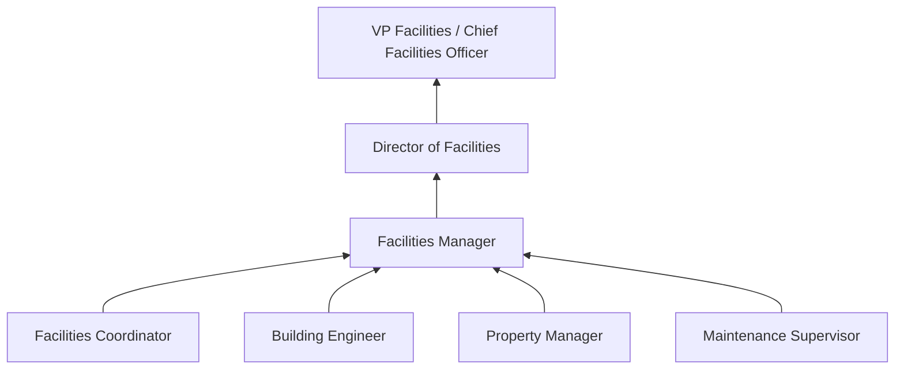

# Facilities Managers

> Plan, direct, or coordinate operations and functionalities of facilities and buildings. May include surrounding grounds or multiple facilities of an organization's campus.

## Overview

Facilities Managers are responsible for the physical infrastructure that enables organizations to operate. They oversee building maintenance, space planning, environmental systems, safety compliance, and capital improvement projects. This role requires balancing operational efficiency with occupant comfort, managing diverse vendor relationships, and ensuring facilities meet regulatory requirements. Facilities Managers play a critical role in organizational sustainability, emergency preparedness, and creating productive work environments.

## Classification Hierarchy

## Key Statistics

| Metric | Value |
|--------|-------|
| SOC Code | 11-3013.00 |
| Job Zone | 4 (Considerable Preparation) |
| Category | [Management](/occupations/Management/index) |
| Core Tasks | 18+ |
| Source | O*NET |

## Core Tasks

### plan.FacilitiesOperations

Facilities Managers develop comprehensive plans for building operations and improvements.

**Actions:**
- `plan.SpaceUtilization.for.Efficiency` - Optimize workspace allocation
- `plan.CapitalProjects.for.Improvements` - Schedule major renovations
- `plan.MaintenanceSchedules.for.Prevention` - Create preventive maintenance programs
- `plan.EnergyManagement.for.Sustainability` - Reduce environmental impact

### direct.FacilitiesStaff

Facilities Managers lead teams responsible for building maintenance and operations.

**Actions:**
- `direct.MaintenanceStaff.in.RepairActivities` - Supervise building repairs
- `direct.CustodialServices.for.Cleanliness` - Oversee janitorial operations
- `direct.GroundskeepingStaff.for.Landscaping` - Manage exterior maintenance
- `train.Staff.on.SafetyProcedures` - Ensure compliance with protocols

### coordinate.BuildingSystems

Facilities Managers ensure all building systems operate effectively.

**Actions:**
- `coordinate.HVACSystems.for.ComfortControl` - Manage climate systems
- `coordinate.ElectricalSystems.for.Reliability` - Maintain power infrastructure
- `coordinate.PlumbingSystems.for.Functionality` - Oversee water systems
- `coordinate.SecuritySystems.for.Protection` - Manage access control

### monitor.BuildingPerformance

Facilities Managers track facility performance metrics and compliance.

**Actions:**
- `monitor.EnergyConsumption.for.CostReduction` - Track utility usage
- `monitor.BuildingCondition.for.Maintenance` - Assess facility status
- `monitor.SafetyCompliance.with.Regulations` - Ensure code adherence
- `monitor.OccupantSatisfaction.for.Improvements` - Gather user feedback

### manage.FacilitiesBudgets

Facilities Managers control costs while maintaining facility quality.

**Actions:**
- `manage.OperatingBudgets.for.Maintenance` - Control ongoing expenses
- `manage.CapitalBudgets.for.Improvements` - Fund major projects
- `negotiate.VendorContracts.for.CostEfficiency` - Optimize procurement
- `forecast.Expenses.for.Planning` - Project future needs

## Skills & Competencies

### Technical Skills
- **Building Systems** - Expert
- **Project Management** - Advanced
- **Budget Management** - Advanced
- **Vendor Management** - Advanced
- **Sustainability Practices** - Proficient
- **Safety Regulations** - Advanced

### Soft Skills
- **Problem Solving** - Critical
- **Communication** - Critical
- **Organization** - Essential
- **Decision Making** - Essential
- **Leadership** - Essential
- **Negotiation** - Essential

## Related Occupations

## Industries

- [Real Estate](/industries/RealEstate/index) - High Employment
- [Healthcare](/industries/Healthcare/index) - High Employment
- [Educational Services](/industries/Education/index) - High Employment
- [Government](/industries/PublicAdministration) - Moderate Employment
- [Manufacturing](/industries/Manufacturing/index) - Moderate Employment
- [Professional Services](/industries/Scientific) - Moderate Employment

## Career Progression

## Education & Training

| Requirement | Details |
|-------------|---------|
| Typical Education | Bachelor's degree in Facilities Management, Business, or Engineering |
| Work Experience | 5+ years in facilities or building operations |
| On-the-Job Training | Moderate; ongoing technical training |
| Common Certifications | CFM (Certified Facility Manager), FMP (Facility Management Professional), LEED |

## Departments

This occupation typically works in:
- [Facilities](/departments/Operations)
- [Operations](/departments/Operations/index)
- Real Estate
- Corporate Services

---

*Source: O*NET 11-3013.00 - ONETOccupation*
