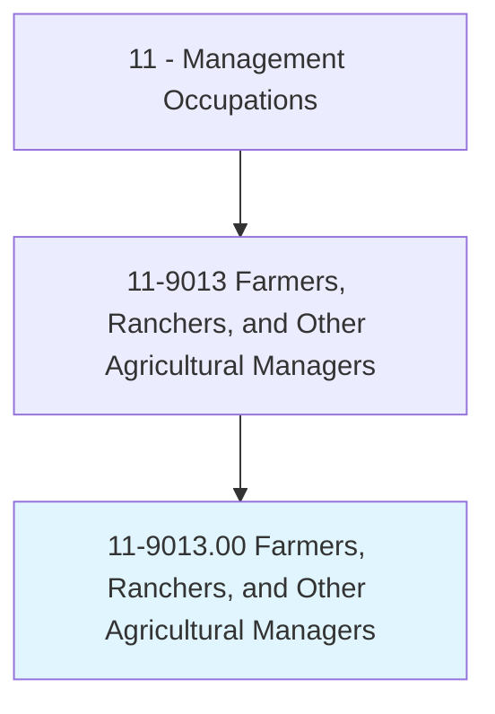
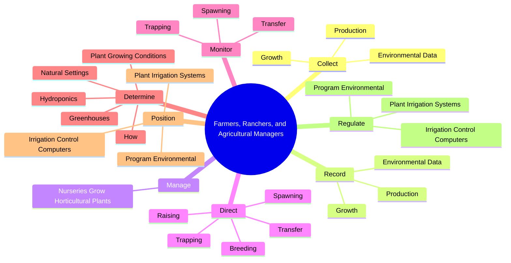
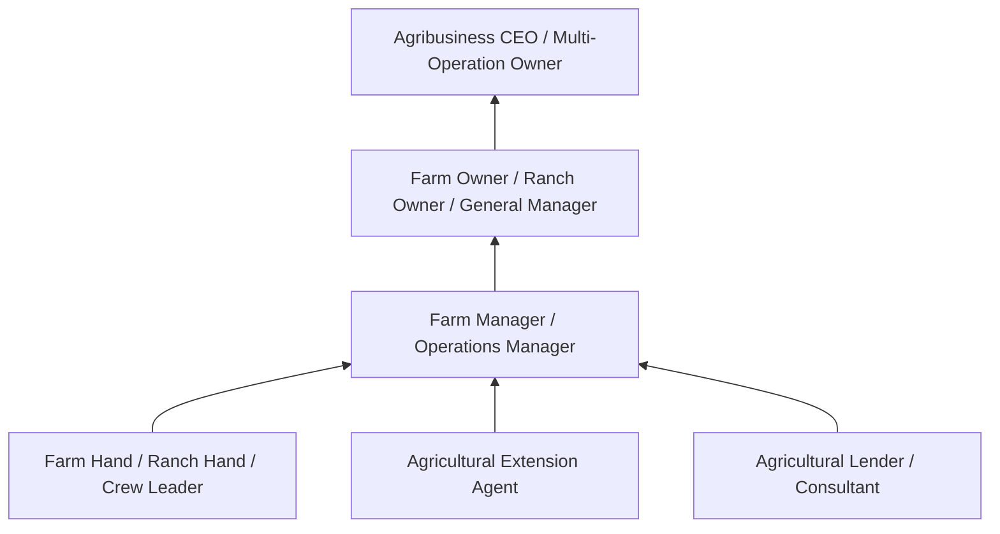
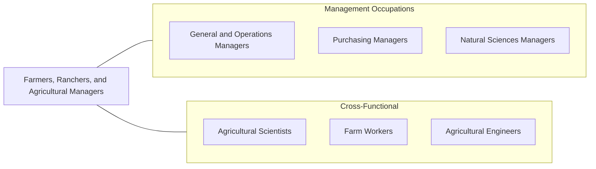

# Farmers, Ranchers, and Other Agricultural Managers

> Plan, direct, or coordinate the management or operation of farms, ranches, greenhouses, aquacultural operations, nurseries, timber tracts, or other agricultural establishments. May hire, train, and supervise farm workers or contract for services to carry out the day-to-day activities of the managed operation. May engage in or supervise planting, cultivating, harvesting, and financial and marketing activities.

## Overview

Farmers, Ranchers, and Other Agricultural Managers oversee the production of crops, livestock, and other agricultural products. They make critical decisions about what to plant or raise, when to harvest, how to market their products, and how to manage the financial aspects of agricultural operations. Their work combines hands-on production knowledge with business management, requiring expertise in agronomy, animal husbandry, equipment operation, and commodity markets.

The role encompasses a wide range of operations from small family farms to large commercial agricultural enterprises. These managers must contend with factors largely outside their control, including weather, commodity prices, pest infestations, and disease outbreaks. They increasingly rely on technology -- precision agriculture, GPS-guided equipment, soil sensors, and data analytics -- to optimize yields, reduce costs, and minimize environmental impact.

Modern agricultural management also requires navigating complex regulatory requirements related to food safety, environmental protection, water rights, and labor laws. Many agricultural managers are also entrepreneurs who must manage cash flow, secure financing, negotiate with buyers, and adapt their operations to changing market conditions and consumer preferences including organic, sustainable, and locally-sourced products.

## Classification Hierarchy

## Key Statistics

| Metric | Value |
|--------|-------|
| SOC Code | 11-9013.00 |
| Job Zone | 3 (Medium Preparation) |
| Category | [Management Occupations](/occupations/Management/index) |
| Task Count | 173 |
| Salary Range | $35,000 - $130,000+ (highly variable) |
| Employment Level | Large - over 960,000 |
| Growth Outlook | Declining |
| Source | O*NET |

## Core Tasks

### collect.Growth

Farmers and Agricultural Managers systematically collect growth, production, and environmental data to inform management decisions and track operational performance.

**Actions:**
- `collect.Growth`
- `collect.Production`
- `collect.EnvironmentalData`

### record.Growth

Farmers and Agricultural Managers maintain detailed records of growth patterns, production outputs, and environmental conditions for planning and regulatory purposes.

**Actions:**
- `record.Growth`
- `record.Production`
- `record.EnvironmentalData`

### manage.NurseriesGrowHorticulturalPlants

Agricultural Managers who operate nurseries manage the cultivation of horticultural plants for trade customers, retail customers, and display purposes.

**Actions:**
- `manage.NurseriesGrowHorticulturalPlants.for.Sale.to.trade.Customers`
- `manage.NurseriesGrowHorticulturalPlants.for.RetailCustomers`
- `manage.NurseriesGrowHorticulturalPlants.for.F`
- `manage.NurseriesGrowHorticulturalPlants.for.Display`

## Skills & Competencies

### Technical Skills
- **Crop / Livestock Production** - Expert
- **Agricultural Equipment Operation** - Expert
- **Soil & Water Management** - Advanced
- **Pest & Disease Management** - Advanced
- **Financial Management & Accounting** - Advanced
- **Marketing & Sales** - Advanced
- **Regulatory Compliance (EPA, USDA)** - Advanced

### Soft Skills
- **Decision Making** - Critical
- **Problem Solving** - Critical
- **Work Ethic & Physical Stamina** - Critical
- **Adaptability** - Essential
- **Business Acumen** - Essential
- **Mechanical Aptitude** - Essential
- **Risk Tolerance** - Important

## Education & Certifications

| Requirement | Details |
|-------------|---------|
| Typical Education | High school diploma to Bachelor's degree in Agriculture, Agribusiness, Animal Science, or related field |
| Work Experience | Extensive hands-on agricultural experience, often generational |
| On-the-Job Training | Extensive - continuous learning in production methods, markets, and technology |
| Common Certifications | CCA (Certified Crop Adviser - ASA), Private Pesticide Applicator License (state DOA), GAP Certification (USDA), Organic Certification (USDA NOP) |

## Career Progression

## Industry Variations

- **Row Crops** - Commodity marketing; precision agriculture; irrigation management; government subsidy programs (USDA FSA)
- **Livestock / Ranching** - Animal health management; breeding programs; grazing management; meat processing coordination
- **Specialty Crops / Horticulture** - Greenhouse management; direct-to-consumer marketing; organic certification; labor-intensive harvesting
- **Aquaculture** - Water quality management; species-specific husbandry; processing facility coordination; environmental permits

## Technology & Tools

- **Precision Agriculture** - John Deere Operations Center, Climate FieldView, Trimble Ag
- **Farm Management Software** - Granular, FarmLogs, Conservis, AgriWebb
- **Equipment** - GPS-guided tractors, drones (DJI Agras), soil sensors, automated irrigation
- **Financial** - QuickBooks, FarmBooks, AgFinance
- **Market Access** - CME Group (commodity futures), USDA Market News, Farmers.gov
- **Compliance** - USDA NRCS conservation tools, EPA reporting systems

## Related Occupations

## Industries

- [Agriculture, Forestry, Fishing and Hunting](/industries/Agriculture) - Very High Employment
- [Government (USDA, Extension Services)](/industries/PublicAdministration) - Moderate Employment

## Departments

This occupation typically works in:
- Farm / Ranch Operations
- Production Management
- Agricultural Business

---

*Source: O*NET 11-9013.00 - ONETOccupation*
