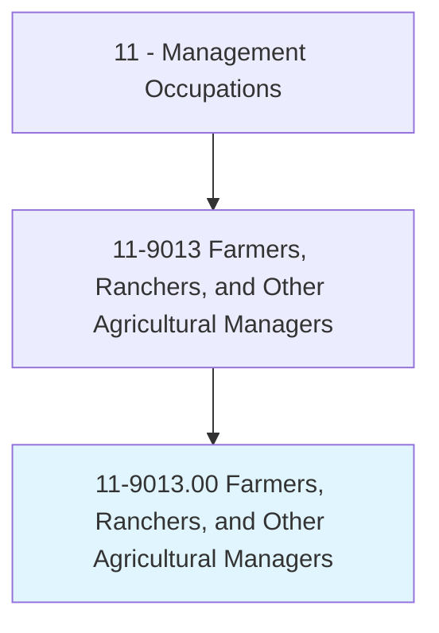
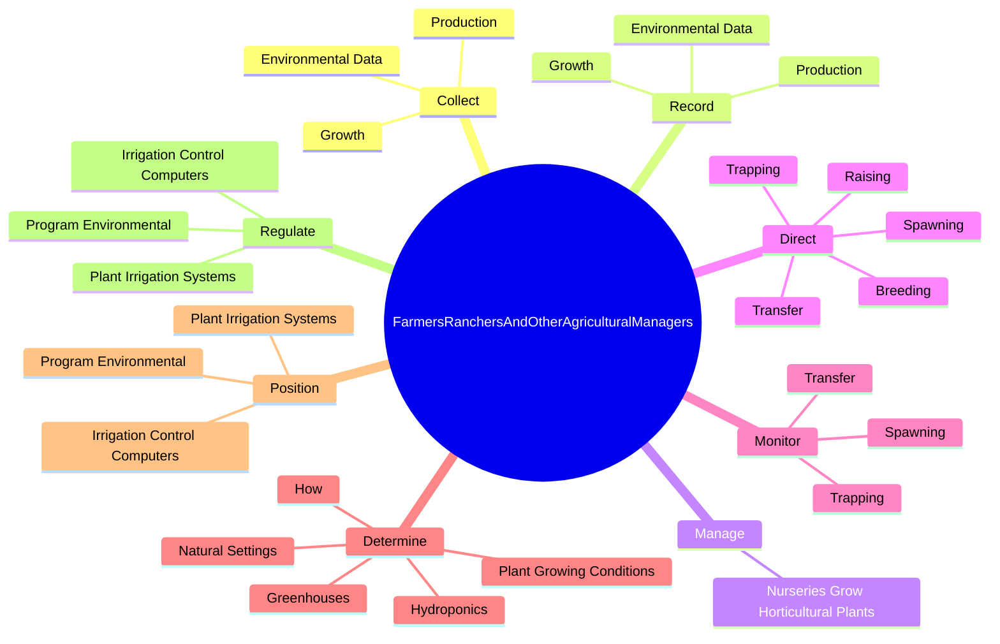
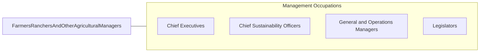

# Farmers, Ranchers, and Other Agricultural Managers

> Plan, direct, or coordinate the management or operation of farms, ranches, greenhouses, aquacultural operations, nurseries, timber tracts, or other agricultural establishments. May hire, train, and supervise farm workers or contract for services to carry out the day-to-day activities of the managed operation. May engage in or supervise planting, cultivating, harvesting, and financial and marketing activities.

## Overview

Farmers, Ranchers, and Other Agricultural Managers is an occupation within the Management Occupations category. Plan, direct, or coordinate the management or operation of farms, ranches, greenhouses, aquacultural operations, nurseries, timber tracts, or other agricultural establishments. May hire, train, and supervise farm workers or contract for services to carry out the day-to-day activities of the managed operation.

## Classification Hierarchy

## Key Statistics

| Metric | Value |
|--------|-------|
| SOC Code | 11-9013.00 |
| Category | [Management Occupations](/occupations/Management) |
| Task Count | 173 |
| Source | O*NET |

## Core Tasks

### collect.Growth

Farmers, Ranchers, and Other Agricultural Managers collect growth as part of their core responsibilities.

**Actions:**
- `collect.Growth`
- `collect.Production`
- `collect.EnvironmentalData`

### record.Growth

Farmers, Ranchers, and Other Agricultural Managers record growth as part of their core responsibilities.

**Actions:**
- `record.Growth`
- `record.Production`
- `record.EnvironmentalData`

### manage.NurseriesGrowHorticulturalPlants

Farmers, Ranchers, and Other Agricultural Managers manage nurseries grow horticultural plants as part of their core responsibilities.

**Actions:**
- `manage.NurseriesGrowHorticulturalPlants.for.Sale.to.trade.Customers`
- `manage.NurseriesGrowHorticulturalPlants.for.RetailCustomers`
- `manage.NurseriesGrowHorticulturalPlants.for.F`
- `manage.NurseriesGrowHorticulturalPlants.for.Display`

## Skills & Competencies

### Technical Skills
- **Strategic Planning** - Advanced
- **Financial Management** - Advanced
- **Operations Management** - Advanced

### Soft Skills
- **Communication** - Essential
- **Problem Solving** - Essential
- **Critical Thinking** - Important
- **Teamwork** - Important
- **Adaptability** - Important

## Related Occupations

## Industries

This occupation is found across multiple industries. See [Industries](/industries) for sector-specific employment data.

## Career Progression

---

*Source: O*NET 11-9013.00 - ONETOccupation*
