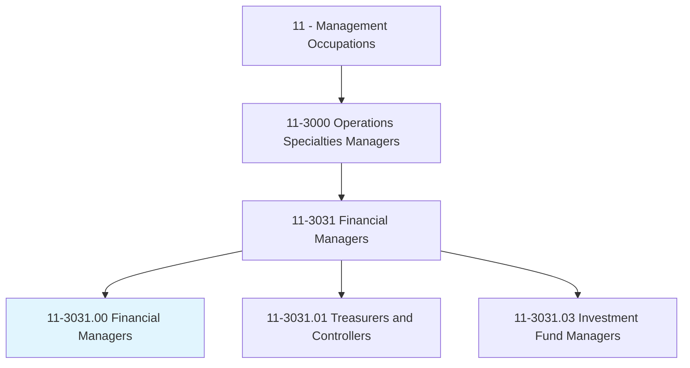
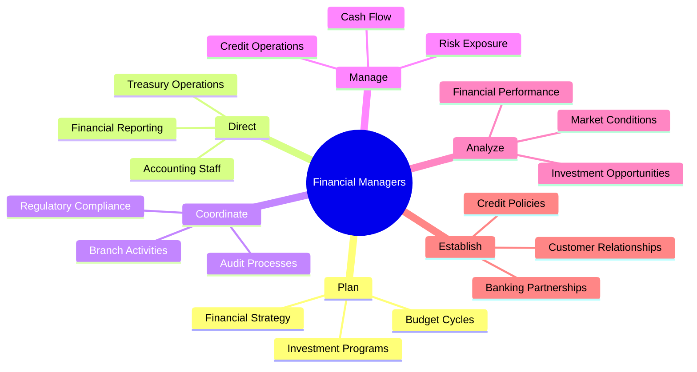
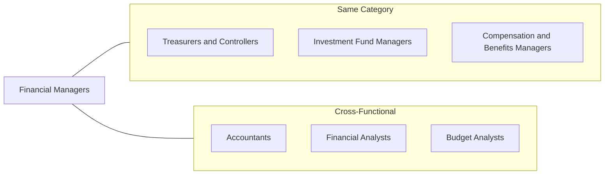
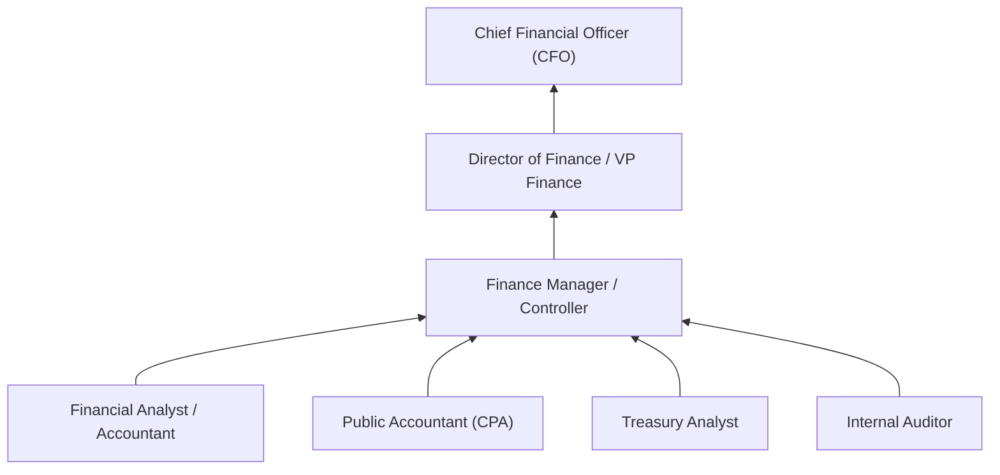

# Financial Managers

> Plan, direct, or coordinate accounting, investing, banking, insurance, securities, and other financial activities of a branch, office, or department of an establishment.

## Overview

Financial Managers are stewards of organizational capital, responsible for the financial health and strategic fiscal direction of their organizations. They oversee financial planning, cash management, investment strategies, and financial reporting. Working in roles such as Finance Directors, Controllers, and Branch Managers, they ensure regulatory compliance, manage risk, and provide the financial insights that inform business decisions. This role requires deep financial expertise combined with strategic thinking and leadership abilities.

## Classification Hierarchy

## Key Statistics

| Metric | Value |
|--------|-------|
| SOC Code | 11-3031.00 |
| Job Zone | 5 (Extensive Preparation) |
| Category | [Management](/occupations/Management) |
| Core Tasks | 25+ |
| Source | O*NET |

## Core Tasks

### establish.CustomerRelationships

Financial Managers build relationships with customers and business partners.

**Actions:**
- `establish.Relationships.with.IndividualCustomers` - Serve retail clients
- `establish.Relationships.with.BusinessCustomers` - Support commercial clients
- `provide.Assistance.with.CustomerProblems` - Resolve financial issues
- `maintain.Relationships.for.Retention` - Build loyalty

### oversee.CashFlow

Financial Managers ensure adequate liquidity and optimal use of funds.

**Actions:**
- `oversee.Flow.of.CashInstruments` - Manage monetary transactions
- `oversee.Flow.of.FinancialInstruments` - Handle securities
- `monitor.CashPosition.for.Liquidity` - Ensure sufficient funds
- `optimize.WorkingCapital.for.Efficiency` - Balance cash needs

### plan.FinancialActivities

Financial Managers coordinate financial operations across organizational units.

**Actions:**
- `plan.Activities.of.Workers.in.Branches` - Oversee branch operations
- `plan.Activities.of.Offices` - Manage departmental functions
- `plan.Activities.of.BranchBanks` - Direct banking operations
- `plan.Activities.of.BrokerageFirms` - Oversee investment services

### direct.FinancialOperations

Financial Managers lead teams in executing financial functions.

**Actions:**
- `direct.Activities.of.InsuranceDepartments` - Manage insurance operations
- `direct.Activities.of.CreditDepartments` - Oversee lending functions
- `direct.Activities.of.Risk` - Manage risk exposure
- `direct.FinancialReporting.for.Compliance` - Ensure accurate statements

### coordinate.RegulatoryCompliance

Financial Managers ensure adherence to financial regulations.

**Actions:**
- `coordinate.AuditProcesses.for.Compliance` - Facilitate examinations
- `ensure.RegulatoryCompliance.with.Standards` - Meet requirements
- `implement.Controls.for.RiskMitigation` - Establish safeguards
- `report.FinancialResults.to.Regulators` - File required disclosures

## Skills & Competencies

### Technical Skills
- **Financial Analysis** - Expert
- **Accounting Principles** - Expert
- **Risk Management** - Advanced
- **Regulatory Compliance** - Advanced
- **Financial Reporting** - Advanced
- **Investment Management** - Advanced

### Soft Skills
- **Leadership** - Critical
- **Strategic Thinking** - Critical
- **Communication** - Critical
- **Decision Making** - Essential
- **Attention to Detail** - Essential
- **Integrity** - Essential

## Related Occupations

## Industries

- [Finance and Insurance](/industries/FinanceInsurance) - High Employment
- [Professional Services](/industries/ProfessionalServices) - High Employment
- [Manufacturing](/industries/Manufacturing) - Moderate Employment
- [Healthcare](/industries/Healthcare) - Moderate Employment
- [Government](/industries/Government) - Moderate Employment
- [Wholesale Trade](/industries/WholesaleTrade) - Moderate Employment

## Career Progression

## Education & Training

| Requirement | Details |
|-------------|---------|
| Typical Education | Bachelor's degree in Finance, Accounting, or Business Administration |
| Work Experience | 5+ years in financial roles with progressive responsibility |
| On-the-Job Training | Moderate; continuous professional development |
| Common Certifications | CPA, CFA, CMA, MBA |

## Departments

This occupation typically works in:
- [Finance](/departments/Finance)
- [Treasury](/departments/Treasury)
- [Accounting](/departments/Accounting)
- [Financial Planning & Analysis](/departments/FPA)

---

*Source: O*NET 11-3031.00 - ONETOccupation*
