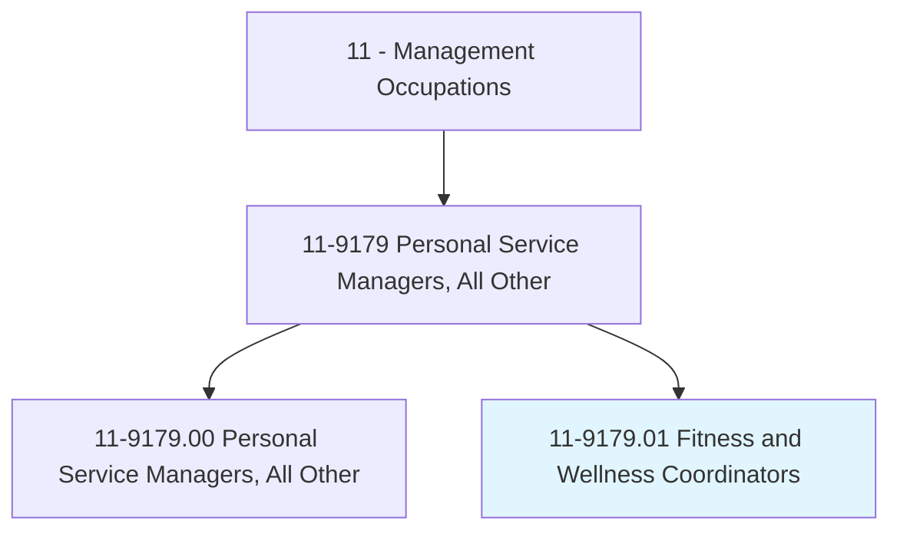
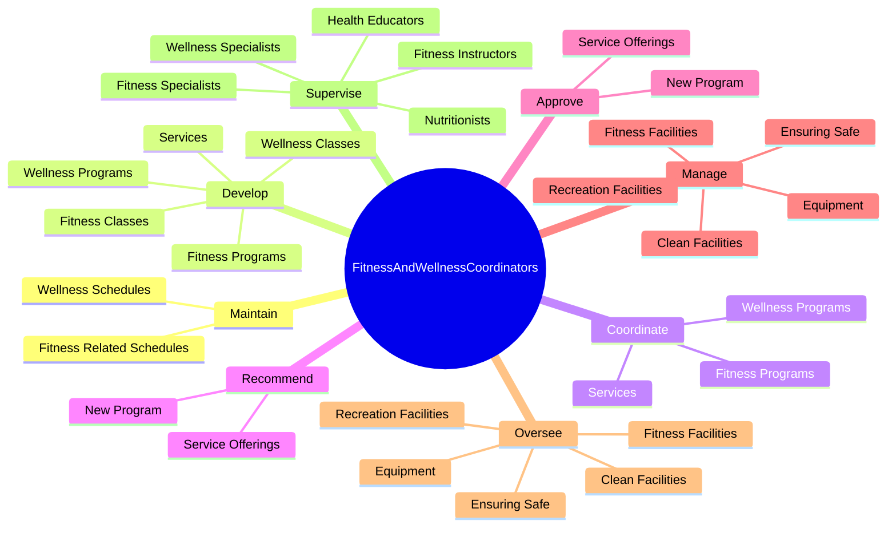
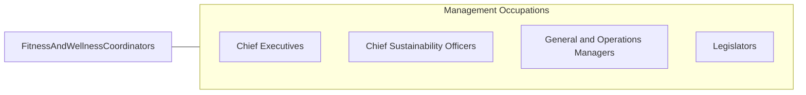

# Fitness and Wellness Coordinators

> Manage or coordinate fitness and wellness programs and services. Manage and train staff of wellness specialists, health educators, or fitness instructors.

## Overview

Fitness and Wellness Coordinators is a specialized variant within the Management Occupations category. Manage or coordinate fitness and wellness programs and services. 

## Classification Hierarchy

## Key Statistics

| Metric | Value |
|--------|-------|
| SOC Code | 11-9179.01 |
| Category | [Management Occupations](/occupations/Management) |
| Task Count | 159 |
| Source | O*NET |

## Core Tasks

### maintain.WellnessSchedules

Fitness and Wellness Coordinators maintain wellness schedules as part of their core responsibilities.

**Actions:**
- `maintain.WellnessSchedules`
- `maintain.FitnessRelatedSchedules`

### develop.FitnessPrograms

Fitness and Wellness Coordinators develop fitness programs as part of their core responsibilities.

**Actions:**
- `develop.FitnessPrograms`
- `develop.Services`
- `develop.WellnessPrograms`
- `develop.FitnessClasses.of.ClassOfferings`

### coordinate.FitnessPrograms

Fitness and Wellness Coordinators coordinate fitness programs as part of their core responsibilities.

**Actions:**
- `coordinate.FitnessPrograms`
- `coordinate.Services`
- `coordinate.WellnessPrograms`

## Skills & Competencies

### Technical Skills
- **Strategic Planning** - Advanced
- **Financial Management** - Advanced
- **Operations Management** - Advanced

### Soft Skills
- **Communication** - Essential
- **Problem Solving** - Essential
- **Critical Thinking** - Important
- **Teamwork** - Important
- **Adaptability** - Important

## Related Occupations

## Industries

This occupation is found across multiple industries. See [Industries](/industries) for sector-specific employment data.

## Career Progression

---

*Source: O*NET 11-9179.01 - ONETOccupation*
