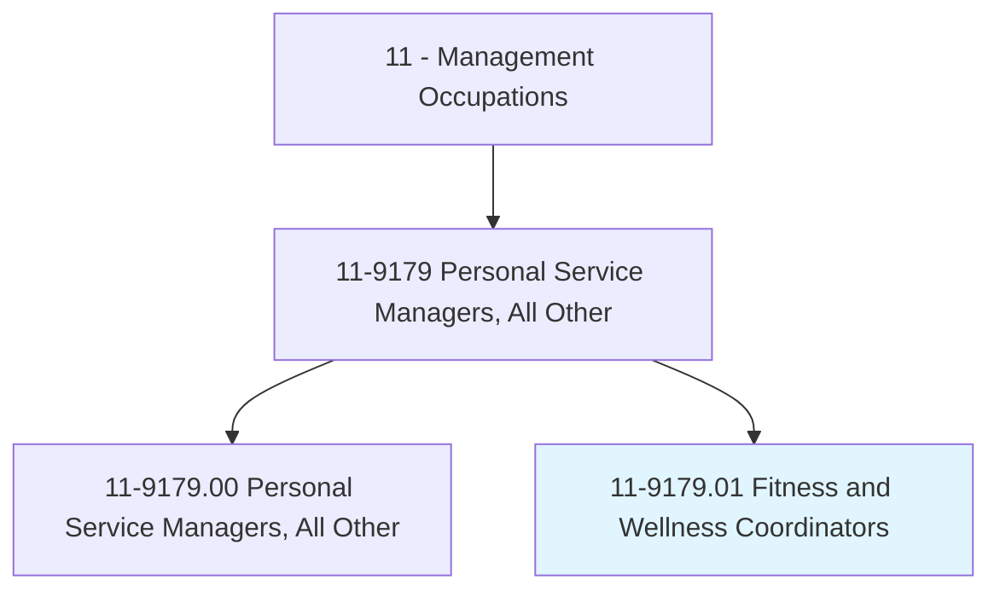
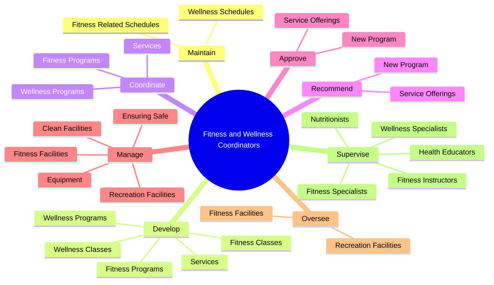
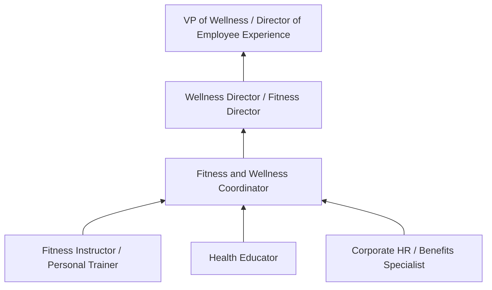
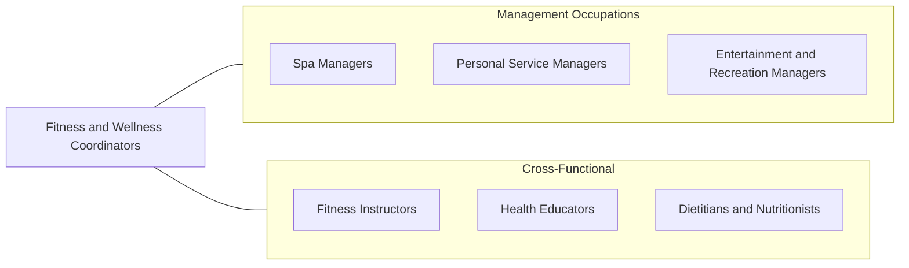

# Fitness and Wellness Coordinators

> Manage or coordinate fitness and wellness programs and services. Manage and train staff of wellness specialists, health educators, or fitness instructors.

## Overview

Fitness and Wellness Coordinators design, implement, and manage programs that promote physical fitness, health, and well-being within organizations or facilities. They oversee fitness centers, corporate wellness initiatives, community health programs, and recreational facilities, ensuring that programming meets the diverse needs of participants while operating safely and efficiently.

These coordinators develop class schedules, hire and train fitness instructors and wellness specialists, select equipment and vendors, track participation metrics, and evaluate program effectiveness. In corporate settings, they design wellness challenges, coordinate health screenings, manage employee assistance programs, and measure ROI through metrics such as reduced absenteeism, lower healthcare costs, and improved employee satisfaction.

The growing emphasis on preventive health, workplace wellness, and holistic well-being has expanded the role significantly. Fitness and Wellness Coordinators now address mental health, stress management, nutrition counseling, ergonomics, and chronic disease prevention alongside traditional fitness programming. They must stay current with fitness trends, evidence-based health practices, and liability considerations.

## Classification Hierarchy

## Key Statistics

| Metric | Value |
|--------|-------|
| SOC Code | 11-9179.01 |
| Job Zone | 4 (Considerable Preparation) |
| Category | [Management Occupations](/occupations/Management/index) |
| Task Count | 159 |
| Salary Range | $45,000 - $85,000+ |
| Employment Level | Moderate |
| Growth Outlook | Faster than average |
| Source | O*NET |

## Core Tasks

### develop.FitnessPrograms

Fitness and Wellness Coordinators create comprehensive fitness and wellness programming including group classes, individual training options, and wellness initiatives.

**Actions:**
- `develop.FitnessPrograms`
- `develop.Services`
- `develop.WellnessPrograms`
- `develop.FitnessClasses.of.ClassOfferings`

### manage.FitnessFacilities

Fitness and Wellness Coordinators ensure fitness and recreation facilities are safe, clean, and properly equipped for all programming needs.

**Actions:**
- No specific sub-actions listed for this task group.

### supervise.FitnessSpecialists

Fitness and Wellness Coordinators supervise and train a diverse staff of fitness specialists, wellness coaches, nutritionists, and health educators.

**Actions:**
- No specific sub-actions listed for this task group.

## Skills & Competencies

### Technical Skills
- **Fitness Program Design** - Expert
- **Wellness Program Management** - Expert
- **Exercise Science Principles** - Advanced
- **Facility & Equipment Management** - Advanced
- **Health Promotion & Education** - Advanced
- **Budget Management** - Advanced
- **Risk Management & Safety** - Advanced

### Soft Skills
- **Leadership** - Critical
- **Communication** - Essential
- **Motivational Skills** - Essential
- **Organizational Skills** - Essential
- **Customer Service** - Essential
- **Creativity** - Important
- **Empathy** - Important

## Education & Certifications

| Requirement | Details |
|-------------|---------|
| Typical Education | Bachelor's degree in Exercise Science, Kinesiology, Health Promotion, or related field |
| Advanced Education | Master's in Health Promotion or Public Health for corporate wellness roles |
| Work Experience | 3-5 years in fitness, wellness, or health education |
| Common Certifications | ACSM-CEP (Certified Exercise Physiologist - ACSM), NSCA-CSCS (Certified Strength and Conditioning Specialist), ACE-GFI (Group Fitness Instructor - ACE), CWWPM (Certified Worksite Wellness Program Manager - Chapman Institute), CPR/AED/First Aid |

## Career Progression

## Industry Variations

- **Corporate Wellness** - Employee health metrics; healthcare cost reduction; productivity improvement; wellness challenges; biometric screenings
- **Health Clubs / Gyms** - Membership retention; group fitness scheduling; personal training management; facility maintenance
- **Healthcare / Hospital Wellness** - Cardiac rehab programs; chronic disease management; patient wellness; community health screenings
- **Municipal / Community** - Park district programming; accessible fitness options; senior wellness; youth sports and fitness

## Technology & Tools

- **Fitness Management** - Mindbody, ClubReady, ABC Fitness Solutions, Zen Planner
- **Wellness Platforms** - Virgin Pulse, Limeade, WellSteps, Vitality
- **Wearable Integration** - Fitbit Health Solutions, Apple Health, Garmin Connect
- **Class Scheduling** - Mindbody, When I Work, TeamUp
- **Assessment Tools** - InBody (body composition), FMS (Functional Movement Screen)
- **Communication** - Slack, Teams, Mailchimp for member engagement

## Related Occupations

## Industries

- [Arts, Entertainment, and Recreation](/industries/Entertainment) - High Employment
- [Healthcare and Social Assistance](/industries/Healthcare/index) - Moderate Employment
- [Professional Services (Corporate Wellness)](/industries/Scientific) - Moderate Employment
- [Government (Parks & Recreation)](/industries/PublicAdministration) - Moderate Employment

## Departments

This occupation typically works in:
- Wellness / Fitness
- [Human Resources (Corporate Wellness)](/departments/HumanResources/index)
- Recreation
- Employee Experience

---

*Source: O*NET 11-9179.01 - ONETOccupation*
