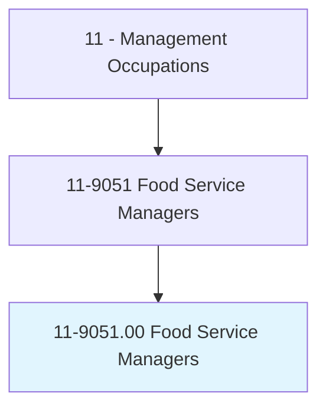
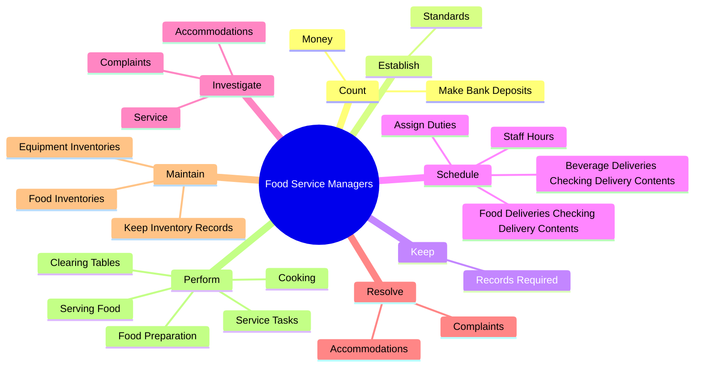
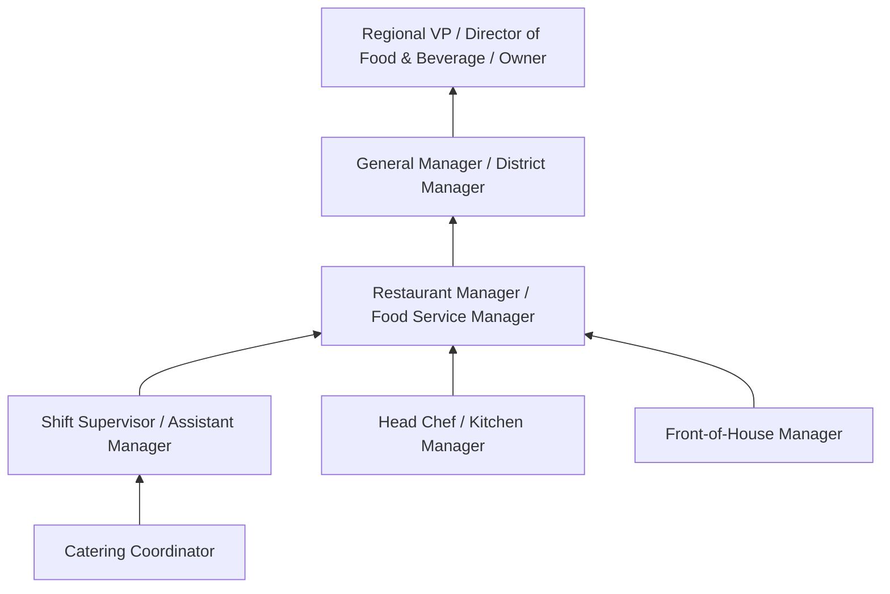
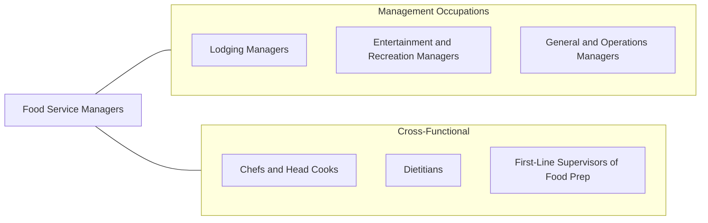

# Food Service Managers

> Plan, direct, or coordinate activities of an organization or department that serves food and beverages.

## Overview

Food Service Managers oversee the daily operations of restaurants, cafeterias, catering companies, and other establishments that prepare and serve food and beverages. They are responsible for ensuring food quality, customer satisfaction, regulatory compliance, and profitability. Their duties span managing staff, controlling costs, maintaining health and safety standards, and creating a positive dining experience.

The scope of this role varies widely depending on the type of establishment. A manager at a quick-service restaurant may focus heavily on operational efficiency and staff scheduling, while a fine dining manager may concentrate on menu development, wine programs, and guest relations. Institutional food service managers in hospitals, schools, or corporate cafeterias must balance nutritional requirements, dietary restrictions, and high-volume production.

Food Service Managers face unique challenges including thin profit margins, high employee turnover, seasonal demand fluctuations, and stringent food safety regulations. They must adapt to evolving consumer preferences, including demand for healthier options, allergen transparency, sustainable sourcing, and technology-driven ordering systems. The role demands both operational precision and hospitality-focused leadership.

## Classification Hierarchy

## Key Statistics

| Metric | Value |
|--------|-------|
| SOC Code | 11-9051.00 |
| Job Zone | 3 (Medium Preparation) |
| Category | [Management Occupations](/occupations/Management/index) |
| Task Count | 140 |
| Salary Range | $40,000 - $85,000+ |
| Employment Level | Large - over 300,000 |
| Growth Outlook | Average |
| Source | O*NET |

## Core Tasks

### count.Money

Food Service Managers handle daily financial operations including cash management, bank deposits, and reconciliation of sales figures.

**Actions:**
- `count.Money`
- `count.MakeBankDeposits`

### establish.Standards

Food Service Managers establish performance and customer service standards that define the quality expectations for staff and the dining experience.

**Actions:**
- `establish.Standards.for.PersonnelPerformanceService`
- `establish.Standards.for.Customerservice`

### keep.RecordsRequired

Food Service Managers maintain required records for government agencies regarding sanitation inspections, food subsidies, and regulatory compliance.

**Actions:**
- `keep.RecordsRequired.by.GovernmentAgenciesRegardingSanitationSubsidies`
- `keep.RecordsRequired.by.FoodSubsidies`

## Skills & Competencies

### Technical Skills
- **Food Safety & Sanitation** - Expert
- **Inventory & Cost Control** - Expert
- **Menu Planning & Pricing** - Advanced
- **Staff Scheduling** - Advanced
- **Vendor Management** - Advanced
- **Point-of-Sale Systems** - Advanced
- **Health Code Compliance** - Advanced

### Soft Skills
- **Leadership** - Critical
- **Customer Service** - Critical
- **Communication** - Essential
- **Problem Solving** - Essential
- **Time Management** - Essential
- **Composure Under Pressure** - Essential
- **Team Building** - Important

## Education & Certifications

| Requirement | Details |
|-------------|---------|
| Typical Education | High school diploma to Bachelor's degree in Hospitality Management, Culinary Arts, or Business |
| Work Experience | 3-5 years in food service, often starting in front-of-house or kitchen roles |
| On-the-Job Training | Extensive - hands-on experience in all aspects of food service operations |
| Common Certifications | ServSafe Manager (National Restaurant Association), CFM (Certified Food Manager), FMP (Foodservice Management Professional - NRA), CPFM (Certified Professional Food Manager) |

## Career Progression

## Industry Variations

- **Full-Service Restaurants** - Menu development; wine and beverage programs; guest relations; ambiance management; reservation systems
- **Quick-Service / Fast Casual** - Throughput optimization; franchise compliance; drive-through efficiency; digital ordering integration
- **Institutional (Healthcare / Education)** - Nutritional compliance; dietary accommodations; high-volume meal planning; government subsidy management
- **Hotels & Resorts** - Banquet and event coordination; room service operations; multiple outlet management; seasonal staffing

## Technology & Tools

- **POS Systems** - Toast, Square, Lightspeed, Aloha, NCR
- **Inventory Management** - MarketMan, BlueCart, BevSpot, Compeat
- **Staff Scheduling** - 7shifts, HotSchedules, When I Work, Deputy
- **Online Ordering** - DoorDash, Uber Eats, Grubhub (integration management)
- **Accounting** - Restaurant365, QuickBooks, Xero
- **Reservation / Table Management** - OpenTable, Resy, Yelp Reservations

## Related Occupations

## Industries

- Accommodation and Food Services - Very High Employment
- [Healthcare and Social Assistance](/industries/Healthcare/index) - Moderate Employment
- [Educational Services](/industries/Education) - Moderate Employment
- [Government](/industries/PublicAdministration) - Moderate Employment
- [Retail Trade](/industries/Retail/index) - Moderate Employment

## Departments

This occupation typically works in:
- Food & Beverage
- [Operations](/departments/Operations/index)
- Hospitality
- Catering & Events

---

*Source: O*NET 11-9051.00 - ONETOccupation*
