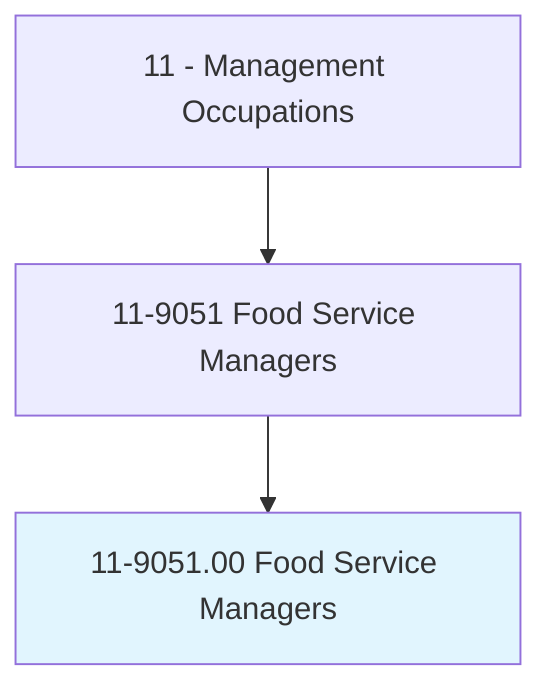
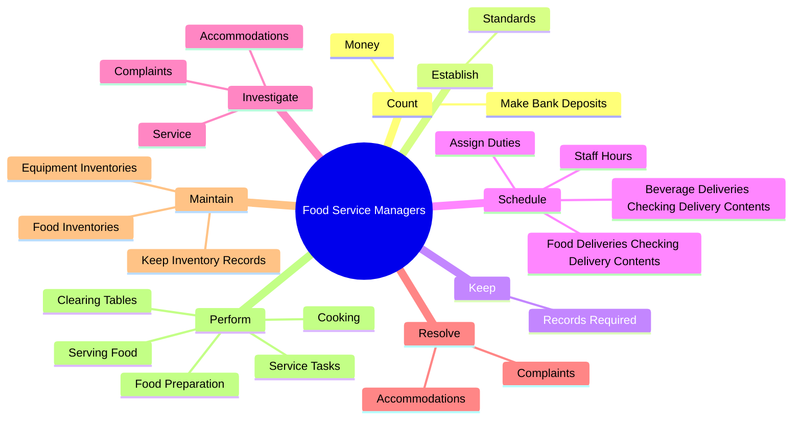
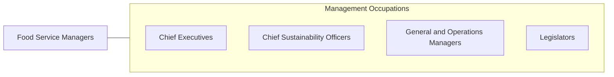

# Food Service Managers

> Plan, direct, or coordinate activities of an organization or department that serves food and beverages.

## Overview

Food Service Managers is classified under Management Occupations (SOC 11). Plan, direct, or coordinate activities of an organization or department that serves food and beverages.

## Classification Hierarchy

## Key Statistics

| Metric | Value |
|--------|-------|
| SOC Code | 11-9051.00 |
| Category | [Management Occupations](/occupations/Management) |
| Task Count | 140 |
| Source | O*NET |

## Core Tasks

### count.Money

Food Service Managers count money as part of their core responsibilities.

**Actions:**
- `count.Money`
- `count.MakeBankDeposits`

### establish.Standards

Food Service Managers establish standards as part of their core responsibilities.

**Actions:**
- `establish.Standards.for.PersonnelPerformanceService`
- `establish.Standards.for.Customerservice`

### keep.RecordsRequired

Food Service Managers keep records required as part of their core responsibilities.

**Actions:**
- `keep.RecordsRequired.by.GovernmentAgenciesRegardingSanitationSubsidies`
- `keep.RecordsRequired.by.FoodSubsidies`

## Skills & Competencies

### Technical Skills
- **Strategic Planning** - Advanced
- **Financial Management** - Advanced
- **Operations Management** - Advanced

### Soft Skills
- **Communication** - Essential
- **Problem Solving** - Essential
- **Critical Thinking** - Important
- **Teamwork** - Important
- **Adaptability** - Important

## Related Occupations

## Industries

This occupation is found across multiple industries. See [Industries](/industries) for sector-specific employment data.

## Career Progression

---

*Source: O*NET 11-9051.00 - ONETOccupation*
