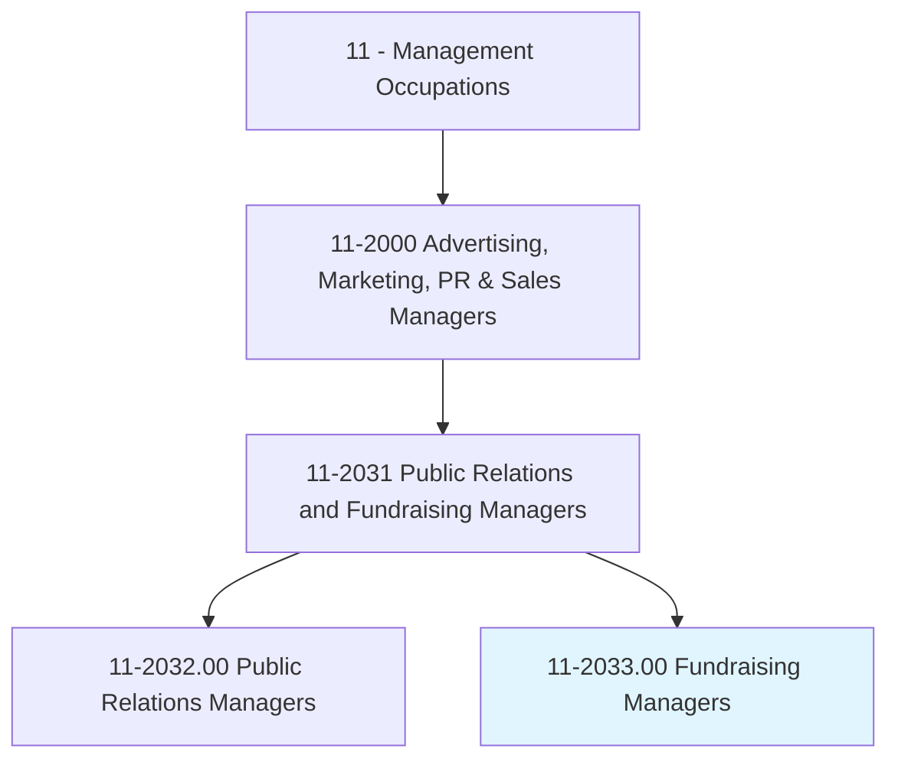
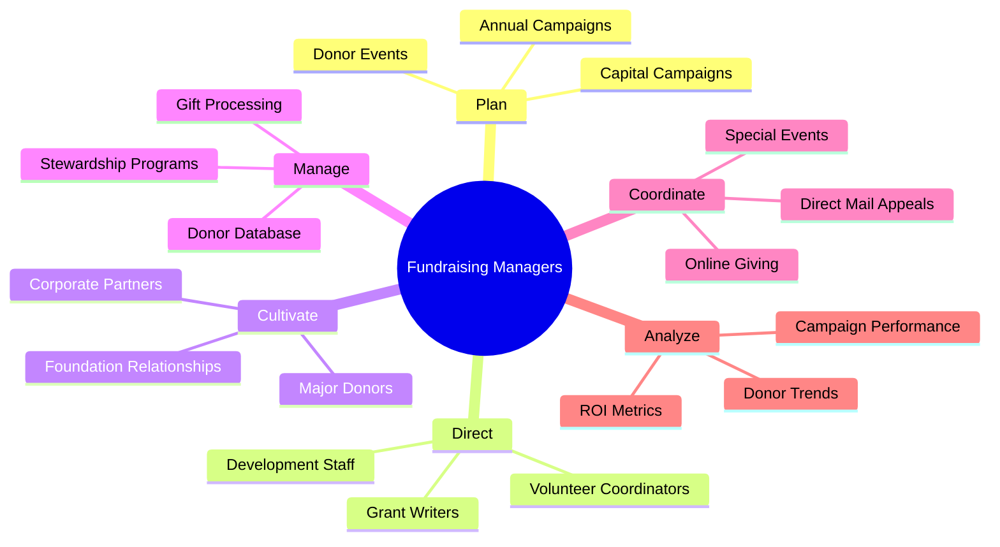
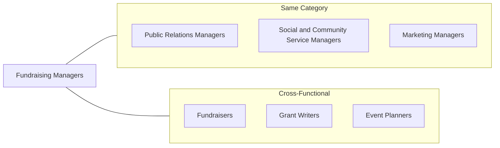
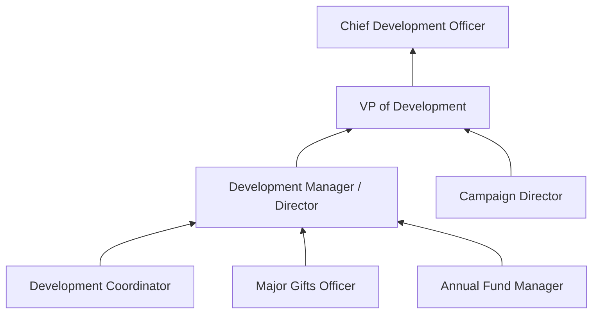

# Fundraising Managers

> Plan, direct, or coordinate activities to solicit and maintain funds for special projects or nonprofit organizations.

## Overview

Fundraising Managers are development professionals who lead organizations' efforts to secure financial support from donors, foundations, corporations, and government sources. They design comprehensive fundraising strategies, manage donor relationships, oversee campaigns, and ensure sustainable revenue streams for nonprofit organizations, educational institutions, healthcare facilities, and other mission-driven entities. This role combines relationship management, strategic planning, and financial acumen to advance organizational missions through philanthropy.

## Classification Hierarchy

## Key Statistics

| Metric | Value |
|--------|-------|
| SOC Code | 11-2033.00 |
| Job Zone | 4 (Considerable Preparation) |
| Category | [Management](/occupations/Management/index) |
| Core Tasks | 15+ |
| Source | O*NET |

## Core Tasks

### plan.FundraisingCampaigns

Fundraising Managers design and execute comprehensive campaigns to meet revenue goals.

**Actions:**
- `plan.AnnualFundCampaigns.to.sustain.Operations` - Create recurring revenue programs
- `plan.CapitalCampaigns.for.MajorProjects` - Fund large-scale initiatives
- `plan.SpecialEvents.to.engage.Donors` - Create cultivation opportunities
- `develop.CasesForSupport.to.inspire.Giving` - Craft compelling narratives

### direct.DevelopmentStaff

Fundraising Managers lead teams of development professionals and volunteers.

**Actions:**
- `direct.DevelopmentOfficers.in.DonorCultivation` - Guide major gift work
- `supervise.GrantWriters.for.FoundationFunding` - Oversee grant applications
- `coordinate.VolunteerSolicitors.for.Campaigns` - Leverage volunteer networks
- `train.Staff.on.FundraisingTechniques` - Build team capabilities

### cultivate.DonorRelationships

Fundraising Managers build and maintain relationships with key supporters.

**Actions:**
- `cultivate.MajorDonors.through.PersonalizedEngagement` - Nurture high-value relationships
- `steward.CorporatePartners.with.RecognitionPrograms` - Maintain corporate support
- `engage.FoundationOfficers.for.GrantOpportunities` - Build funder relationships
- `recognize.Donors.through.StewardshipActivities` - Express gratitude

### manage.DonorDatabase

Fundraising Managers ensure accurate donor records and effective data utilization.

**Actions:**
- `manage.DonorDatabase.for.TargetedOutreach` - Segment and track donors
- `analyze.GivingPatterns.to.identify.Prospects` - Discover new opportunities
- `track.CampaignProgress.against.Goals` - Monitor performance
- `report.FundraisingResults.to.Leadership` - Communicate outcomes

### coordinate.SpecialEvents

Fundraising Managers plan and execute events that engage donors and raise funds.

**Actions:**
- `coordinate.GalaEvents.for.MajorFundraising` - Produce signature events
- `plan.DonorAppreciationEvents.for.Stewardship` - Thank supporters
- `organize.AuctionEvents.to.maximize.Revenue` - Create interactive giving opportunities
- `execute.VirtualEvents.for.BroaderReach` - Expand audience access

## Skills & Competencies

### Technical Skills
- **Development Strategy** - Expert
- **Donor Relations** - Expert
- **Grant Writing** - Advanced
- **Database Management** - Advanced
- **Event Planning** - Advanced
- **Financial Analysis** - Proficient

### Soft Skills
- **Relationship Building** - Critical
- **Communication** - Critical
- **Persuasion** - Critical
- **Strategic Thinking** - Essential
- **Empathy** - Essential
- **Persistence** - Essential

## Related Occupations

## Industries

- [Nonprofit Organizations](/industries/Nonprofit) - High Employment
- [Healthcare](/industries/Healthcare/index) - High Employment
- [Educational Services](/industries/Education/index) - High Employment
- [Religious Organizations](/industries/Religious) - Moderate Employment
- [Arts and Culture](/industries/ArtsAndCulture) - Moderate Employment
- [Social Services](/industries/SocialServices) - Moderate Employment

## Career Progression

## Education & Training

| Requirement | Details |
|-------------|---------|
| Typical Education | Bachelor's degree in Nonprofit Management, Communications, or related field |
| Work Experience | 5+ years in development/fundraising roles |
| On-the-Job Training | Moderate; ongoing professional development |
| Common Certifications | CFRE (Certified Fund Raising Executive), AFP membership |

## Departments

This occupation typically works in:
- [Development](/departments/Development)
- [Advancement](/departments/Advancement)
- [Annual Giving](/departments/AnnualGiving)
- [Major Gifts](/departments/MajorGifts)

---

*Source: O*NET 11-2033.00 - ONETOccupation*
