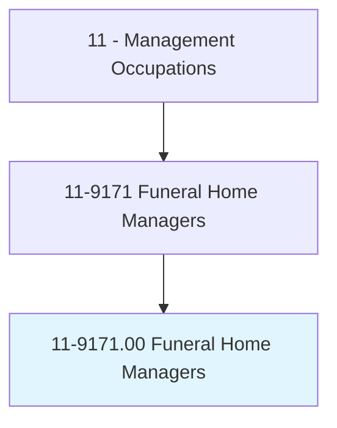
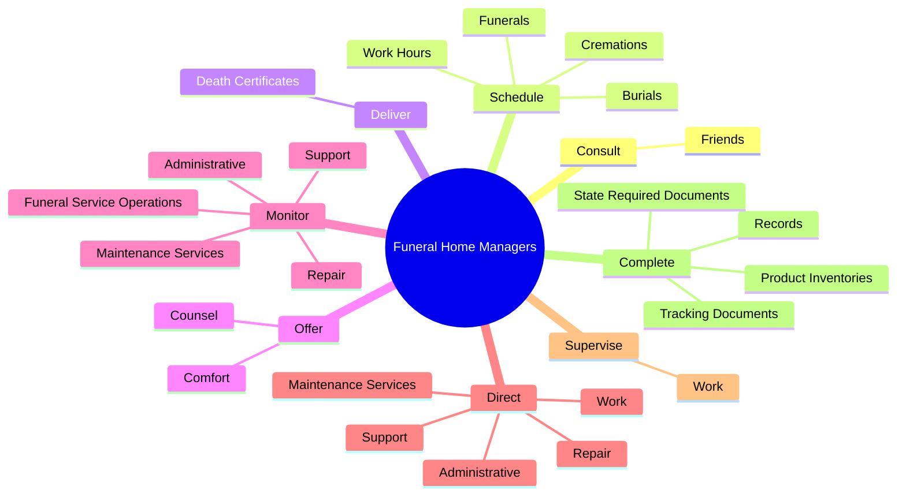
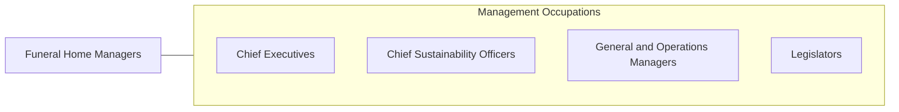

# Funeral Home Managers

> Plan, direct, or coordinate the services or resources of funeral homes. Includes activities such as determining prices for services or merchandise and managing the facilities of funeral homes.

## Overview

Funeral Home Managers is an occupation within the Management Occupations category. Plan, direct, or coordinate the services or resources of funeral homes. 

## Classification Hierarchy

## Key Statistics

| Metric | Value |
|--------|-------|
| SOC Code | 11-9171.00 |
| Category | [Management Occupations](/occupations/Management/index) |
| Task Count | 92 |
| Source | O*NET |

## Core Tasks

### consult.Friends

Funeral Home Managers consult friends as part of their core responsibilities.

**Actions:**
- `consult.Friends.of.Deceased.to.arrange.FuneralDetails`
- `consult.Friends.of.ObituaryNoticeWording`
- `consult.Friends.of.CasketSelection`
- `consult.Friends.of.Plans.for.Services`

### schedule.Funerals

Funeral Home Managers schedule funerals as part of their core responsibilities.

**Actions:**
- `schedule.Funerals`
- `schedule.Burials`
- `schedule.Cremations`
- `schedule.WorkHours.for.FuneralHome`

### deliver.DeathCertificates

Funeral Home Managers deliver death certificates as part of their core responsibilities.

**Actions:**
- `deliver.DeathCertificates.to.MedicalFacilitiesToObtainSignaturesFromLegallyAuthorizedPersons`
- `deliver.DeathCertificates.to.OfficesToObtainSignaturesFromLegallyAuthorizedPersons`

## Skills & Competencies

### Technical Skills
- **Strategic Planning** - Advanced
- **Financial Management** - Advanced
- **Operations Management** - Advanced

### Soft Skills
- **Communication** - Essential
- **Problem Solving** - Essential
- **Critical Thinking** - Important
- **Teamwork** - Important
- **Adaptability** - Important

## Related Occupations

## Industries

This occupation is found across multiple industries. See [Industries](/industries) for sector-specific employment data.

## Career Progression

---

*Source: O*NET 11-9171.00 - ONETOccupation*
