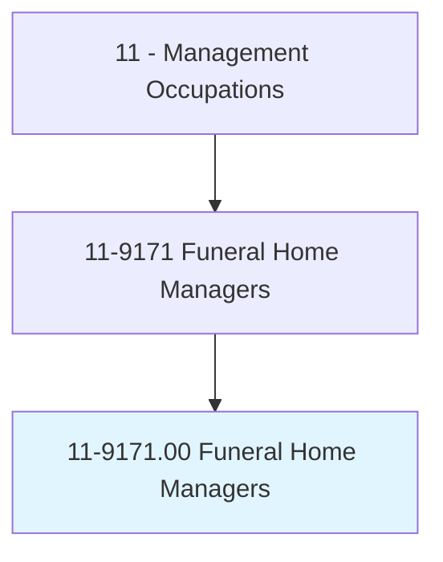
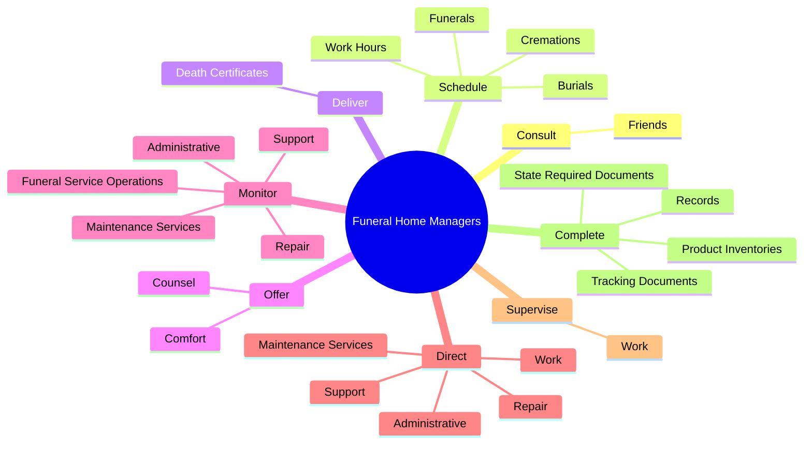
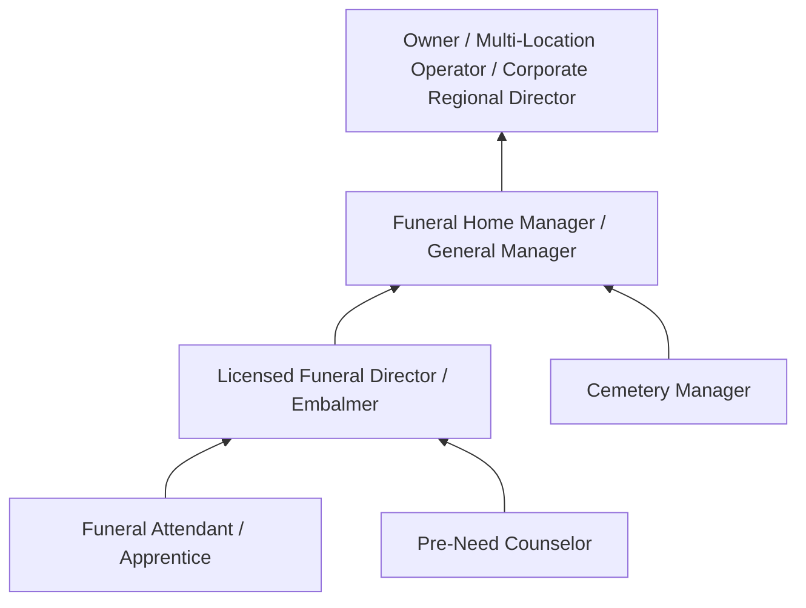
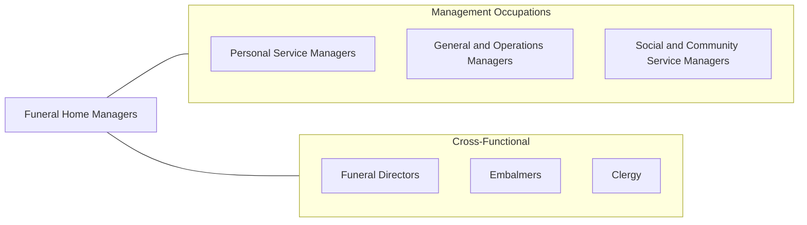

# Funeral Home Managers

> Plan, direct, or coordinate the services or resources of funeral homes. Includes activities such as determining prices for services or merchandise and managing the facilities of funeral homes.

## Overview

Funeral Home Managers oversee all aspects of funeral home operations, from arranging services with grieving families to managing the business and regulatory aspects of the funeral industry. They coordinate funerals, burials, and cremations while providing compassionate support to families during one of the most difficult experiences of their lives. The role combines business management with deeply personal service.

These managers handle a wide range of responsibilities including consulting with families on service arrangements, pricing merchandise and services, managing staff, maintaining facilities, ensuring regulatory compliance, and overseeing financial operations. They must be knowledgeable about diverse cultural and religious funeral traditions, legal requirements for death certificates and permits, and the growing variety of memorial options including green burials, celebration of life services, and virtual attendance.

The funeral industry is evolving with changing consumer preferences. Cremation rates have risen significantly, pre-need planning has become more common, and families increasingly seek personalized and non-traditional services. Funeral Home Managers must adapt their operations and offerings while maintaining the dignity and professionalism that the profession demands. They also manage the emotional toll on their staff, who regularly work with bereaved families.

## Classification Hierarchy

## Key Statistics

| Metric | Value |
|--------|-------|
| SOC Code | 11-9171.00 |
| Job Zone | 3 (Medium Preparation) |
| Category | [Management Occupations](/occupations/Management/index) |
| Task Count | 92 |
| Salary Range | $50,000 - $110,000+ |
| Employment Level | Small - approximately 10,000 |
| Growth Outlook | Slower than average |
| Source | O*NET |

## Core Tasks

### consult.Friends

Funeral Home Managers consult with family and friends of the deceased to arrange funeral details, discuss options including obituary wording, casket selection, and service plans.

**Actions:**
- `consult.Friends.of.Deceased.to.arrange.FuneralDetails`
- `consult.Friends.of.ObituaryNoticeWording`
- `consult.Friends.of.CasketSelection`
- `consult.Friends.of.Plans.for.Services`

### schedule.Funerals

Funeral Home Managers coordinate the scheduling of all services and staff to ensure seamless operations, often managing multiple services simultaneously.

**Actions:**
- `schedule.Funerals`
- `schedule.Burials`
- `schedule.Cremations`
- `schedule.WorkHours.for.FuneralHome`

### deliver.DeathCertificates

Funeral Home Managers transport death certificates to medical facilities and government offices to obtain required signatures from legally authorized persons.

**Actions:**
- `deliver.DeathCertificates.to.MedicalFacilitiesToObtainSignaturesFromLegallyAuthorizedPersons`
- `deliver.DeathCertificates.to.OfficesToObtainSignaturesFromLegallyAuthorizedPersons`

## Skills & Competencies

### Technical Skills
- **Funeral Service Operations** - Expert
- **Regulatory Compliance (FTC Funeral Rule, State Laws)** - Expert
- **Business Management** - Advanced
- **Embalming & Restorative Arts Oversight** - Advanced
- **Financial Management & Pricing** - Advanced
- **Facility Maintenance** - Advanced
- **Pre-Need Sales & Planning** - Advanced

### Soft Skills
- **Empathy & Compassion** - Critical
- **Communication** - Critical
- **Discretion & Professionalism** - Critical
- **Leadership** - Essential
- **Organizational Skills** - Essential
- **Composure Under Emotional Stress** - Essential
- **Cultural Sensitivity** - Essential

## Education & Certifications

| Requirement | Details |
|-------------|---------|
| Typical Education | Associate's or Bachelor's degree in Mortuary Science or Funeral Service Education |
| Licensure | State Funeral Director / Embalmer License (required - state board of funeral directors) |
| Work Experience | 1-3 years apprenticeship under a licensed funeral director (state-specific) |
| Common Certifications | CFuE (Certified Funeral Executive - NFDA), CFSP (Certified Funeral Service Practitioner - Academy of Professional Funeral Service Practice) |

## Career Progression

## Industry Variations

- **Independent Funeral Homes** - Family ownership; community reputation; personalized service; full-service operations including embalming
- **Corporate Funeral Chains** - Standardized operations (Service Corporation International, Dignity Memorial); brand compliance; multi-location management; corporate reporting
- **Cremation-Focused Operations** - Streamlined facilities; direct cremation services; memorial product sales; lower overhead operations
- **Green / Alternative Providers** - Natural burial options; eco-friendly caskets; conservation burial grounds; home funeral guidance

## Technology & Tools

- **Funeral Management Software** - HMIS (Homesteaders), Osiris, FrontRunner, Passare
- **Accounting** - QuickBooks, Sage for funeral home financials
- **Pre-Need Management** - Precoa, Homesteaders Life Company systems
- **Website / Marketing** - FrontRunner, Batesville Connect, social media
- **Streaming / Virtual Services** - OneRoom, Gathering Us, funeral livestreaming platforms
- **Document Management** - Electronic death certificate systems (state-specific EDRS)

## Related Occupations

## Industries

- [Personal and Laundry Services (Funeral Services)](/industries/PersonalServices) - Very High Employment

## Departments

This occupation typically works in:
- Funeral Operations
- Client Services / Arrangements
- Pre-Need Planning

---

*Source: O*NET 11-9171.00 - ONETOccupation*
