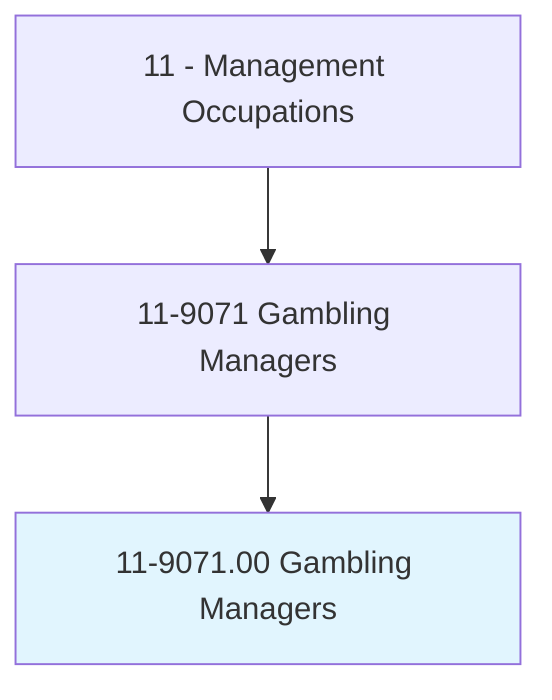
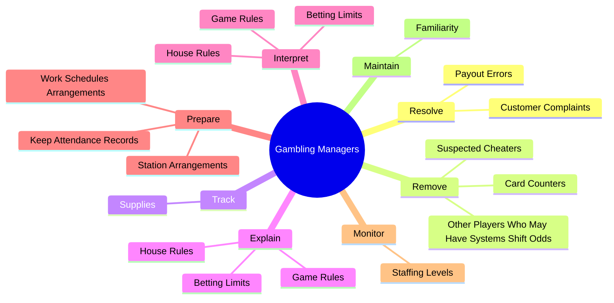
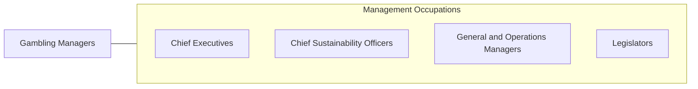

# Gambling Managers

> Plan, direct, or coordinate gambling operations in a casino. May formulate house rules.

## Overview

Gambling Managers is an occupation within the Management Occupations category. Plan, direct, or coordinate gambling operations in a casino. 

## Classification Hierarchy

## Key Statistics

| Metric | Value |
|--------|-------|
| SOC Code | 11-9071.00 |
| Category | [Management Occupations](/occupations/Management) |
| Task Count | 58 |
| Source | O*NET |

## Core Tasks

### resolve.CustomerComplaints

Gambling Managers resolve customer complaints as part of their core responsibilities.

**Actions:**
- `resolve.CustomerComplaints.regarding.Problems`
- `resolve.PayoutErrors`

### remove.SuspectedCheaters

Gambling Managers remove suspected cheaters as part of their core responsibilities.

**Actions:**
- `remove.SuspectedCheaters.of.Winning.to.Favor`
- `remove.CardCounters.of.Winning.to.Favor`
- `remove.OtherPlayersWhoMayHaveSystemsShiftOdds.of.Winning.to.Favor`

### track.Supplies

Gambling Managers track supplies as part of their core responsibilities.

**Actions:**
- `track.Supplies.of.Money.to.Tables`
- `track.Supplies.of.PerformRequiredPaperwork`

## Skills & Competencies

### Technical Skills
- **Strategic Planning** - Advanced
- **Financial Management** - Advanced
- **Operations Management** - Advanced

### Soft Skills
- **Communication** - Essential
- **Problem Solving** - Essential
- **Critical Thinking** - Important
- **Teamwork** - Important
- **Adaptability** - Important

## Related Occupations

## Industries

This occupation is found across multiple industries. See [Industries](/industries) for sector-specific employment data.

## Career Progression

---

*Source: O*NET 11-9071.00 - ONETOccupation*
