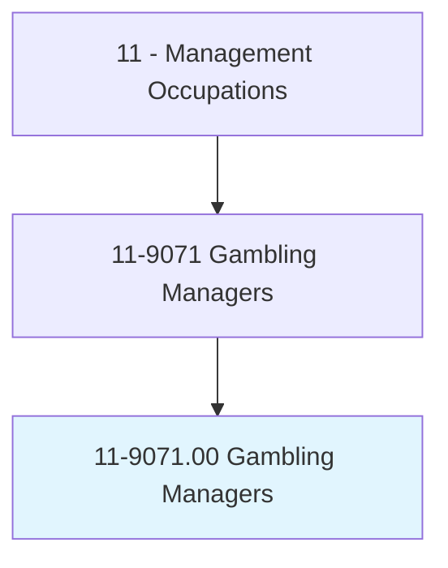
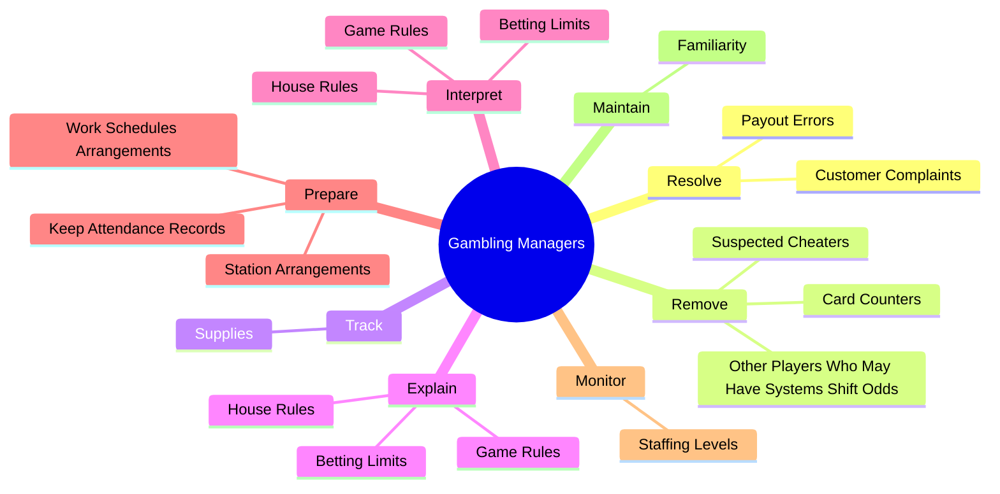
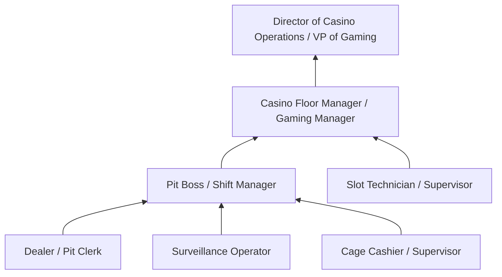
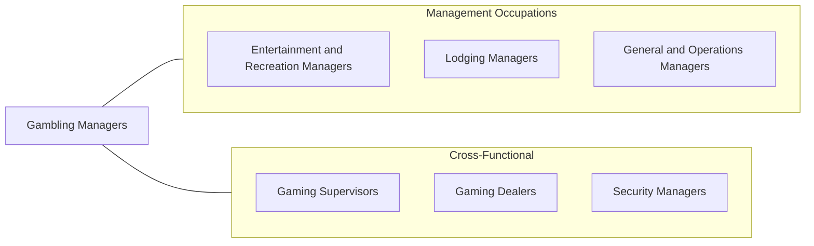

# Gambling Managers

> Plan, direct, or coordinate gambling operations in a casino. May formulate house rules.

## Overview

Gambling Managers oversee the gaming operations of casinos, racetracks, and other wagering establishments. They are responsible for ensuring that gaming activities run smoothly, profitably, and in full compliance with gaming regulations and internal controls. This includes managing table games, slot operations, sports betting, and poker rooms while maintaining the integrity of gaming activities and delivering an exceptional customer experience.

The role requires a sophisticated understanding of gaming mathematics, regulatory compliance, and security protocols. Gambling Managers must detect and address cheating, manage large volumes of cash, coordinate with gaming commissions, and ensure that all operations adhere to strict licensing requirements. They also handle customer disputes, manage comps and loyalty programs, and work to maximize gaming revenue while maintaining responsible gambling standards.

As the gaming industry expands into online platforms, sports betting, and mobile wagering, Gambling Managers increasingly oversee both physical and digital gaming operations. They must adapt to new technologies, evolving regulations across jurisdictions, and changing customer preferences while maintaining the security and integrity that are foundational to the industry.

## Classification Hierarchy

## Key Statistics

| Metric | Value |
|--------|-------|
| SOC Code | 11-9071.00 |
| Job Zone | 3 (Medium Preparation) |
| Category | [Management Occupations](/occupations/Management/index) |
| Task Count | 58 |
| Salary Range | $50,000 - $110,000+ |
| Employment Level | Small - approximately 5,000 |
| Growth Outlook | Average |
| Source | O*NET |

## Core Tasks

### resolve.CustomerComplaints

Gambling Managers address customer complaints regarding service issues, payout disputes, and other gaming-related problems to maintain customer satisfaction and operational integrity.

**Actions:**
- `resolve.CustomerComplaints.regarding.Problems`
- `resolve.PayoutErrors`

### remove.SuspectedCheaters

Gambling Managers identify and remove individuals suspected of cheating, card counting, or using systems to shift odds in their favor, protecting the establishment's financial interests.

**Actions:**
- `remove.SuspectedCheaters.of.Winning.to.Favor`
- `remove.CardCounters.of.Winning.to.Favor`
- `remove.OtherPlayersWhoMayHaveSystemsShiftOdds.of.Winning.to.Favor`

### track.Supplies

Gambling Managers track the movement of cash and supplies to gaming tables and ensure proper documentation of all financial transactions.

**Actions:**
- `track.Supplies.of.Money.to.Tables`
- `track.Supplies.of.PerformRequiredPaperwork`

## Skills & Competencies

### Technical Skills
- **Gaming Operations Management** - Expert
- **Gaming Regulations & Compliance** - Expert
- **Cash Handling & Financial Controls** - Advanced
- **Surveillance & Security Procedures** - Advanced
- **Gaming Mathematics & Odds** - Advanced
- **Customer Relationship Management** - Advanced
- **Staff Scheduling & Management** - Advanced

### Soft Skills
- **Leadership** - Critical
- **Decision Making** - Critical
- **Customer Service** - Essential
- **Observation & Attention to Detail** - Essential
- **Communication** - Essential
- **Composure Under Pressure** - Essential
- **Conflict Resolution** - Important

## Education & Certifications

| Requirement | Details |
|-------------|---------|
| Typical Education | High school diploma to Bachelor's degree in Hospitality Management, Business, or related field |
| Work Experience | 5+ years in casino operations with progressive supervisory responsibility |
| On-the-Job Training | Extensive - detailed knowledge of gaming operations and house procedures |
| Licensure | State Gaming License (required in all jurisdictions - state gaming commissions) |
| Common Certifications | CGM (Certified Gaming Manager - UNLV/gaming associations), Responsible Gaming certification, AML compliance training |

## Career Progression

## Industry Variations

- **Commercial Casinos** - Large-scale table and slot operations; high-roller programs; entertainment integration; multi-property management
- **Tribal Gaming** - Compliance with IGRA (Indian Gaming Regulatory Act); tribal compact requirements; community benefit programs
- **Online / Mobile Gaming** - Digital platform management; responsible gaming tools; multi-jurisdiction licensing; fraud detection systems
- **Sports Betting** - Odds management; risk exposure monitoring; regulatory compliance across states; partnership management with leagues

## Technology & Tools

- **Casino Management Systems** - IGT Advantage, Konami Synkros, Scientific Games, Aristocrat Oasis 360
- **Surveillance** - CCTV systems, facial recognition, AI-powered analytics
- **Table Management** - RFID chip tracking, electronic table games, automatic card shufflers
- **Slot Management** - SAS (Slot Accounting System), server-based gaming platforms
- **Player Tracking** - Loyalty management systems, CRM platforms
- **Compliance** - AML transaction monitoring, Title 31 reporting systems

## Related Occupations

## Industries

- [Arts, Entertainment, and Recreation](/industries/Entertainment) - Very High Employment
- Accommodation and Food Services - Moderate Employment
- [Government (Tribal)](/industries/PublicAdministration) - Moderate Employment

## Departments

This occupation typically works in:
- Casino Operations / Gaming
- Table Games
- Slot Operations
- Player Development

---

*Source: O*NET 11-9071.00 - ONETOccupation*
