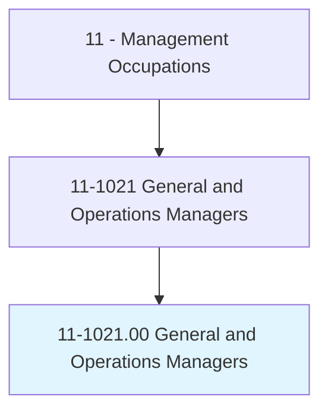
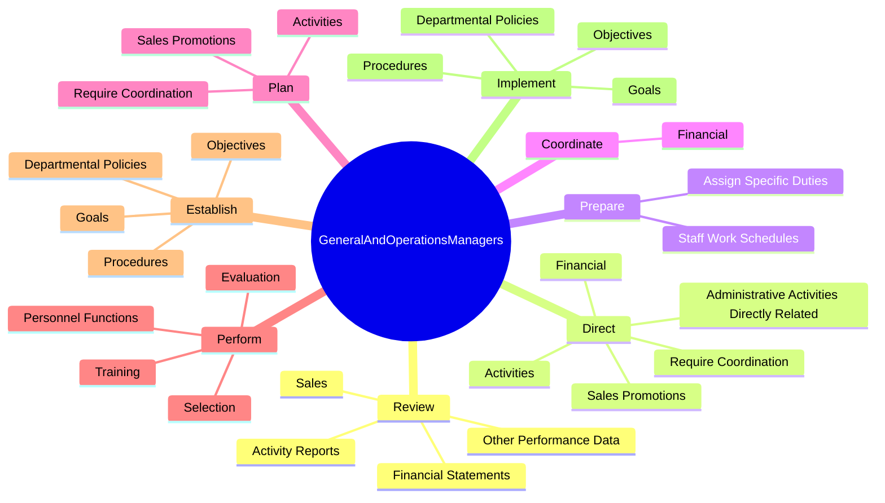
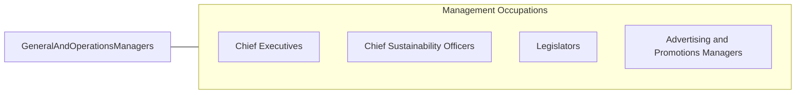

# General and Operations Managers

> Plan, direct, or coordinate the operations of public or private sector organizations, overseeing multiple departments or locations. Duties and responsibilities include formulating policies, managing daily operations, and planning the use of materials and human resources, but are too diverse and general in nature to be classified in any one functional area of management or administration, such as personnel, purchasing, or administrative services. Usually manage through subordinate supervisors. Excludes First-Line Supervisors.

## Overview

General and Operations Managers is an occupation within the Management Occupations category. Plan, direct, or coordinate the operations of public or private sector organizations, overseeing multiple departments or locations. Duties and responsibilities include formulating policies, managing daily operations, and planning the use of materials and human resources, but are too diverse and general in nature to be classified in any one functional area of management or administration, such as personnel, purchasing, or administrative services.

## Classification Hierarchy

## Key Statistics

| Metric | Value |
|--------|-------|
| SOC Code | 11-1021.00 |
| Category | [Management Occupations](/occupations/Management/index) |
| Task Count | 91 |
| Source | O*NET |

## Core Tasks

### review.FinancialStatements

General and Operations Managers review financial statements as part of their core responsibilities.

**Actions:**
- `review.FinancialStatements.to.measure.ProductivityAchievementToIdentifyAreasNeedingCostReductionProgramImprovement`
- `review.FinancialStatements.to.GoalAchievementToIdentifyAreasNeedingCostReductionProgramImprovement`
- `review.Sales.to.measure.ProductivityAchievementToIdentifyAreasNeedingCostReductionProgramImprovement`
- `review.Sales.to.GoalAchievementToIdentifyAreasNeedingCostReductionProgramImprovement`

### direct.AdministrativeActivitiesDirectlyRelated

General and Operations Managers direct administrative activities directly related as part of their core responsibilities.

**Actions:**
- `direct.AdministrativeActivitiesDirectlyRelated.to.MakingProducts`
- `direct.AdministrativeActivitiesDirectlyRelated.to.ProvidingServices`
- `direct.Financial.to.fund.Operations`
- `direct.Financial.to.maximize.Investments`

### prepare.StaffWorkSchedules

General and Operations Managers prepare staff work schedules as part of their core responsibilities.

**Actions:**
- `prepare.StaffWorkSchedules`
- `prepare.AssignSpecificDuties`

## Skills & Competencies

### Technical Skills
- **Strategic Planning** - Advanced
- **Financial Management** - Advanced
- **Operations Management** - Advanced

### Soft Skills
- **Communication** - Essential
- **Problem Solving** - Essential
- **Critical Thinking** - Important
- **Teamwork** - Important
- **Adaptability** - Important

## Related Occupations

## Industries

This occupation is found across multiple industries. See [Industries](/industries) for sector-specific employment data.

## Career Progression

---

*Source: O*NET 11-1021.00 - ONETOccupation*
