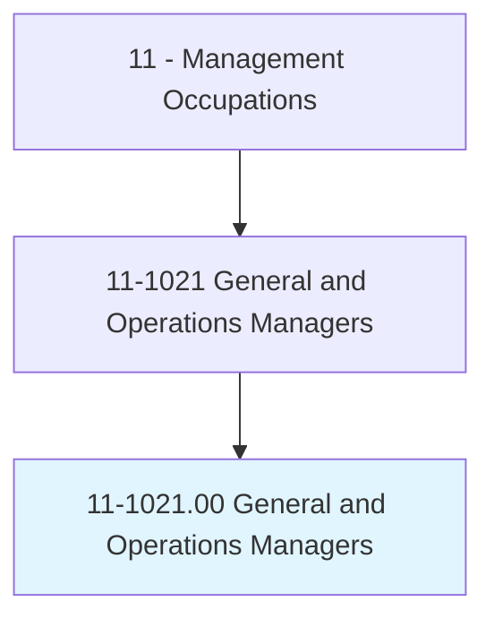
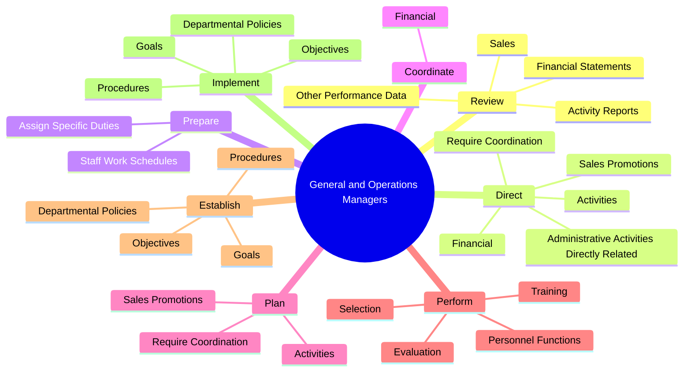
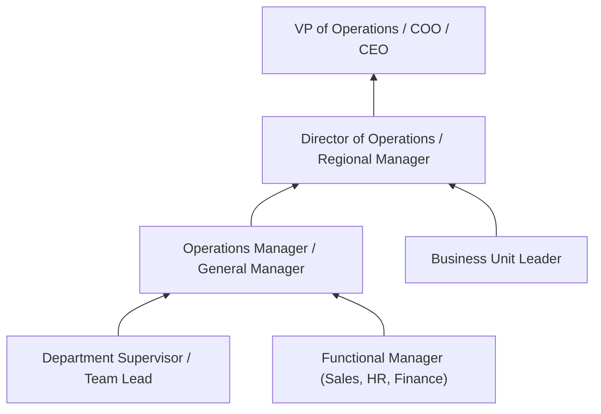
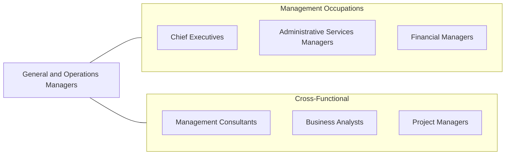

# General and Operations Managers

> Plan, direct, or coordinate the operations of public or private sector organizations, overseeing multiple departments or locations. Duties and responsibilities include formulating policies, managing daily operations, and planning the use of materials and human resources, but are too diverse and general in nature to be classified in any one functional area of management or administration, such as personnel, purchasing, or administrative services. Usually manage through subordinate supervisors. Excludes First-Line Supervisors.

## Overview

General and Operations Managers are among the most common management occupations, responsible for overseeing the day-to-day operations of organizations or major organizational units. Their responsibilities span multiple functional areas including finance, human resources, production, sales, and administration. They formulate policies, manage budgets, set performance goals, and coordinate the work of subordinate managers and staff to achieve organizational objectives.

The breadth of this role varies significantly by organization size and industry. In smaller organizations, General Managers may directly oversee all business functions. In larger organizations, they typically manage a specific business unit, division, or location, reporting to senior executives. Regardless of scale, they are accountable for the overall performance of their area, including profitability, operational efficiency, customer satisfaction, and employee engagement.

General and Operations Managers must be versatile leaders capable of making decisions across diverse functional areas. They analyze financial reports, identify opportunities for improvement, implement change initiatives, and ensure regulatory compliance. The role serves as a critical development stage for future senior executives, requiring a combination of strategic vision and hands-on operational expertise.

## Classification Hierarchy

## Key Statistics

| Metric | Value |
|--------|-------|
| SOC Code | 11-1021.00 |
| Job Zone | 4 (Considerable Preparation) |
| Category | [Management Occupations](/occupations/Management/index) |
| Task Count | 91 |
| Salary Range | $55,000 - $155,000+ |
| Employment Level | Very Large - over 2.9 million |
| Growth Outlook | Average |
| Source | O*NET |

## Core Tasks

### review.FinancialStatements

General and Operations Managers review financial data to measure productivity and goal achievement, identifying areas where cost reduction or program improvement is needed.

**Actions:**
- `review.FinancialStatements.to.measure.ProductivityAchievementToIdentifyAreasNeedingCostReductionProgramImprovement`
- `review.FinancialStatements.to.GoalAchievementToIdentifyAreasNeedingCostReductionProgramImprovement`
- `review.Sales.to.measure.ProductivityAchievementToIdentifyAreasNeedingCostReductionProgramImprovement`
- `review.Sales.to.GoalAchievementToIdentifyAreasNeedingCostReductionProgramImprovement`

### direct.AdministrativeActivitiesDirectlyRelated

General and Operations Managers direct the administrative and financial activities related to producing products or delivering services, optimizing resource allocation.

**Actions:**
- `direct.AdministrativeActivitiesDirectlyRelated.to.MakingProducts`
- `direct.AdministrativeActivitiesDirectlyRelated.to.ProvidingServices`
- `direct.Financial.to.fund.Operations`
- `direct.Financial.to.maximize.Investments`

### prepare.StaffWorkSchedules

General and Operations Managers create work schedules and assign duties to ensure adequate coverage and efficient use of human resources.

**Actions:**
- `prepare.StaffWorkSchedules`
- `prepare.AssignSpecificDuties`

## Skills & Competencies

### Technical Skills
- **Operations Management** - Expert
- **Financial Analysis & Budgeting** - Advanced
- **Strategic Planning** - Advanced
- **Human Resources Management** - Advanced
- **Supply Chain & Logistics** - Advanced
- **Sales & Marketing Oversight** - Advanced
- **Regulatory Compliance** - Advanced

### Soft Skills
- **Leadership** - Critical
- **Decision Making** - Critical
- **Communication** - Essential
- **Problem Solving** - Essential
- **Delegation** - Essential
- **Negotiation** - Important
- **Adaptability** - Important

## Education & Certifications

| Requirement | Details |
|-------------|---------|
| Typical Education | Bachelor's degree in Business Administration, Management, or related field |
| Advanced Education | MBA or Master's in Management frequently preferred for larger organizations |
| Work Experience | 5-10 years of progressively responsible management experience |
| On-the-Job Training | Moderate - industry-specific knowledge development |
| Common Certifications | PMP (Project Management Professional - PMI), Six Sigma Green/Black Belt, CMC (Certified Management Consultant - IMC), Lean Management Certification |

## Career Progression

## Industry Variations

- **Retail** - Multi-store management; inventory control; customer experience; seasonal staffing; loss prevention
- **Manufacturing** - Production scheduling; quality management; safety compliance; supply chain coordination; continuous improvement
- **Healthcare** - Clinical operations oversight; patient flow management; regulatory compliance; physician relations
- **Professional Services** - Client relationship management; utilization and billing; talent development; practice management

## Technology & Tools

- **ERP Systems** - SAP, Oracle NetSuite, Microsoft Dynamics 365
- **Business Intelligence** - Tableau, Power BI, Looker
- **Project Management** - Monday.com, Asana, Microsoft Project, Smartsheet
- **Financial** - QuickBooks, Sage, Oracle Financials
- **HR / Workforce** - Workday, ADP, UKG
- **Communication** - Microsoft Teams, Slack, Zoom

## Related Occupations

## Industries

- [Professional, Scientific, and Technical Services](/industries/ProfessionalServices) - Very High Employment
- [Retail Trade](/industries/Retail/index) - Very High Employment
- [Manufacturing](/industries/Manufacturing/index) - High Employment
- [Healthcare and Social Assistance](/industries/Healthcare/index) - High Employment
- [Accommodation and Food Services](/industries/AccommodationFood) - High Employment

## Departments

This occupation typically works in:
- [Operations](/departments/Operations/index)
- [General Management](/departments/GeneralManagement)
- [Administration](/departments/Administration)
- [Business Unit Leadership](/departments/BusinessUnit)

---

*Source: O*NET 11-1021.00 - ONETOccupation*
