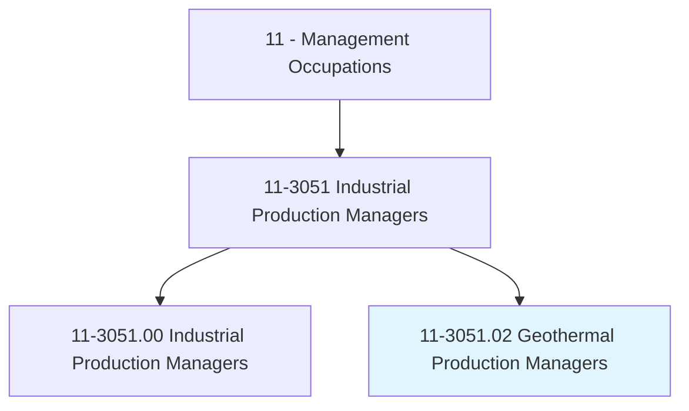
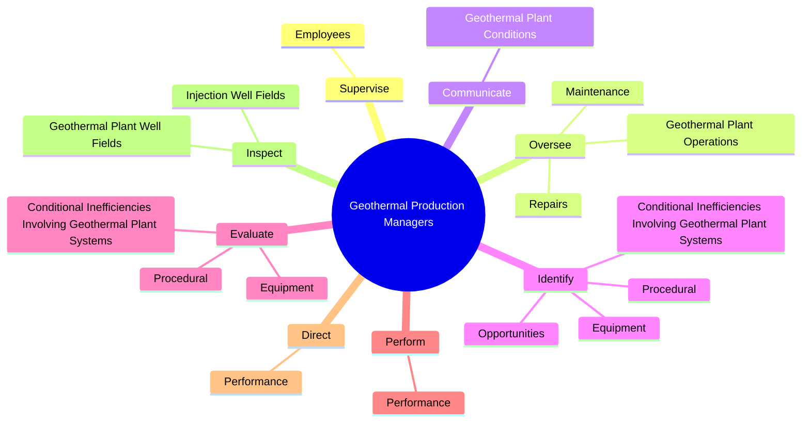
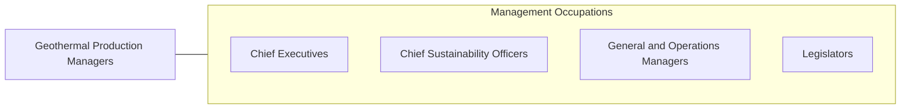

# Geothermal Production Managers

> Manage operations at geothermal power generation facilities. Maintain and monitor geothermal plant equipment for efficient and safe plant operations.

## Overview

Geothermal Production Managers is a specialized variant within the Management Occupations category. Manage operations at geothermal power generation facilities. 

## Classification Hierarchy

## Key Statistics

| Metric | Value |
|--------|-------|
| SOC Code | 11-3051.02 |
| Category | [Management Occupations](/occupations/Management/index) |
| Task Count | 55 |
| Source | O*NET |

## Core Tasks

### supervise.Employees

Geothermal Production Managers supervise employees as part of their core responsibilities.

**Actions:**
- `supervise.Employees.in.GeothermalPowerPlantsFields`
- `supervise.Employees.in.WellFields`

### oversee.GeothermalPlantOperations

Geothermal Production Managers oversee geothermal plant operations as part of their core responsibilities.

**Actions:**
- `oversee.GeothermalPlantOperations.to.ensure.ComplianceWithApplicableStandards`
- `oversee.GeothermalPlantOperations.to.Regulations`
- `oversee.Maintenance.to.ensure.ComplianceWithApplicableStandards`
- `oversee.Maintenance.to.Regulations`

### communicate.GeothermalPlantConditions

Geothermal Production Managers communicate geothermal plant conditions as part of their core responsibilities.

**Actions:**
- `communicate.GeothermalPlantConditions.to.Employees`

## Skills & Competencies

### Technical Skills
- **Strategic Planning** - Advanced
- **Financial Management** - Advanced
- **Operations Management** - Advanced

### Soft Skills
- **Communication** - Essential
- **Problem Solving** - Essential
- **Critical Thinking** - Important
- **Teamwork** - Important
- **Adaptability** - Important

## Related Occupations

## Industries

This occupation is found across multiple industries. See [Industries](/industries) for sector-specific employment data.

## Career Progression

---

*Source: O*NET 11-3051.02 - ONETOccupation*
