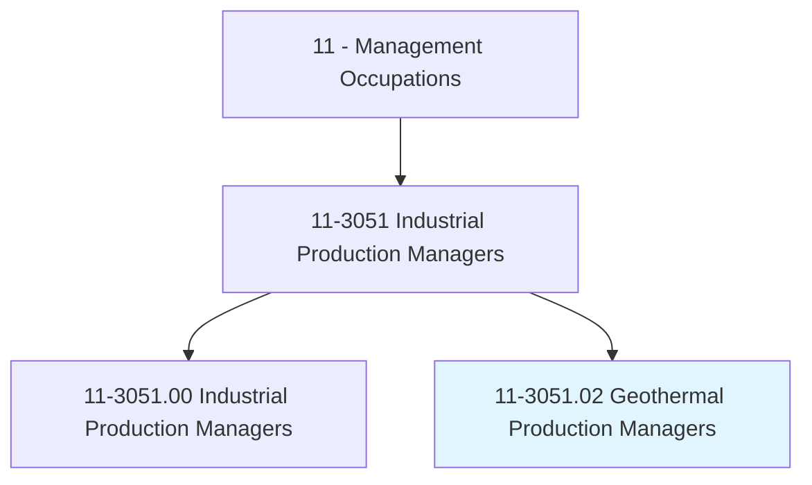
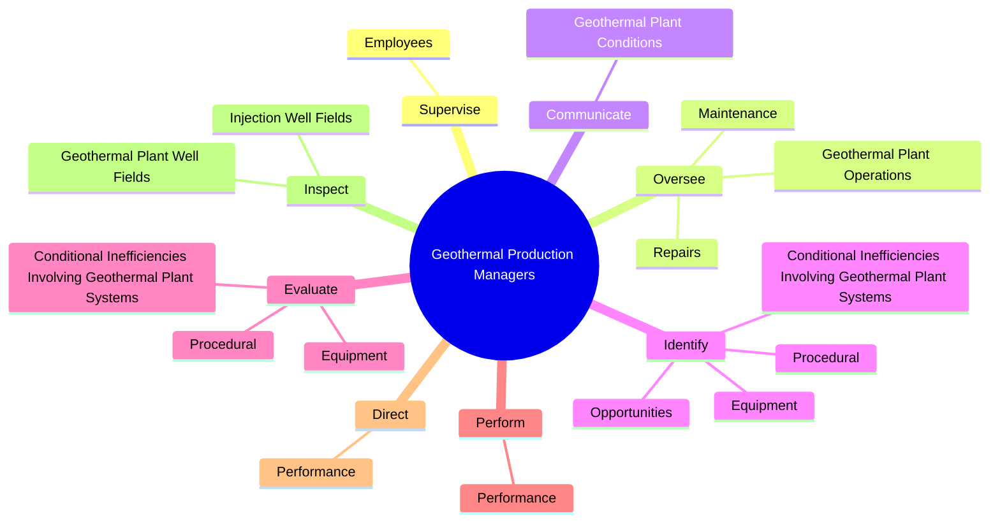
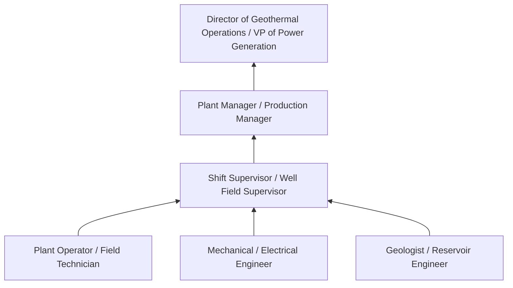
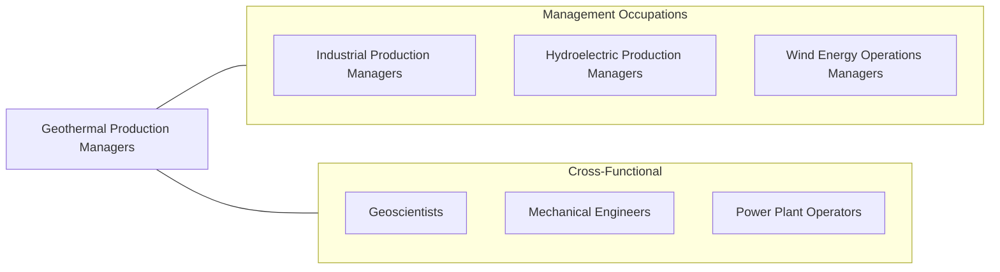

# Geothermal Production Managers

> Manage operations at geothermal power generation facilities. Maintain and monitor geothermal plant equipment for efficient and safe plant operations.

## Overview

Geothermal Production Managers oversee power generation facilities that harness heat from the earth's interior to produce electricity. They manage the complete geothermal production system -- from subsurface well fields and steam gathering systems through power plant equipment (turbines, generators, condensers, cooling towers) to electrical grid interconnection. Their role requires understanding both the geological resource and the mechanical/electrical systems that convert geothermal energy into electricity.

These managers supervise operations and maintenance staff across plant and well field locations, often in remote areas. They monitor reservoir performance, manage steam supply, oversee equipment maintenance, and ensure compliance with environmental regulations covering air emissions (hydrogen sulfide, mercury), wastewater disposal (brine reinjection), and land use. Geothermal resources require careful management to sustain production over decades, making reservoir stewardship a critical responsibility.

Geothermal energy provides baseload renewable power with capacity factors exceeding 90%, distinguishing it from intermittent renewables like wind and solar. The industry is expanding through enhanced geothermal systems (EGS), binary cycle technology for lower-temperature resources, and direct-use applications. Production managers must stay current with advances in drilling technology, reservoir modeling, scale and corrosion management, and emissions abatement as the industry targets new geothermal frontiers.

## Classification Hierarchy

## Key Statistics

| Metric | Value |
|--------|-------|
| SOC Code | 11-3051.02 |
| Job Zone | 4 (Considerable Preparation) |
| Category | [Management Occupations](/occupations/Management/index) |
| Task Count | 55 |
| Salary Range | $85,000 - $150,000+ |
| Employment Level | Very Small |
| Growth Outlook | Faster than average |
| Source | O*NET |

## Core Tasks

### supervise.Employees

Geothermal Production Managers supervise operations and maintenance staff across both power plant facilities and geothermal well fields.

**Actions:**
- `supervise.Employees.in.GeothermalPowerPlantsFields`
- `supervise.Employees.in.WellFields`

### oversee.GeothermalPlantOperations

Geothermal Production Managers oversee all plant and well field operations to ensure compliance with safety, environmental, and regulatory standards.

**Actions:**
- `oversee.GeothermalPlantOperations.to.ensure.ComplianceWithApplicableStandards`
- `oversee.GeothermalPlantOperations.to.Regulations`
- `oversee.Maintenance.to.ensure.ComplianceWithApplicableStandards`
- `oversee.Maintenance.to.Regulations`

### communicate.GeothermalPlantConditions

Geothermal Production Managers communicate plant conditions, resource status, and operational issues to employees, management, and external stakeholders.

**Actions:**
- `communicate.GeothermalPlantConditions.to.Employees`

## Skills & Competencies

### Technical Skills
- **Geothermal Power Systems** - Expert
- **Plant Operations & Maintenance** - Expert
- **Reservoir Management** - Advanced
- **Safety Management (OSHA, PSM)** - Advanced
- **Environmental Compliance** - Advanced
- **Electrical Systems & Grid Operations** - Advanced
- **Geochemistry (Scaling, Corrosion)** - Advanced

### Soft Skills
- **Leadership** - Critical
- **Problem Solving** - Critical
- **Decision Making** - Essential
- **Communication** - Essential
- **Analytical Thinking** - Essential
- **Planning & Organization** - Important
- **Adaptability** - Important

## Education & Certifications

| Requirement | Details |
|-------------|---------|
| Typical Education | Bachelor's degree in Mechanical Engineering, Electrical Engineering, Geology, or related field |
| Work Experience | 7-10 years in power plant or geothermal operations with supervisory experience |
| Common Certifications | PE (Professional Engineer - NCEES), First Class Power Engineer (state-specific), OSHA 30-Hour, GRC (Geothermal Resources Council) professional development |

## Career Progression

## Industry Variations

- **Flash Steam Plants** - High-temperature resource management (>180C); separator operations; non-condensable gas handling; H2S abatement
- **Binary Cycle Plants** - Working fluid management (isobutane, isopentane); heat exchanger maintenance; lower-temperature resources (100-180C)
- **Enhanced Geothermal Systems (EGS)** - Stimulation operations; induced seismicity monitoring; reservoir creation; frontier technology management
- **Direct Use / District Heating** - Heat distribution systems; cascade use optimization; agricultural and industrial heat applications

## Technology & Tools

- **Control Systems** - DCS, SCADA, PLCs, turbine control systems
- **Reservoir Monitoring** - Downhole pressure/temperature gauges, tracer testing, reservoir simulation (TOUGH2, TETRAD)
- **Environmental** - H2S monitoring (Draeger, Jerome), CEMS, brine chemistry analysis
- **Maintenance** - CMMS (Maximo, SAP PM), vibration monitoring, thermography, corrosion monitoring (coupons, probes)
- **Well Field** - Wellhead equipment, steam gathering system controls, injection well monitoring
- **Performance** - PI System (OSIsoft), heat balance calculations, availability tracking

## Related Occupations

## Industries

- [Utilities (Electric Power Generation)](/industries/Utilities/index) - High Employment
- [Oil and Gas Extraction](/industries/OilAndGas/index) - Low Employment
- [Professional, Scientific, and Technical Services](/industries/Scientific) - Low Employment

## Departments

This occupation typically works in:
- [Plant Operations](/departments/Operations/index)
- Power Generation
- Reservoir Management

---

*Source: O*NET 11-3051.02 - ONETOccupation*
