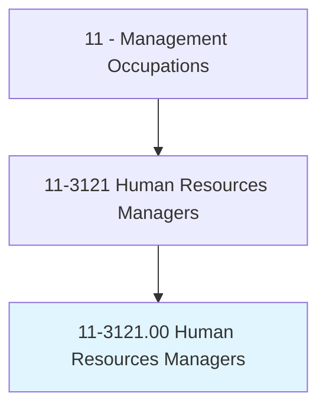
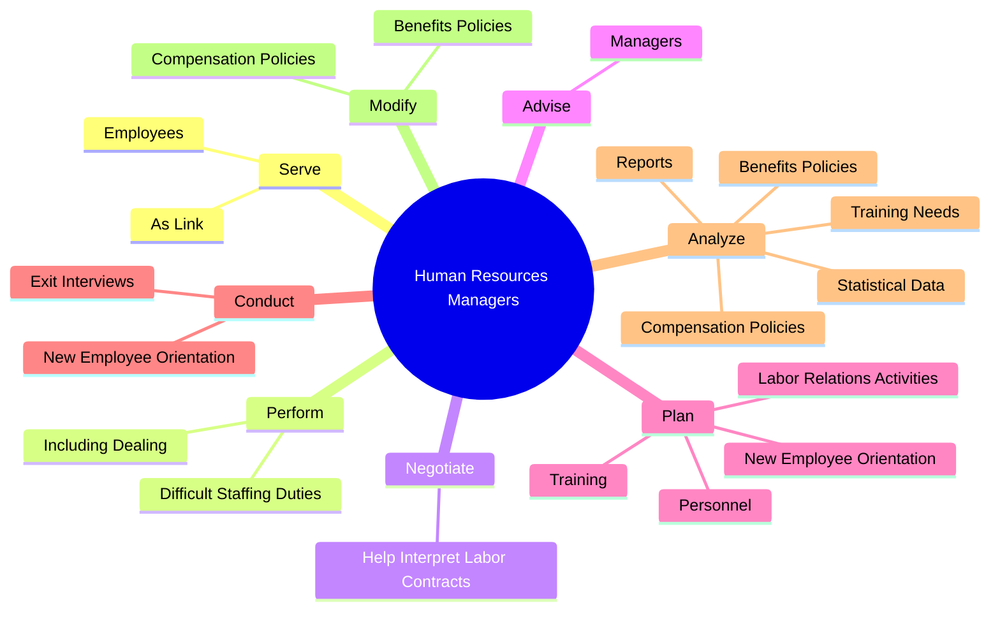
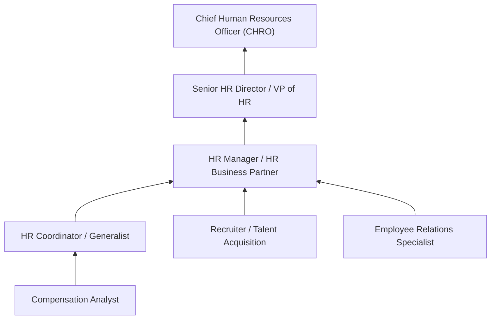
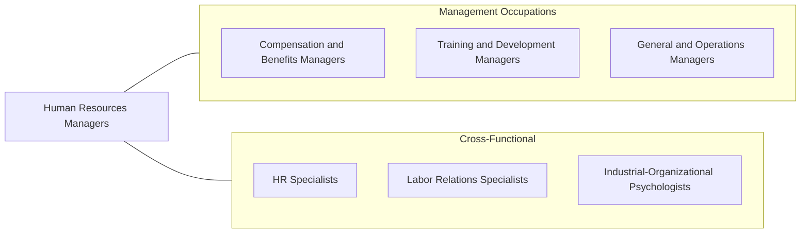

# Human Resources Managers

> Plan, direct, or coordinate human resources activities and staff of an organization.

## Overview

Human Resources Managers lead the people strategy of an organization, overseeing all aspects of employee recruitment, development, compensation, benefits, and retention. They serve as a critical bridge between management and the workforce, ensuring that HR policies align with business objectives while fostering a positive and legally compliant workplace environment.

The scope of this role has expanded significantly in recent years. Beyond traditional personnel management, HR Managers now drive organizational culture initiatives, diversity and inclusion programs, workforce analytics, and change management strategies. They advise senior leadership on talent acquisition strategy, succession planning, and organizational design, making them key contributors to business performance.

HR Managers must navigate an increasingly complex regulatory landscape covering employment law, labor relations, workplace safety, and data privacy. They handle sensitive situations including employee disputes, disciplinary actions, terminations, and workplace investigations, requiring sound judgment, discretion, and a deep understanding of both legal requirements and human behavior.

## Classification Hierarchy

## Key Statistics

| Metric | Value |
|--------|-------|
| SOC Code | 11-3121.00 |
| Job Zone | 4 (Considerable Preparation) |
| Category | [Management Occupations](/occupations/Management/index) |
| Task Count | 103 |
| Salary Range | $80,000 - $160,000+ |
| Employment Level | Large - over 160,000 |
| Growth Outlook | Average |
| Source | O*NET |

## Core Tasks

### serve.AsLink

Human Resources Managers serve as the liaison between management and employees, mediating workplace issues, interpreting policies, and administering contracts to maintain productive working relationships.

**Actions:**
- `serve.AsLink.between.Management.by.HandlingQuestions`
- `serve.AsLink.between.Management.by.Interpreting`
- `serve.AsLink.between.Management.by.AdministeringContracts`
- `serve.AsLink.between.Management.by.HelpingResolveWorkRelatedProblems`

### perform.DifficultStaffingDuties

Human Resources Managers handle complex staffing situations including understaffing crises, employee disputes, terminations, and disciplinary proceedings with professionalism and legal compliance.

**Actions:**
- `perform.DifficultStaffingDuties.with.Understaffing`
- `perform.DifficultStaffingDuties.with.RefereeingDisputes`
- `perform.DifficultStaffingDuties.with.FiringEmployees`
- `perform.DifficultStaffingDuties.with.AdministeringDisciplinaryProcedures`

### negotiate.HelpInterpretLaborContracts

Human Resources Managers negotiate collective bargaining agreements and interpret contract provisions to ensure consistent application across the organization.

**Actions:**
- `negotiate.HelpInterpretLaborContracts`

## Skills & Competencies

### Technical Skills
- **Employment Law & Compliance** - Expert
- **Talent Acquisition & Management** - Expert
- **Compensation & Benefits Design** - Advanced
- **Labor Relations** - Advanced
- **Organizational Development** - Advanced
- **Workforce Analytics** - Advanced
- **HRIS Administration** - Advanced

### Soft Skills
- **Leadership** - Critical
- **Communication** - Critical
- **Conflict Resolution** - Critical
- **Emotional Intelligence** - Essential
- **Negotiation** - Essential
- **Discretion & Confidentiality** - Essential
- **Strategic Thinking** - Essential

## Education & Certifications

| Requirement | Details |
|-------------|---------|
| Typical Education | Bachelor's degree in Human Resources, Business Administration, Psychology, or related field |
| Advanced Education | Master's in HR Management or MBA often preferred for senior roles |
| Work Experience | 5+ years in human resources with progressive responsibility |
| On-the-Job Training | Moderate - ongoing professional development in employment law |
| Common Certifications | SHRM-CP / SHRM-SCP (SHRM), PHR / SPHR (HRCI), CEBS (IFEBP/Wharton), GPHR (HRCI) |

## Career Progression

## Industry Variations

- **Technology** - Focus on competitive compensation, stock options, employer branding, and global distributed workforce management
- **Healthcare** - Credentialing, shift scheduling complexities, clinical staff retention, and union relations
- **Manufacturing** - Labor relations, OSHA compliance, shift workforce management, and vocational training programs
- **Financial Services** - Regulatory compliance for licensed professionals, performance management, and bonus structure design

## Technology & Tools

- **HRIS Platforms** - Workday, SAP SuccessFactors, Oracle HCM Cloud, ADP Workforce Now
- **Recruiting** - Greenhouse, Lever, iCIMS, LinkedIn Recruiter
- **Learning Management** - Cornerstone OnDemand, Docebo, LMS365
- **Performance Management** - Lattice, 15Five, Culture Amp
- **Payroll & Benefits** - ADP, Paycom, Gusto, BambooHR
- **Analytics** - Visier, Tableau, Power BI for workforce reporting

## Related Occupations

## Industries

- [Professional, Scientific, and Technical Services](/industries/ProfessionalServices) - High Employment
- [Healthcare and Social Assistance](/industries/Healthcare/index) - High Employment
- [Manufacturing](/industries/Manufacturing/index) - Moderate Employment
- [Finance and Insurance](/industries/FinanceInsurance) - Moderate Employment
- [Government](/industries/Government) - Moderate Employment

## Departments

This occupation typically works in:
- [Human Resources](/departments/HumanResources/index)
- [People Operations](/departments/PeopleOps)
- [Talent Acquisition](/departments/TalentAcquisition)
- [Employee Relations](/departments/EmployeeRelations)

---

*Source: O*NET 11-3121.00 - ONETOccupation*
