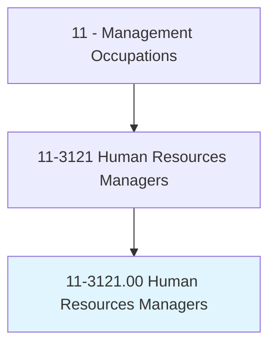
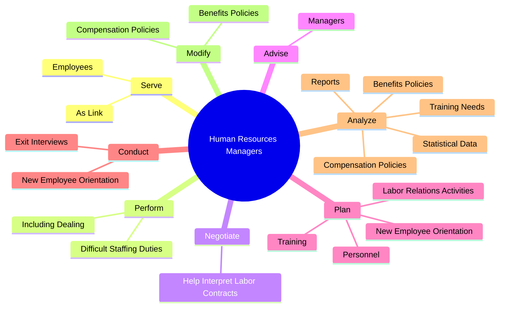
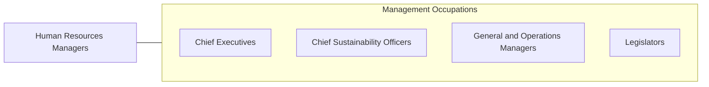

# Human Resources Managers

> Plan, direct, or coordinate human resources activities and staff of an organization.

## Overview

Human Resources Managers is classified under Management Occupations (SOC 11). Plan, direct, or coordinate human resources activities and staff of an organization.

## Classification Hierarchy

## Key Statistics

| Metric | Value |
|--------|-------|
| SOC Code | 11-3121.00 |
| Category | [Management Occupations](/occupations/Management) |
| Task Count | 103 |
| Source | O*NET |

## Core Tasks

### serve.AsLink

Human Resources Managers serve as link as part of their core responsibilities.

**Actions:**
- `serve.AsLink.between.Management.by.HandlingQuestions`
- `serve.AsLink.between.Management.by.Interpreting`
- `serve.AsLink.between.Management.by.AdministeringContracts`
- `serve.AsLink.between.Management.by.HelpingResolveWorkRelatedProblems`

### perform.DifficultStaffingDuties

Human Resources Managers perform difficult staffing duties as part of their core responsibilities.

**Actions:**
- `perform.DifficultStaffingDuties.with.Understaffing`
- `perform.DifficultStaffingDuties.with.RefereeingDisputes`
- `perform.DifficultStaffingDuties.with.FiringEmployees`
- `perform.DifficultStaffingDuties.with.AdministeringDisciplinaryProcedures`

### negotiate.HelpInterpretLaborContracts

Human Resources Managers negotiate help interpret labor contracts as part of their core responsibilities.

**Actions:**
- `negotiate.HelpInterpretLaborContracts`

## Skills & Competencies

### Technical Skills
- **Strategic Planning** - Advanced
- **Financial Management** - Advanced
- **Operations Management** - Advanced

### Soft Skills
- **Communication** - Essential
- **Problem Solving** - Essential
- **Critical Thinking** - Important
- **Teamwork** - Important
- **Adaptability** - Important

## Related Occupations

## Industries

This occupation is found across multiple industries. See [Industries](/industries) for sector-specific employment data.

## Career Progression

---

*Source: O*NET 11-3121.00 - ONETOccupation*
